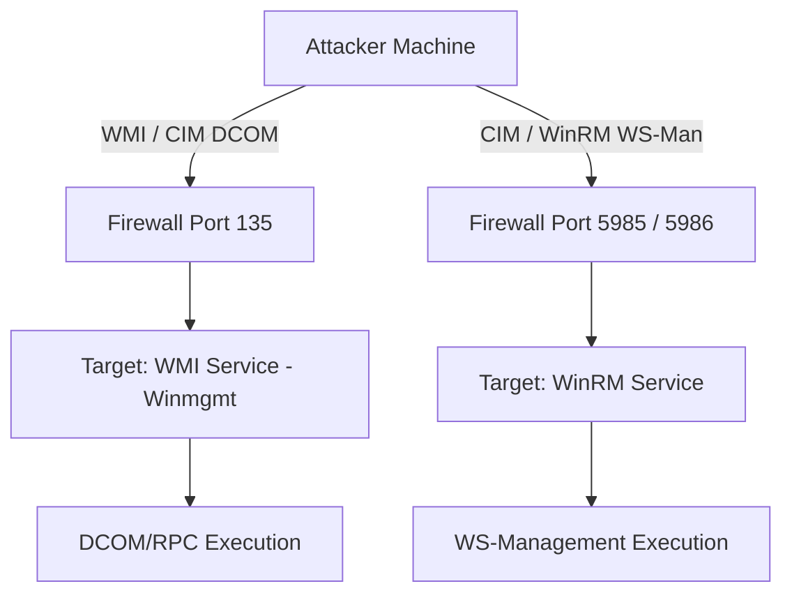

> [!abstract] Remote WMI & CIM Execution (Lateral Movement)
> Windows Management Instrumentation (WMI) and Common Information Model (CIM) can be used to execute commands and enumerate systems remotely. This relies on DCOM (RPC) or WinRM (WS-Man) protocols, making it a powerful technique for Lateral Movement without dropping executables to disk.
> **MITRE ATT&CK Mapping:** [T1021 - Remote Services](https://attack.mitre.org/techniques/T1021/) | [T1047 - Windows Management Instrumentation](https://attack.mitre.org/techniques/T1047/)

## Protocols & Ports Overview

> [!info] Protocol Architecture
> - **WMI:** Uses DCOM (RPC) exclusively over **TCP Port 135**. By default, the WMI service (`Winmgmt`) is running and listening on this port. Not firewall-friendly.
> - **WinRM / WS-Man / PS Remoting:** Uses HTTP/HTTPS over **TCP Port 5985 (HTTP)** and **5986 (HTTPS)**.
> - **CIM:** Flexible. Can use *both* protocols (DCOM port 135 OR WinRM ports 5985/5986).
> 
> **WMI Port Configuration Registry:**
> `HKLM:\Software\Microsoft\Rpc\Internet\`



---

## 1. Remote WMI Execution (DCOM / Port 135)

> [!example]+ Using `gwmi` Remotely
> **Prerequisite:** The target firewall must allow "Windows Management Instrumentation" (WMI).
> 
> ```powershell
> # Execute WMI query on a remote machine using explicit credentials
> gwmi -Class win32_operatingSystem -Computername x.x.x.x -Credential host\user
> ```

---

## 2. Remote CIM Execution

> [!tip]+ Using `gcim` Remotely
> CIM is more flexible than WMI because it allows you to explicitly define the protocol (DCOM or WinRM) via Session Options.

> [!danger]+ Method A: CIM over DCOM (Port 135)
> *Useful when WinRM (5985) is blocked, but RPC (135) is open.*
> ```powershell
> # 1. Define the protocol as DCOM
> $cimoption = New-CimSessionOption -Protocol DCOM
> 
> # 2. Create the CIM session
> $session = New-CimSession -ComputerName x.x.x.x -Credential domain\user -SessionOption $cimoption
> 
> # 3. Execute query using the session
> gcim -ClassName win32_operatingSystem -cimsession $session
> ```

> [!success]+ Method B: CIM over WinRM (Port 5985 / 5986)
> **Prerequisite:** The target firewall must allow "Windows Remote Management" (WinRM).
> ```powershell
> # 1. Create a standard CIM session (Defaults to WinRM/WS-Man)
> $cimsession = New-CimSession -ComputerName x.x.x.x -Credential domain\user
> 
> # 2. Execute query using the session
> gcim -ClassName win32_operatingSystem -CimSession $cimsession
> ```

---

## 3. Managing Remote WMI Permissions (Nishang)

> [!bug+] Backdooring WMI Namespaces with `Set-RemoteWMI`
> By default, standard users cannot execute remote WMI queries. If you compromise an admin account, you can use the `Set-RemoteWMI` script from the **Nishang** framework to grant a low-privileged user remote WMI access. This acts as a stealthy backdoor for lateral movement.
> **Resource:** [samratashok/nishang](https://github.com/samratashok/nishang)
> 
> **Import Module:**
> ```powershell
> ipmo nishang-master\Backdoors\set-remotewmi.ps1
> get-help -example Set-RemoteWMI
> ```
> 
> **Grant Permissions (Backdoor):**
> *Grants `cnanormaluser` remote WMI access on the target machine using Domain Admin credentials.*
> ```powershell
> Set-RemoteWMI -UserName cnanormaluser -Computername x.x.x.x -Credential domain\adminuser -verbose
> ```
> 
> **Target Specific Namespace:**
> *Grants access only to `root\cimv2` instead of all namespaces (Stealthier).*
> ```powershell
> Set-RemoteWMI -UserName cna -Computername x.x.x.x -Credential domain\cna -verbose -namespace 'root\cimv2' -notallnamespaces
> ```
> 
> **Remove Permissions (Cleanup):**
> ```powershell
> Set-RemoteWMI -UserName cna -Computername x.x.x.x -Credential domain\cna -verbose -remove
> ```

> [!warning] OPSEC Notes
> - **DCOM (Port 135):** WMI over DCOM generates **Event ID 4624 (Type 3 - Network Logon)** on the target. It does not generate PowerShell ScriptBlock logging (Event ID 4104) on the target machine, making it highly stealthy for remote execution.
> - **WinRM (Port 5985):** Generates **Event ID 4624 (Type 3)** and creates WSMAN operational logs.

