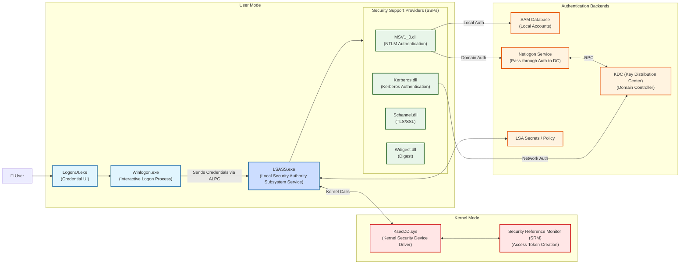

> [!abstract] Persistence via Security Support Provider (SSP)
> The **Security Support Provider (SSP)** is a Windows architecture framework that implements authentication protocols like NTLM and Kerberos. Attackers can inject a malicious SSP DLL (like Mimikatz's `mimilib.dll` or `memssp`) into the Local Security Authority (LSA) to intercept authentication requests and capture credentials in **cleartext** directly from memory, establishing a stealthy persistence mechanism.
> **MITRE ATT&CK Mapping:** [T1101 - Security Support Provider](https://attack.mitre.org/techniques/T1101/) | [T1003 - OS Credential Dumping](https://attack.mitre.org/techniques/T1003/)

## Windows Authentication & SSP Architecture

> [!info] How SSP Works
> When a user logs in, the credentials pass through the `Winlogon` process to the LSA (Local Security Authority) in Kernel mode. The LSA passes these credentials to the loaded SSPs (like `MSV1_0` for NTLM or `Kerberos`) for validation. 
> 
> If an attacker injects a malicious SSP, it sits alongside the legitimate ones. Every time a user authenticates, the malicious SSP intercepts the credentials *before* they are hashed, writing the plaintext password to a log file.


## Execution: Injecting `memssp`

> [!warning] Prerequisites
> This technique requires **Administrator privileges** (specifically `SeDebugPrivilege`).

> [!danger]+ Mimikatz SSP Injection
> Mimikatz can inject its SSP directly into memory (which is lost on reboot) or write it to the registry (persistence across reboots). The `misc::memssp` command patches the LSASS memory and registers the malicious SSP under the name "kiwi".
> 
> ```cmd
> # 1. Enable debug privileges
> mimikatz # privilege::debug
> 
> # 2. Inject memssp into LSASS memory and registry
> mimikatz # misc::memssp
> 
> # 3. Lock the workstation to force a new authentication attempt
> CMD > rundll32 user32.dll,LockWorkstation
> ```
> 
> **Credential Harvesting:**
> Once the user unlocks the workstation and types their password, the malicious SSP captures it in cleartext.
> 
> **Log File Location:**
> The cleartext credentials are saved to:
> `C:\Windows\System32\mimilsa.log`

> [!tip] OPSEC & Persistence Notes
> 1. **Persistence:** While `misc::memssp` patches memory, Mimikatz also drops the `mimilib.dll` reference into the registry (`HKLM\SYSTEM\CurrentControlSet\Control\Lsa\Security Packages`), ensuring it reloads on reboot.
> 2. **File Artifacts:** The presence of `mimilsa.log` in `System32` is a massive red flag for defenders. Attackers often delete this file after reading the credentials or modify `mimilib.dll` to change the log filename.
> 3. **Detection:** Defenders monitor for unauthorized DLLs loaded into `lsass.exe` and monitor the `Lsa\Security Packages` registry key for non-standard entries (like `mimilib` or `kiwi`).

