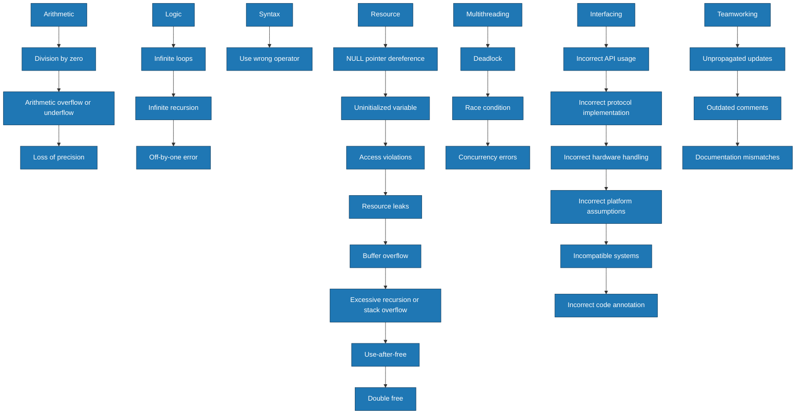

> [!abstract] Buffer Overflow (BOF), Fuzzing & Tracing
> A comprehensive guide to understanding Buffer Overflows, discovering them via Fuzzing, and analyzing them via Tracing. Covers core concepts, Kali Linux tooling, and a practical Spike fuzzing example.
> **MITRE ATT&CK Mapping:** [T1190 - Exploit Public-Facing Application](https://attack.mitre.org/techniques/T1190/) | [T1059.004 - Unix Shell](https://attack.mitre.org/techniques/T1059/004/)

## 1. Understanding Buffer Overflows (BOF)

> [!info] What is a Buffer Overflow?
> A **Buffer Overflow (BOF)** occurs when a program writes more data to a temporary storage area (buffer) than it can hold. This overflow overwrites adjacent memory, potentially leading to crashes, data corruption, or arbitrary code execution.
> 
> **Types of BOF:**
> - **Stack-based BOF:** Overflows the stack memory, often manipulating function return addresses (Most common).
> - **Heap-based BOF:** Targets dynamic memory (heap), less common but highly dangerous.

> [!example]+ Vulnerable C Code Example
> In this example, `strcpy` and `gets` do not check the length of the input. If a user inputs more than 8 characters, it overwrites adjacent memory.
> ```c
> #include <stdio.h>
> #include <string.h>
> 
> void vulnerableFunction(char *input) {
>     char buffer[8];  // Small buffer
>     strcpy(buffer, input);  // No boundary check!
>     printf("Buffer: %s\n", buffer);
> }
> 
> int main() {
>     char userInput[20];
>     printf("Enter text: ");
>     gets(userInput);  // Unsafe function!
>     vulnerableFunction(userInput);
>     return 0;
> }
> ```

---

## 2. Fuzzing (Vulnerability Discovery)

> [!tip] What is Fuzzing?
> Fuzzing is an automated technique that injects large amounts of random, malformed, or unexpected data into a program to trigger crashes or memory corruption.
> 
> **Types of Fuzzing:**
> - **Mutation-based:** Modifies existing valid inputs to create test cases.
> - **Generation-based:** Generates new test cases based on protocol specs.
> - **Coverage-guided:** Tracks code execution paths to maximize testing efficiency.

> [!example]+ Popular Fuzzing Tools in Kali Linux
> 
> **Binary & Protocol Fuzzers:**
> - **AFL (American Fuzzy Lop):** Coverage-guided fuzzer for binaries.
>   `afl-fuzz -i input_folder -o output_folder -- ./program @@`
> - **Radamsa:** Mutation-based fuzzer for file formats.
>   `radamsa input.txt > output.txt`
> - **Spike:** Network protocol fuzzer (Used for BOF testing).
>   `generic_send_tcp x.x.x.x 80 /path/to/spike_script.spk`
> - **Boofuzz:** Python-based network/protocol fuzzer (Successor to Sulley).
> 
> **Web Application Fuzzers:**
> - **Wfuzz:** Web app fuzzer for SQLi, XSS, etc.
>   `wfuzz -c -z file,wordlist.txt http://target.com/FUZZ`
> - **ffuf:** Fast web fuzzer for discovering hidden paths/files.
>   `ffuf -u http://target/FUZZ -w wordlist.txt`
> - **Burp Suite Intruder / OWASP ZAP:** GUI-based web fuzzing platforms.

---

## 3. Tracing (Behavior Analysis)

> [!bug] What is Tracing?
> Tracing involves monitoring and logging system or application activities to debug issues or analyze program behavior during a crash.
> 
> **Tracing Tools in Kali Linux:**
> - **GDB (GNU Debugger):** Traces program execution, inspects memory, and analyzes crash dumps.
> - **strace:** Tracks system calls made by a process.
> - **ltrace:** Traces library calls made by a program.
> - **Wireshark:** Graphical network packet analyzer.
> - **tcpdump:** Command-line network traffic capture.

---

## 4. BOF Exploitation Workflow

> [!success]+ Steps to Exploit a Buffer Overflow
> ```mermaid
> flowchart LR
>     A[1. Fuzzing] --> B[2. Crash Analysis]
>     B --> C[3. Find Offset]
>     C --> D[4. Craft Payload]
>     D --> E[5. Exploit Execution]
>     style A fill:#ffcc66
>     style E fill:#ff9999
> ```
> 1. **Identify Vulnerable Program:** Use fuzzing to find inputs that cause crashes.
> 2. **Analyze Crash:** Use GDB to trace execution and find where the overflow occurs.
> 3. **Determine Offset:** Find the exact number of bytes needed to overwrite the return address (EIP).
> 4. **Craft Payload:** Create a payload to inject malicious code (e.g., shellcode).
> 5. **Exploit Execution:** Feed the crafted input into the vulnerable program.

---

## 5. Practical Example: Fuzzing with Spike (Network BOF)

> [!danger]+ Scenario: Fuzzing a Vulnerable Server on Port 999
> In this scenario, we target a vulnerable network service running on `x.x.x.x:999`. We will use the **Spike** fuzzer to discover a Buffer Overflow vulnerability in a specific application variable.
> 
> **Step 1: Enumeration**
> Connect to the service with Netcat to identify interactive commands or variables.
> ```bash
> nc x.x.x.x 999
> # During enumeration, we discover the server accepts a variable called "TRUN"
> ```
> 
> **Step 2: Create the Spike Script (`file.spk`)**
> Write a Spike script to fuzz the `TRUN` command with random string variables.
> ```text
> s_readline();
> s_string("TRUN ");
> s_string_variable("COMMAND");
> ```
> *(Save and exit the file)*
> 
> **Step 3: Execute the Fuzzer**
> Run the `generic_send_tcp` tool to send the Spike payload to the target.
> ```bash
> generic_send_tcp x.x.x.x 999 file.spk 0 0
> ```
> 
> **Step 4: Tracing the Crash**
> While Spike is running, monitor the target server.
> - Open **Wireshark** to observe the TCP stream and malformed payloads.
> - If you have local access to the server, attach a **Debugger (GDB/Immunity Debugger)** to the vulnerable process to check if the EIP (Instruction Pointer) was overwritten.
> 
> **Step 5: Exploit**
> If the server crashes or the debugger catches a segmentation fault, you have found a BOF. You can now proceed to find the exact offset using tools like `pattern_create` and `pattern_offset` to build a working exploit.


