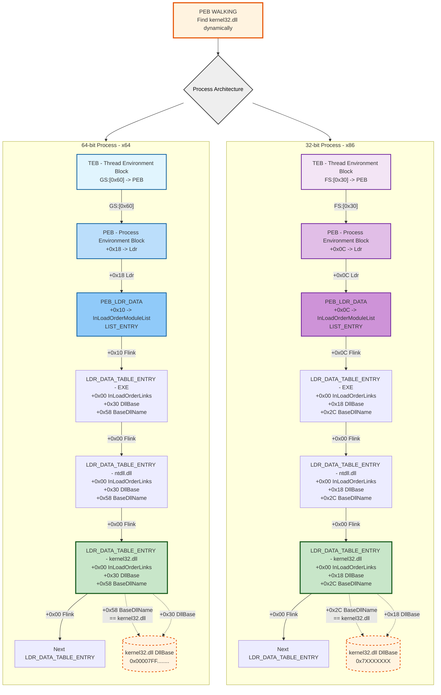

> [!abstract] Windows x64 Assembly & Shellcode Engineering: From MASM to PEB Walking
> Writing assembly language for Windows x64 is a foundational skill for malware development, shellcode engineering, and reverse engineering. Unlike 32-bit assembly (which pushed arguments to the stack), x64 assembly uses a strict **Calling Convention** that passes arguments via registers. This note breaks down the rules of x64 assembly, compares the two most popular assemblers (MASM vs. NASM), and ultimately dives into the darkest art of shellcoding: dynamically finding APIs by walking the Process Environment Block (PEB) in memory.
> **MITRE ATT&CK Mapping:** [T1059 - Command and Scripting Interpreter](https://attack.mitre.org/techniques/T1059/) | [T1027 - Obfuscated Files or Information](https://attack.mitre.org/techniques/T1027/) | [T1106 - Native API](https://attack.mitre.org/techniques/T1106/)
## Microsoft x64 Calling Convention

> [!info] How x64 Functions Receive Arguments
> Before writing assembly, you must understand how Windows expects functions to be called. Let's use `MessageBoxA` as an example. It takes 4 arguments: `MessageBoxA(hWnd, lpText, lpCaption, uType)`.
> 
> In x64 Windows, the first four arguments are passed in specific registers, and the stack must be 16-byte aligned before the `call` instruction.
> 
> | Argument | Register | Purpose |
> | :--- | :--- | :--- |
> | 1st (`hWnd`) | `rcx` | Window Handle (0 for NULL) |
> | 2nd (`lpText`) | `rdx` | Pointer to the message body |
> | 3rd (`lpCaption`) | `r8` | Pointer to the window title |
> | 4th (`uType`) | `r9` | Button/Icon type (0 for MB_OK) |
> 
> **The Shadow Space (32 Bytes):**
> The x64 calling convention requires the caller to allocate 32 bytes (20h) of "shadow space" on the stack. The callee (the function you are calling) uses this space to save those 4 registers (`rcx`, `rdx`, `r8`, `r9`) if it wants to. 
> 
> **Stack Alignment:**
> Before making a `call`, the `rsp` (Stack Pointer) must be aligned to a 16-byte boundary. The `call` instruction pushes the 8-byte return address, misaligning the stack. By subtracting `28h` (40 bytes), we allocate the 32-byte shadow space + 8 bytes to realign the stack to 16 bytes.


---

## 🛠️ The Contenders (MASM vs. NASM)

### 1. MASM (Microsoft Macro Assembler)
MASM is the official Microsoft assembler. It is heavily integrated with Visual Studio and uses a high-level macro syntax (like `PROC` and `ENDP`).

> [!example]+ MASM Code (`file.asm`)
> ```assembly
> option casemap:none ; Case sensitive (important for Windows APIs)
> 
> EXTERN MessageBoxA:PROC
> EXTERN ExitProcess:PROC
> 
> .data
> szText db "HelloWorld", 0
> 
> .code
> main PROC
>     sub rsp, 28h      ; Allocate 32-byte shadow space + 8-byte stack alignment
> 
>     xor ecx, ecx      ; 1st param: hWnd = NULL (0)
>     lea rdx, szText   ; 2nd param: lpText = pointer to string
>     xor r8d, r8d      ; 3rd param: lpCaption = NULL
>     mov r9d, 0        ; 4th param: uType = MB_OK
> 
>     call MessageBoxA
> 
>     xor ecx, ecx      ; Exit code = 0
>     call ExitProcess
> 
> main ENDP
> END
> ```

> [!tip]+ Compiling and Linking MASM
> MASM comes bundled with Visual Studio Build Tools.
> ```bash
> # 1. Assemble the .asm file into an object file (.obj)
> ml64.exe /c .\file.asm
> 
> # 2. Link the .obj file with Windows libraries
> link.exe .\file.obj user32.lib kernel32.lib /subsystem:console /entry:main
> ```

### 2. NASM (Netwide Assembler)

NASM is a cross-platform, open-source assembler. It is preferred by many exploit developers and shellcode writers because its syntax is raw, explicit, and doesn't hide instructions behind macros.

> [!bug]+ NASM Code (`hello.asm`)
> ```assembly
> bits 64
> default rel       ; Use RIP-relative addressing (crucial for position-independent shellcode)
> 
> extern MessageBoxA
> extern ExitProcess
> 
> section .data
>     title db "NASM Example", 0
>     msg   db "Hello from NASM x64!", 0
> 
> section .text
>     global main
> 
> main:
>     ; Shadow space + stack alignment
>     sub rsp, 28h
> 
>     ; MessageBoxA(NULL, msg, title, MB_OK)
>     xor ecx, ecx             ; 1st param: hWnd = NULL
>     lea rdx, [msg]           ; 2nd param: lpText
>     lea r8, [title]          ; 3rd param: lpCaption
>     xor r9d, r9d             ; 4th param: uType = MB_OK
>     call MessageBoxA
> 
>     ; ExitProcess(0)
>     xor ecx, ecx
>     call ExitProcess
> ```
> *Notice the `default rel` directive. This forces NASM to use RIP-relative addressing when accessing data like `msg` and `title`. This is exactly how modern shellcode works—it doesn't use hardcoded memory addresses; it calculates data locations relative to the Instruction Pointer (RIP).*

> [!danger]+ Compiling and Linking NASM
> NASM can be downloaded separately. It relies on the MSVC linker to create the final `.exe`.
> ```bash
> # 1. Assemble the .asm file into a win64 object file (.obj)
> nasm -f win64 .\hello.asm -o .\hello.obj
> 
> # 2. Link the .obj file with Windows libraries (Using MSVC Linker)
> link.exe .\hello.obj user32.lib kernel32.lib /subsystem:console /entry:main
> ```
## ⚖️ Part 3: The Verdict (Which is better?)

> [!quote] Red Team & Malware Dev Perspective
> 
> | Feature | MASM (Microsoft) | NASM (Netwide) |
> | :--- | :--- | :--- |
> | **Syntax** | High-level macros (`PROC`, `INVOKE`, `LOCAL`). | Raw, strict, and explicit. |
> | **Data Access** | `lea rdx, szText` (Hides addressing details). | `lea rdx, [msg]` with `default rel` (Explicit RIP-relative). |
> | **Toolchain** | Bundled with Visual Studio (`ml64.exe`). | Requires separate download + MSVC linker. |
> | **Best For...** | Standalone Windows `.exe` development. | **Shellcode development & Exploit writing.** |
> 
> **The Verdict:**
> If you want to write a full standalone Windows executable with complex logic, **MASM** is easier because of its macros and deep Visual Studio integration.
> 
> However, if your goal is to write **shellcode** (Position Independent Code that runs from memory without a PE header), **NASM** is far superior. Its strict syntax forces you to understand memory addressing, and `default rel` natively supports the RIP-relative addressing required for modern shellcode.
## The Dark Arts (Shellcode Context: Walking the PEB)

> [!info] Why can't shellcode just use `EXTERN MessageBoxA`?
> In the NASM code above, we used `extern MessageBoxA` and linked it with `user32.lib`. This works perfectly for a standalone `.exe` because the linker builds an **Import Address Table (IAT)** into the PE header, telling the OS where `MessageBoxA` lives. 
> 
> However, if you are writing **pure shellcode** (Position-Independent Code that gets injected into memory), you don't have a PE header or an IAT. The OS doesn't tell you where the DLLs are. You have to find them yourself by walking the **PEB (Process Environment Block)**.

### The Memory Structure Chain (TEB -> PEB -> LDR)

> [!tip] How Shellcode Finds `kernel32.dll` and `user32.dll`
> Every thread in Windows has a **TEB (Thread Environment Block)**. The TEB contains a pointer to the **PEB (Process Environment Block)**. The PEB contains a pointer to `PEB_LDR_DATA`, which holds a linked list of all the DLLs loaded into the process. 
> 
> By walking this linked list (`LIST_ENTRY` with `Flink` and `Blink`), shellcode can find the `BaseAddress` of `ntdll.dll`, `kernel32.dll`, and `user32.dll` without calling any Windows APIs.

![[locate_dll.png]]



### The Conceptual Approach (The "Simple" PEB Walk)

> [!example]+ Finding `kernel32.dll` Base Address in NASM
> This is the exact technique used to explain how shellcode locates APIs dynamically. It parses the memory structures without needing a linker or an IAT.
> 
> ```nasm
> bits 64
> default rel
> 
> global GetKernel32Base
> 
> GetKernel32Base:
>     ; 1. Get pointer to PEB via the TEB (GS segment register)
>     mov rax, [gs:0x60]      ; rax = PEB
>     
>     ; 2. Get pointer to PEB_LDR_DATA
>     mov rax, [rax+0x18]     ; rax = PEB_LDR_DATA
>     
>     ; 3. Get pointer to InLoadOrderModuleList (First entry is the exe itself)
>     mov rax, [rax+0x20]     ; rax = first LIST_ENTRY (Flink)
>     
>     ; 4. Walk the linked list to find kernel32.dll
>     ; The list order is usually: [exe] -> [ntdll.dll] -> [kernel32.dll]
>     mov rax, [rax]           ; Move to ntdll.dll
>     mov rax, [rax]           ; Move to kernel32.dll
>     
>     ; 5. Extract the DllBase address
>     ; In the LDR_DATA_TABLE_ENTRY, DllBase is at offset 0x30 (x64)
>     mov rax, [rax+0x30]     ; rax = Base Address of kernel32.dll
>     
>     ret
> ```
> 
> *Note: This code assumes the 3rd entry is always `kernel32.dll`. In real-world scenarios, EDRs or AVs might inject DLLs into the process early, breaking this order and causing a crash.*

> [!warning] Why `default rel` is Critical Here
> Notice how the NASM code uses `gs:0x60` and `[rax+0x18]`. It uses **no hardcoded absolute memory addresses**. Everything is calculated relative to the current state of the CPU registers. This is what makes the code Position-Independent (PIC). If you used MASM and hardcoded addresses, the shellcode would crash the moment it was injected into a different process.

### The Real-World Shellcode (Robust PE Parsing)

To write reliable shellcode, we cannot rely on hardcoded list indices. We must **loop** through the PEB to find `kernel32.dll` by its name, and then **parse the PE Export Directory** to find the actual memory address of the functions we need (`GetProcAddress`, `LoadLibraryA`, and ultimately `MessageBoxA`).

> [!danger]+ Complete NASM Code: From PEB Walking to MessageBoxA Execution
> This is a complete, position-independent shellcode. It contains two helper functions (`GetDllBase` and `GetFuncAddress`) and a `main` block that orchestrates the API resolution and execution.
> 
> ```nasm
> bits 64
> default rel
> 
> ; --- Data Section ---
> section .data
>     szKernel32  dw 'k','e','r','n','e','l','3','2','.','d','l','l',0
>     szUser32    dw 'u','s','e','r','3','2','.','d','l','l',0
>     szGetProcA  db 'GetProcAddress', 0
>     szLoadLibA  db 'LoadLibraryA', 0
>     szMsgBoxA   db 'MessageBoxA', 0
>     szExitProc  db 'ExitProcess', 0
>     szTitle     db 'Shellcode', 0
>     szMsg       db 'Hello World from PEB Walker!', 0
>     szUser32A   db 'user32.dll', 0  ; ANSI string for LoadLibraryA
> 
> ; --- Code Section ---
> section .text
>     global main
> 
> main:
>     ; Setup stack frame for main
>     sub rsp, 28h
> 
>     ; ---------------------------------------------------------
>     ; STEP 1: Find kernel32.dll Base Address
>     ; ---------------------------------------------------------
>     lea rsi, [szKernel32]
>     call GetDllBase
>     mov rbx, rax            ; rbx = kernel32.dll Base Address
> 
>     ; ---------------------------------------------------------
>     ; STEP 2: Find GetProcAddress in kernel32.dll
>     ; ---------------------------------------------------------
>     mov rcx, rbx            ; Arg 1: DllBase
>     lea rdx, [szGetProcA]   ; Arg 2: Function name string
>     call GetFuncAddress
>     mov r12, rax            ; r12 = Address of GetProcAddress
> 
>     ; ---------------------------------------------------------
>     ; STEP 3: Find LoadLibraryA in kernel32.dll
>     ; ---------------------------------------------------------
>     mov rcx, rbx            ; Arg 1: DllBase
>     lea rdx, [szLoadLibA]   ; Arg 2: Function name string
>     call GetFuncAddress
>     mov r13, rax            ; r13 = Address of LoadLibraryA
> 
>     ; ---------------------------------------------------------
>     ; STEP 4: Call LoadLibraryA("user32.dll")
>     ; ---------------------------------------------------------
>     lea rcx, [szUser32A]    ; Arg 1: "user32.dll" (ANSI)
>     call r13                ; Call LoadLibraryA
>     mov rbx, rax            ; rbx = user32.dll Base Address
> 
>     ; ---------------------------------------------------------
>     ; STEP 5: Call GetProcAddress(user32.dll, "MessageBoxA")
>     ; ---------------------------------------------------------
>     mov rcx, rbx            ; Arg 1: user32.dll Base
>     lea rdx, [szMsgBoxA]    ; Arg 2: "MessageBoxA"
>     call r12                ; Call GetProcAddress
>     mov r14, rax            ; r14 = Address of MessageBoxA
> 
>     ; ---------------------------------------------------------
>     ; STEP 6: Call MessageBoxA(0, szMsg, szTitle, MB_OK)
>     ; ---------------------------------------------------------
>     xor ecx, ecx            ; hWnd = NULL
>     lea rdx, [szMsg]        ; lpText = "Hello World..."
>     lea r8, [szTitle]       ; lpCaption = "Shellcode"
>     xor r9d, r9d            ; uType = MB_OK (0)
>     call r14                ; Execute MessageBoxA!
> 
>     ; ---------------------------------------------------------
>     ; STEP 7: Find and call ExitProcess(0) to clean exit
>     ; ---------------------------------------------------------
>     lea rsi, [szKernel32]
>     call GetDllBase
>     mov rcx, rax
>     lea rdx, [szExitProc]
>     call GetFuncAddress
>     xor ecx, ecx            ; Exit code 0
>     call rax
> 
> ; =========================================================================
> ; Function: GetDllBase
> ; Input: rsi = Pointer to wide-string DLL name
> ; Output: rax = Base Address of the DLL (0 if not found)
> ; =========================================================================
> GetDllBase:
>     push rbx
>     push rsi
>     push rdi
> 
>     mov rax, [gs:0x60]          ; rax = PEB
>     mov rax, [rax+0x18]         ; rax = PEB_LDR_DATA
>     mov rax, [rax+0x20]         ; rax = &InLoadOrderModuleList (Flink)
>     mov rbx, rax                ; rbx = Head of the list
> 
> loop_find_dll:
>     mov rax, [rax]               ; Move to NEXT module
>     cmp rax, rbx
>     je dll_not_found
> 
>     mov rcx, [rax + 0x68]       ; rcx = BaseDllName.Buffer
>     test rcx, rcx
>     jz loop_find_dll
> 
>     mov rdi, rcx
> compare_chars:
>     mov dx, [rsi]               ; Target char
>     mov cx, [rdi]               ; Current DLL char
>     cmp dx, cx
>     jne loop_find_dll
> 
>     test dx, dx                 ; Null terminator?
>     jz dll_found
> 
>     add rsi, 2
>     add rdi, 2
>     jmp compare_chars
> 
> dll_found:
>     mov rax, [rax + 0x30]       ; rax = DllBase
>     jmp cleanup_getdll
> 
> dll_not_found:
>     xor rax, rax
> 
> cleanup_getdll:
>     pop rdi
>     pop rsi
>     pop rbx
>     ret
> 
> ; =========================================================================
> ; Function: GetFuncAddress
> ; Input: rcx = DllBase, rdx = Pointer to ANSI function name
> ; Output: rax = Function Address (0 if not found)
> ; =========================================================================
> GetFuncAddress:
>     push rbp
>     push rsi
>     push rdi
>     push r12
>     push r13
>     push r14
>     push r15
> 
>     mov r15, rcx            ; r15 = DllBase
>     mov r14, rdx            ; r14 = Function Name to find
> 
>     ; 1. Get e_lfanew (Offset to PE Header)
>     mov eax, [r15 + 0x3c]
>     
>     ; 2. Get Export Directory RVA (PE Header + 0x88)
>     mov eax, [r15 + rax + 0x88]
>     test eax, eax
>     jz func_not_found
>     
>     ; Export Directory VA = DllBase + RVA
>     add rax, r15
>     mov r13, rax            ; r13 = Export Directory Address
> 
>     ; 3. AddressOfNames (Export Dir + 0x20)
>     mov eax, [r13 + 0x20]
>     mov r12, r15
>     add r12, rax            ; r12 = AddressOfNames array VA
> 
>     ; AddressOfNameOrdinals (Export Dir + 0x24)
>     mov eax, [r13 + 0x24]
>     mov rbp, r15
>     add rbp, rax            ; rbp = AddressOfNameOrdinals array VA
> 
>     ; AddressOfFunctions (Export Dir + 0x1c)
>     mov eax, [r13 + 0x1c]
>     mov rdi, r15
>     add rdi, rax            ; rdi = AddressOfFunctions array VA
> 
>     ; 4. Loop through names to find the function
>     mov eax, [r13 + 0x18]   ; eax = NumberOfNames
>     mov rsi, 0              ; rsi = index counter
> 
> name_loop:
>     cmp esi, eax
>     jge func_not_found
> 
>     ; Get name pointer RVA
>     mov ecx, [r12 + rsi*4]
>     lea rcx, [r15 + rcx]    ; VA of the current name
> 
>     ; Compare strings (r14 = target, rcx = current)
>     mov r8, r14
>     mov r9, rcx
> 
> cmp_loop:
>     mov dl, [r8]
>     mov cl, [r9]
>     cmp dl, cl
>     jne next_name
>     test dl, dl
>     jz found_name
>     inc r8
>     inc r9
>     jmp cmp_loop
> 
> next_name:
>     inc rsi
>     jmp name_loop
> 
> found_name:
>     ; 5. Get ordinal and function address
>     movzx ecx, word [rbp + rsi*2] ; Ordinal
>     mov eax, [rdi + rcx*4]        ; Function RVA
>     add rax, r15                  ; Function VA = DllBase + RVA
>     jmp cleanup_func
> 
> func_not_found:
>     xor rax, rax
> 
> cleanup_func:
>     pop r15
>     pop r14
>     pop r13
>     pop r12
>     pop rdi
>     pop rsi
>     pop rbp
>     ret
> ```

### 🧠 Deep Dive: How the PE Parser (`GetFuncAddress`) Works

> [!info] Parsing the PE Export Directory
> Finding the Base Address of a DLL is only half the battle. The DLL is a standard PE file. To find `MessageBoxA` inside `user32.dll`, the shellcode must manually replicate what `GetProcAddress` does:
> 
> 1. **DOS Header (**`e_lfanew`**):** It reads offset `0x3c` from the DllBase to find the RVA (Relative Virtual Address) of the PE Header.
> 2. **Export Directory:** In x64 PE files, the Export Directory RVA is located at PE Header + `0x88`. The shellcode adds this RVA to the DllBase to get the exact memory address of the Export Directory.
> 3. **The Three Arrays:** The Export Directory contains three critical parallel arrays:
>    - `AddressOfNames` (+0x20): An array of RVAs pointing to function name strings (e.g., `"MessageBoxA"`).
>    - `AddressOfNameOrdinals` (+0x24): An array of 16-bit numbers (Ordinals) corresponding to the names.
>    - `AddressOfFunctions` (+0x1c): An array of RVAs pointing to the actual function code.
> 4. **The Search Loop:** The shellcode loops through `AddressOfNames`, comparing each string to `"MessageBoxA"`. When it finds a match, it uses the index to look up the corresponding Ordinal in `AddressOfNameOrdinals`.
> 5. **Final Resolution:** It uses that Ordinal as an index into `AddressOfFunctions` to get the final RVA of the function, adds the DllBase, and returns the absolute memory address.
> 
> This entire process happens in memory, without touching the disk or relying on the OS loader.

