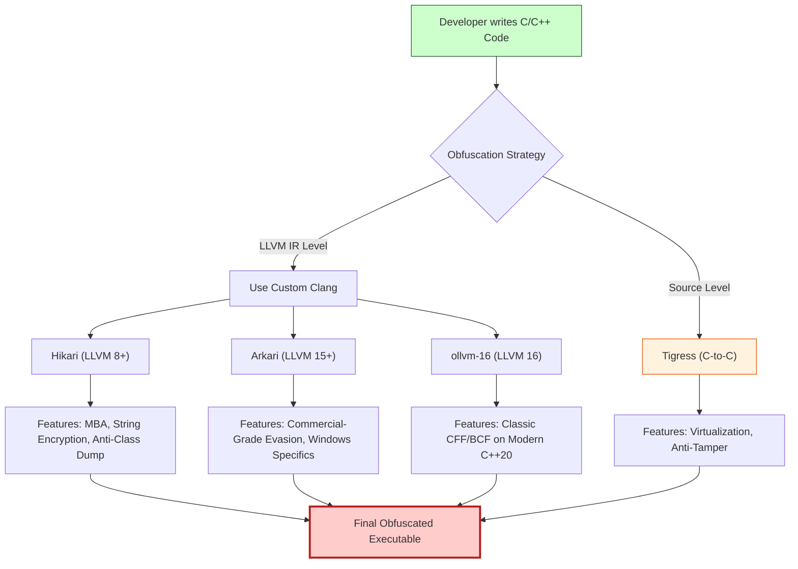

> [!abstract] The Modern Obfuscation Landscape: From OLLVM to Tigress
> Code obfuscation is the art of transforming executable code into a form that is extremely difficult for humans and automated tools (like IDA Pro or Ghidra) to reverse engineer, while preserving its original functionality. As reverse engineering tools have evolved, so have obfuscators. This note breaks down the most powerful open-source and commercial-grade obfuscators available today.
> **MITRE ATT&CK Mapping:** [T1027 - Obfuscated Files or Information](https://attack.mitre.org/techniques/T1027/) | [T1027.002 - Software Packing](https://attack.mitre.org/techniques/T1027/002/)

## 📊 The Obfuscation Taxonomy

> [!info] Compiler-Level vs. Source-Level
> Obfuscators generally fall into two categories. LLVM-based obfuscators modify the Intermediate Representation (IR) during compilation, making them compatible with any language LLVM supports (C, C++, Rust, Swift). Source-level obfuscators (like Tigress) modify the `.c` files *before* they hit the compiler, allowing for transformations that compilers cannot do.



## 1. OLLVM (The Foundation)

> [!info] Obfuscator-LLVM
> OLLVM is the grandfather of modern LLVM obfuscation. Although it is based on LLVM 4.0 (which is now obsolete), it established the three foundational passes that all other tools build upon:
> - **CFF (Control Flow Flattening):** Destroys the CFG.
> - **BCF (Bogus Control Flow):** Inserts opaque predicates and junk code.
> - **SUB (Instruction Substitution):** Replaces simple math with complex logic.
> 
> *Because OLLVM is stuck on LLVM 4.0, it cannot compile modern C++20 code or target modern architectures efficiently. This led to the creation of the tools below.*

## 2. Hikari (The Modern Successor)

> [!tip] Hikari Obfuscator
> [Hikari](https://github.com/HikariObfuscator/Hikari) is a massive, actively maintained rewrite of OLLVM based on LLVM 8.0+. It takes obfuscation to the next level by introducing passes that target modern static analysis tools.
> 
> **Unique Features:**
> - **MBA (Mixed Boolean Arithmetic):** Replaces simple arithmetic (e.g., `a + b`) with extremely complex bitwise logic (e.g., `(~a & b) | (a & ~b)`), which defeats pattern matching in IDA.
> - **String Encryption:** Encrypts string literals in the `.rdata` section and decrypts them only in memory at runtime.
> - **Indirect Branching:** Replaces direct `jmp` instructions with complex mathematical calculations to determine the jump target.
> - **Anti-Class Dump:** Specifically designed to obfuscate Objective-C/Swift metadata (for macOS/iOS malware).
> 
> **Execution:**
> ```bash
> # Using Hikari's custom clang
> hikari-clang++ -m32 main.cpp -o main_hikari.exe -mllvm -enable-strcry -mllvm -enable-indibran -mllvm -enable-mba
> ```
## 3. Arkari (The Commercial-Grade Beast)

> [!danger] Arkari
> [Arkari](https://github.com/komimoe/Arkari) is built on top of Hikari (based on LLVM 15+). It is designed for Red Teams and malware developers who need absolute stealth and compatibility with the latest Windows SDKs.
> 
> **Unique Features:**
> - **Advanced MBA:** Far more complex mathematical substitutions than Hikari, specifically tuned to break Ghidra's decompiler.
> - **Indirect Global Variable Access:** Hides access to global variables by computing their addresses dynamically, breaking cross-references (XREFs) in IDA.
> - **Subtarget Optimization:** Specifically optimizes obfuscated code for modern Intel/AMD architectures to minimize the performance hit.
> - **Modern C++ Support:** Fully supports C++23 and modern Windows API headers.
> 
> **Execution:**
> ```bash
> # Arkari is a drop-in replacement for clang
> arkari-clang++ -m64 payload.cpp -o payload_arkari.exe -mllvm -arkari-mba-level=3 -mllvm -arkari-indibranch -mllvm -arkari-igv
> ```
## 4. ollvm-16 (The Modern Port)

> [!example] ollvm-16
> [ollvm-16](https://github.com/wwh1004/ollvm-16) is exactly what it sounds like: a direct port of the classic OLLVM passes (CFF, BCF, SUB) to the modern LLVM 16 pipeline.
> 
> **Why use it over Hikari/Arkari?**
> - **Lightweight:** It doesn't add complex MBA or string encryption. It just does classic CFF/BCF.
> - **Stability:** Because it's a direct port, it is incredibly stable and doesn't suffer from the bugs sometimes introduced by the heavy IR modifications in Hikari.
> - **Modern Compatibility:** It can compile modern C++ code and link with the latest Visual Studio libraries.
> 
> **Execution:**
> ```bash
> # Classic OLLVM flags, modern LLVM backend
> ollvm16-clang -m64 hello.c -o hello_ollvm16.exe -mllvm -fla -mllvm -sub -mllvm -bcf
> ```
## 5. Tigress (The Source-to-Source Master)

> [!bug] Tigress
> [Tigress](https://tigress.wtf/download.html) is completely different from the tools above. It is a **source-to-source** obfuscator. It takes a `.c` file as input, and outputs a different, heavily obfuscated `.c` file, which you then compile with GCC or MSVC.
> 
> **Unique Features:**
> - **Virtualization:** Converts C functions into custom, randomized bytecode. It then injects a virtual CPU into the C code to interpret that bytecode at runtime. This is the strongest form of obfuscation.
> - **Data Encoding:** Encrypts arrays and structs.
> - **Anti-Tamper:** Injects code that checks the integrity of the binary at runtime.
> - **Code Flattening:** Flattens the C code at the AST (Abstract Syntax Tree) level.
> 
> **Execution (Linux/WSL required):**
> ```bash
> # 1. Obfuscate the source code
> ./tigress \
>   --Transform=Virtualize --Functions=check_secret \
>   --Transform=Flatten --Functions=check_secret \
>   --Transform=EncodeData --Functions=check_secret \
>   --out=obfuscated.c hello.c
> 
> # 2. Compile the obfuscated C code with a normal compiler
> gcc -m32 obfuscated.c -o hello_tigress.exe
> ```

## 🛒 The Obfuscation Bazaar (Download & Repositories)

> [!info] Direct Links & Repositories
> Below are the direct links to the GitHub repositories, release pages, and official websites for all the obfuscators mentioned above.

### 1. Hikari Obfuscator
> [!tip]+ Hikari Repository & Downloads
> Hikari is actively maintained and usually requires building from source, but pre-built binaries for Windows and Linux can sometimes be found in the CI/CD artifacts or releases.
> - **GitHub Repo:** [https://github.com/HikariObfuscator/Hikari](https://github.com/HikariObfuscator/Hikari)
> - **Releases/Builds:** Check the "Actions" tab for pre-built binaries or clone and build with CMake.

### 2. Arkari Obfuscator
> [!danger]+ Arkari Repository
> Arkari is based on Hikari but pushes the limits further. It is heavily used by Red Teams. 
> - **GitHub Repo:** [https://github.com/komimoe/Arkari](https://github.com/komimoe/Arkari)
> - *Note:* You will likely need to compile this using CMake and a modern LLVM toolchain.

### 3. ollvm-16 (Modern OLLVM Port)
> [!example]+ ollvm-16 Repository
> A direct, clean port of the classic OLLVM passes to LLVM 16. Best for modern C++ compatibility without the complex overhead of Hikari.
> - **GitHub Repo:** [https://github.com/wwh1004/ollvm-16](https://github.com/wwh1004/ollvm-16)
> - *Note:* No pre-built binaries provided. Build using standard CMake instructions for LLVM.

### 4. Tigress Obfuscator
> [!bug]+ Tigress Official Website & Downloads
> Tigress is unique (Source-to-Source) and provides pre-compiled binaries for Linux/macOS (Windows requires WSL).
> - **Official Website:** [https://tigress.wtf/](https://tigress.wtf/)
> - **Direct Download Page:** [https://tigress.wtf/download.html](https://tigress.wtf/download.html)
> - *Files available:* `tigress-3.3.tar.gz` (Linux/Unix). Just extract and run the `tigress` executable.

### 5. Legacy OLLVM (Original)
> [!warning]+ Original OLLVM Repo
> The original Obfuscator-LLVM project (based on LLVM 4.0). No longer actively maintained, but historically significant.
> - **GitHub Repo:** [https://github.com/obfuscator-llvm/obfuscator](https://github.com/obfuscator-llvm/obfuscator)
> - **Pre-built Windows Binaries:** Search GitHub for `obfuscator-llvm windows release` to find community-compiled `clang.exe` files if you don't want to build from source.


> [!success] Red Team OPSEC Tip (Building vs Pre-built)
> **Always build your own binaries.** Downloading pre-compiled `clang.exe` files from random GitHub repositories is a massive OPSEC risk. Threat actors and defenders often backdoor or fingerprint pre-compiled obfuscator binaries. If you are doing serious Red Teaming, clone the repository, inspect the source (diff against the official LLVM if necessary), and compile it yourself using CMake.
