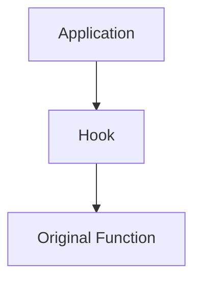
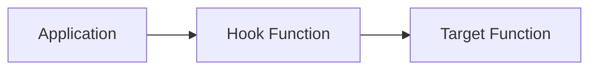
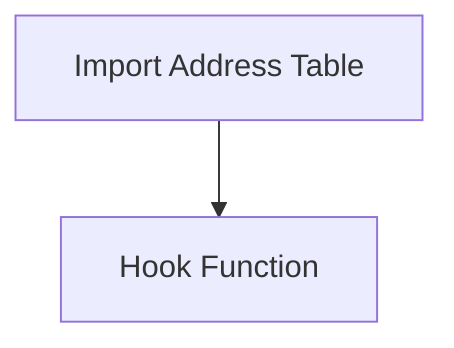
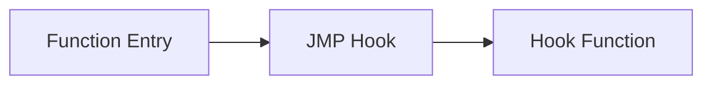

# Hooking

> [!abstract]
> Hooking is a technique that intercepts function calls, messages, or events and redirects execution to custom code.

---

## Why Hooking Exists

> [!example]
> Imagine a receptionist standing between visitors and an employee.
>
> Instead of visitors directly reaching the employee, the receptionist intercepts them first and decides what happens next.
>
> A software hook works in a very similar way.

---

## Legitimate Uses

> [!success]
> Common legitimate use cases:
>
> - Debugging
> - API Monitoring
> - Accessibility Software
> - EDR/XDR Products
> - Performance Analysis

---

## Malicious Uses

> [!warning]
> Attackers may use hooking techniques to:
>
> - Capture credentials
> - Hide malicious behavior
> - Intercept API calls
> - Bypass security mechanisms

---

## Detours Hooking

> [!info]
> Detours Hooking redirects execution from a target function to a custom function.

> [!tip]
> Microsoft's Detours library is one of the most well-known implementations of this technique.

---

## IAT Hooking

> [!info]
> IAT Hooking modifies entries inside the Import Address Table so that imported API calls are redirected to a hook function.

> [!example]
> Instead of calling `MessageBoxA()`, the application unknowingly calls the hook function.

---

## Inline Patching

> [!info]
> Inline Patching overwrites the first instructions of a function with a jump instruction.

> [!warning]
> Since executable code is modified directly, this technique is often monitored by EDR solutions.

---

## Quick Comparison

> [!summary]
>
> | Technique | Modifies Code | Modifies Table | Complexity |
> |------------|--------------|---------------|------------|
> | Detours Hooking | ✅ | ❌ | Medium |
> | IAT Hooking | ❌ | ✅ | Low |
> | Inline Patching | ✅ | ❌ | High |

---

## Key Takeaway

> [!quote]
> Hooking is fundamentally about controlling execution flow. Whether it is used for debugging, monitoring, or malicious purposes depends entirely on the operator.